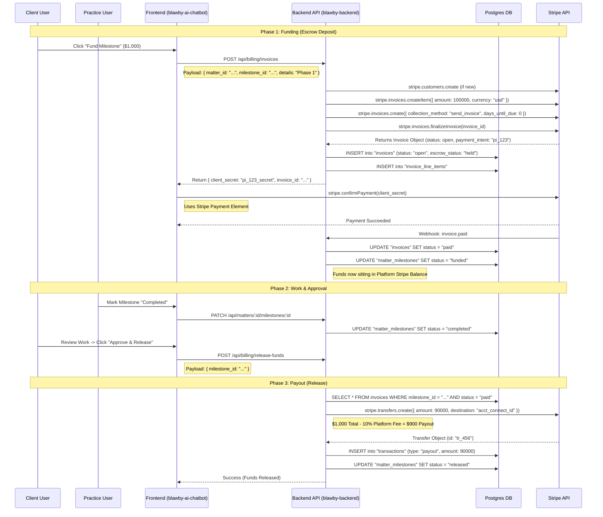
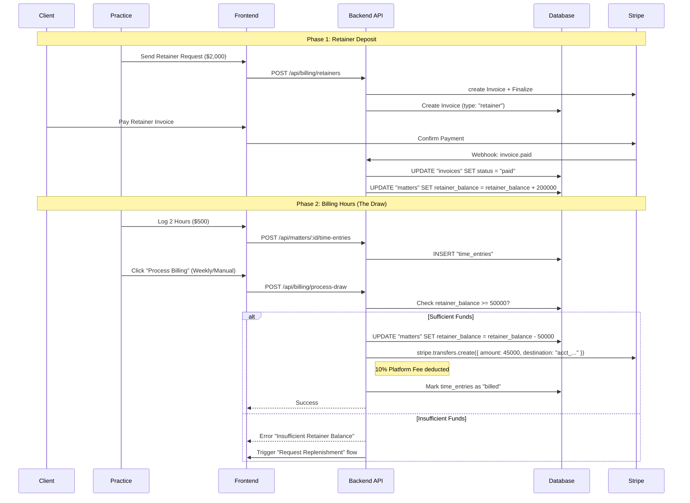

# Deep Analysis: Billing Architecture & Implementation Plan

## 1. Executive Summary
**Goal**: Enable "Upwork-style" billing where funds are held in Escrow (for Milestones) or billed against a Retainer (for Hourly work) before being released to the Practice.

**Core Architecture**:
*   **Platform-as-Merchant**: The Platform collects funds from the Client -> Holds them -> Transfers to Practice upon approval.
*   **Infrastructure**: specialized `billing` module in `blawby-backend` orchestrating Stripe Invoices and Connect Transfers.

## 2. Technical Context & Findings (New)

### A. Backend Architecture (`blawby-backend`)
*   **Structure**: `src/modules/{module_name}` (e.g., `matters`, `onboarding`).
*   **ORM**: Drizzle.
*   **Schema Gap**: The `matters` table (`src/modules/matters/database/schema/matters.schema.ts`) has `billing_type` but **MISSING** `retainer_balance`. We must add this.
*   **Stripe**: `StripeConnectedAccount` logic is robust (`onboarding` module). We can leverage the existing `stripe` client export.

### B. Legacy Migration (`blawby-app`)
*   **Invoice Schema**: `invoices` table is clean. We will reproduce it in `billing` module with an added `matter_id` foreign key.
*   **Logic**: `StripeInvoiceService.php` uses `on_behalf_of` for invoices. We will adopt this to ensure the Practice is the Merchant of Record for tax purposes, even if Platform holds funds temporarily.

### C. Frontend (`blawby-ai-chatbot`)
*   **API**: `src/shared/lib/apiClient.ts` is robust. We will extend it with a `Billing` namespace.
*   **Tech**: Preact. Integration with `@stripe/stripe-js` (Payment Element) is required for the "Fund Milestone" modal.

---

## 3. Technical Implementation Sequences

### A. Sequence: Milestone Escrow Flow (Fixed Price)

### B. Sequence: Hourly Retainer Draw

---

## 4. Backend Implementation Plan (`blawby-backend`)

### **A. Module Structure: `src/modules/billing`**
This module is the "Financial Engine" connecting Matters (Work) to Stripe (Money).

**1. Database Schema**
*   **File**: `src/modules/billing/database/schema/invoices.schema.ts`
    *   `id`: uuid
    *   `stripe_invoice_id`: text (unique)
    *   `matter_id`: uuid (FK to matters.id)
    *   `amount_total`: integer (cents)
    *   `amount_platform_fee`: integer (cents)
    *   `status`: enum ('draft', 'open', 'paid', 'void')
    *   `escrow_status`: enum ('none', 'held', 'released')
*   **File**: `src/modules/matters/database/schema/matters.schema.ts`
    *   **ADD**: `retainer_balance` (integer, default 0).

**2. Services**
*   **File**: `src/modules/billing/services/invoice-generator.service.ts`
    *   `generateMilestoneInvoice(milestoneId)`: Creates Stripe Invoice Item + Invoice.
*   **File**: `src/modules/billing/services/escrow.service.ts`
    *   `releaseFunds(invoiceId)`:
        1. Checks `escrow_status` == 'held'
        2. Calculates payout (Total - Fee)
        3. Calls `stripe.transfers.create`
        4. Updates DB to `released`.

**3. API Handlers**
*   `POST /api/billing/milestones/:id/fund`: Triggers Invoice creation.
    *   *Returns*: `{ client_secret, invoice_id }` for Frontend Stripe Element.
*   `POST /api/billing/milestones/:id/release`: Triggers Escrow release.
    *   *Requires*: Active Session User == Client of the Matter.

---

## 5. Frontend Implementation Plan (`blawby-ai-chatbot`)

### **A. API Integration**
*   **File**: `src/shared/lib/apiClient.ts`
    *   Add `billing` namespace methods: `fundMilestone`, `releaseMilestone`, `getInvoices`.

### **B. Components**
1.  **FundMilestoneModal.tsx** (`src/features/billing/components/`)
    *   Input: `milestone` object.
    *   Content: Summarizes cost + Stripe `PaymentElement`.
    *   Action: Calls `api.billing.fundMilestone`, handles confirmation.

2.  **MilestoneActionRow.tsx** (`src/features/matters/components/`)
    *   *State Logic*:
        *   `status === 'pending_funding'` -> Render **<Button>Fund Escrow</Button>**
        *   `status === 'funded'` -> Render **<Badge>Funds Secured</Badge>**
        *   `status === 'completed' && isClient` -> Render **<Button>Approve & Pay</Button>**

---

## 6. Security & Compliance Notes
*   **Funds Flow**: We are using separate Charges and Transfers. This means funds technically reside in the Platform's Stripe Balance during the "Escrow" period.
*   **Compliance**: Ensure Terms of Service clarify that BLawby acts as a limited payment agent.
*   **Idempotency**: All `Transfer` calls must use `idempotency_key` based on the `invoice_id` to prevent double-payouts.
