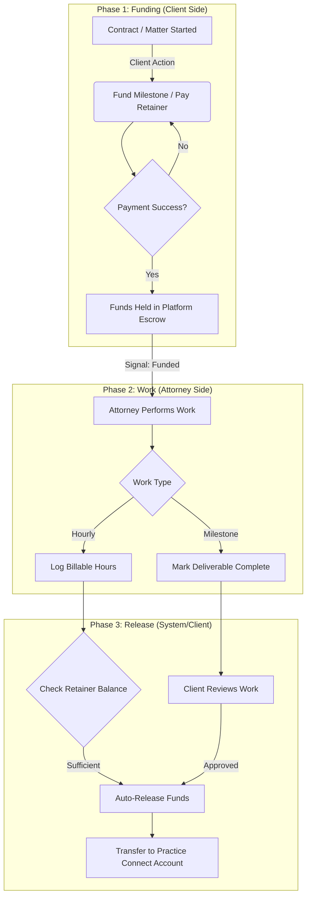
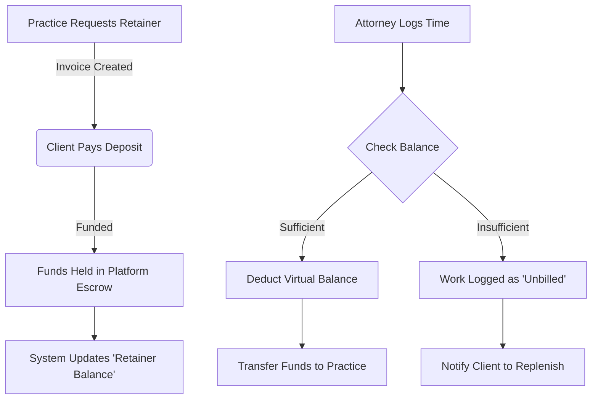
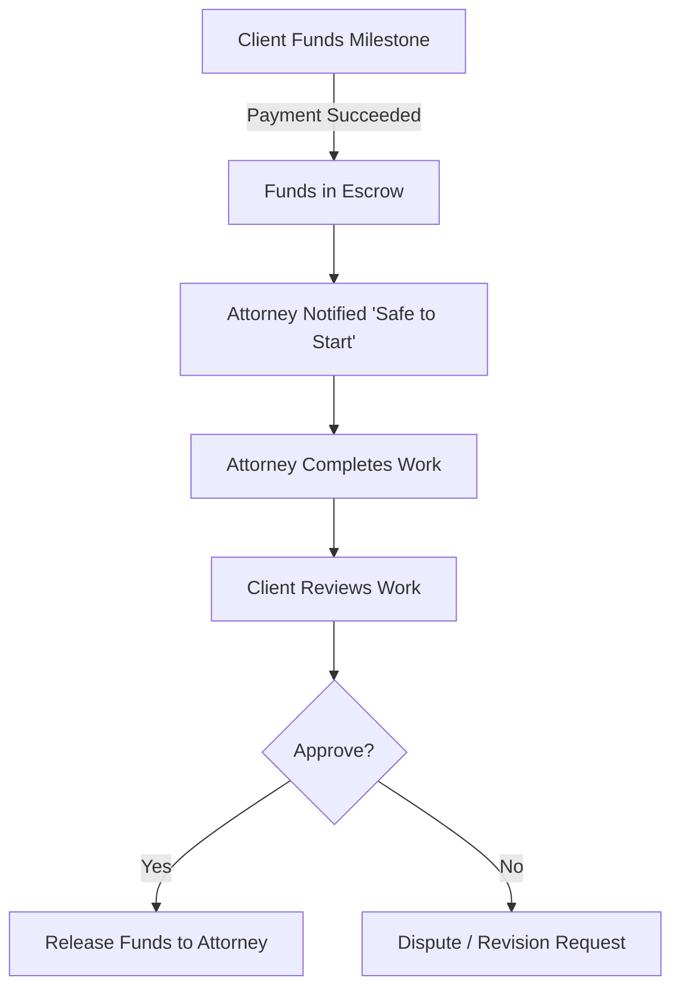
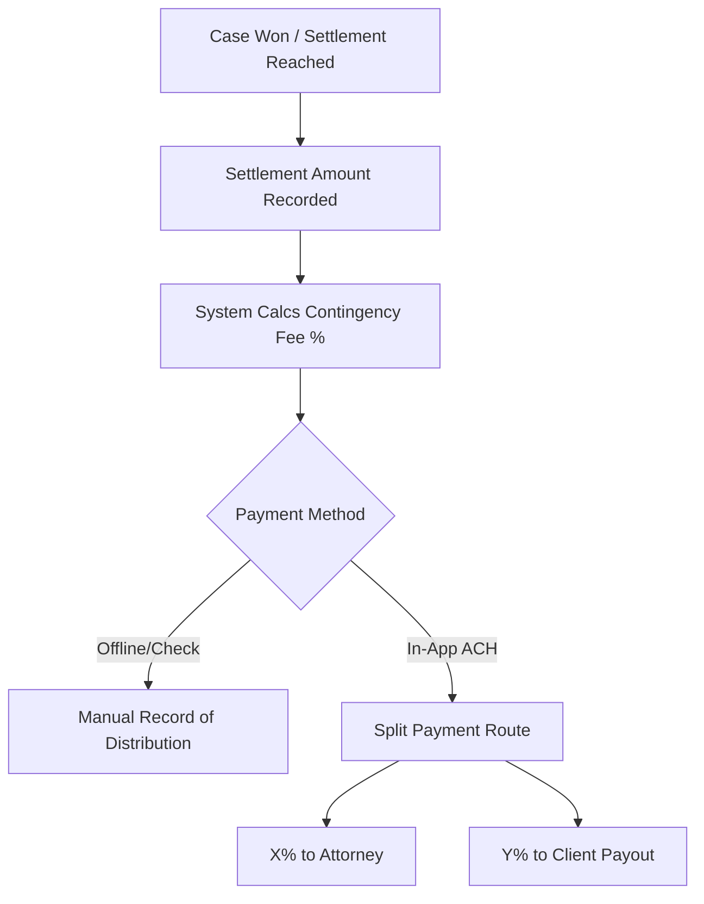

# Deep Analysis: Billing Architecture & Implementation Plan

## 1. Executive Summary
**Goal**: Enable "Upwork-style" billing where funds are held in Escrow (for Milestones) or billed against a Retainer (for Hourly work) before being released to the Practice.

**Core Funds Flow**:
1.  **Work Defined**: (Hourly/Milestone/Contingency)
2.  **Funds Secured**: Client pays Invoice -> Held in Platform Escrow (not straight to lawyer).
3.  **Work Approved**: Client Approves Work / Hours Logged.
4.  **Funds Released**: System creates Transfer -> Lawyer's Connect Account.

**Strategy**:
1.  **Migrate** robust accounting logic (Invoices, Transfers) from the legacy `blawby-app`.
2.  **Build** a new `billing` module in `blawby-backend` to handle the "Hold & Release" lifecycle.
3.  **Implement** a client-facing "Wallet/Invoice" UI in `blawby-ai-chatbot`.

---

## 2. Detailed Workflows & Happy Paths

### A. Hourly Work (Retainer Model)
**Process**: The client makes a lump-sum deposit (Retainer). Work draws from this balance.
1.  **Initial Deposit**:
    *   Practice sends "Retainer Invoice" ($2000).
    *   Client pays. Funds are held in **Platform Escrow**.
    *   System records a "Retainer Balance" for this Client/Matter.
2.  **Consuming Hours**:
    *   Attorney logs 2 hours ($500).
    *   **Auto-Action**: System checks Retainer Balance.
    *   If sufficient: System deducts $500 from virtual balance AND creates a `Transfer` of $500 (minus fees) to the Attorney's Connect Account.
3.  **Depletion & Notification**:
    *   When balance < Threshold (e.g., $500), system prompts Client to "Replenish Retainer".

### B. Fixed Price (Milestone Model)
**Process**: Pay-per-deliverable. Safety for both sides.
1.  **Start Phase**:
    *   Client clicks "Fund Milestone 1".
    *   Funds move to Escrow.
2.  **Work**:
    *   Attorney marks milestone as "Completed".
3.  **Approval**:
    *   Client reviews and clicks "Approve".
    *   Logic: `Release Funds` -> `Stripe Transfer`.

### C. Contingency Model (Settlement)
**Process**: Attorney takes a % of the total win.
1.  **Win**: Settlement funds ($100,000) are received (usually offline or via large transfer).
2.  **Recording**:
    *   Attorney records "Settlement Received".
    *   System calculates Contingency Fee (e.g., 33% -> $33,000).
3.  **Payout**:
    *   This is often handled **outside** the app (Trust Accounts).
    *   *If handled in app*: Client pays the full settlement via ACH.
    *   System splits payment: 33% to Attorney, 67% to Client.

---

## 3. Migration: From Legacy (`blawby-app`)
*We are extracting established logic to ensure we don't reinvent the wheel.*

### **Logic to Extract & Port**
1.  **Core Invoice Logic** (`app/Services/StripeInvoiceService.php`)
    *   *Port to Backend*: The logic for `createStripeInvoice` (creating the Stripe object) and `createLocalInvoice` (saving to DB).
    *   *Why*: We need formal Invoices, not just simple charges, to support transparency and PDF generation.

2.  **Transfer Logic** (`app/Services/StripeTransfersService.php`)
    *   *Port to Backend*: The `transferInvoiceAmountToConnectedAccount` method.
    *   *Crucial*: This is the mechanism for **releasing funds** from Escrow (Platform) to the Lawyer (Connect Account).

3.  **Database Schema** (`database/migrations/*invoice*.php`)
    *   *Port to Backend*: `invoices` and `invoice_line_items` structure.
    *   *Adaptation*: Add `matter_id` to link invoices directly to legal implementation.

4.  **Webhook Handlers** (`app/Services/StripePaymentService.php`)
    *   *Port to Backend*: `handleInvoicePaidByCustomer`, `handleInvoicePaymentFailed`.

---

## 4. Backend Implementation (`blawby-backend`)
*Location: `/Users/paulchrisluke/Repos 2026/blawby-backend`*

### **A. New Module: `billing`**
Create a new directory: `src/modules/billing`.

**1. Database Schema (`src/modules/billing/database/schema`)**
*   **`invoices.schema.ts`**:
    *   `id`, `stripe_invoice_id`, `amount_due`, `status` (draft, open, paid, void), `customer_id`.
    *   **New Fields**: `matter_id` (FK), `milestone_id` (FK, nullable), `escrow_status` (held, released).
*   **`invoice_line_items.schema.ts`**:
    *   `details`, `amount`, `uom` (hours/fixed).
*   **`transactions.schema.ts`** (optional but recommended):
    *   To track the actual movement of funds (`stripe_transfer_id`, `amount`, `destination_account`).

**2. Services (`src/modules/billing/services`)**
*   **`invoices.service.ts`**:
    *   `createMilestoneInvoice(milestoneId)`: Generates an invoice for a specific milestone.
    *   `finalizeInvoice(invoiceId)`: Locks the invoice and sends it to Stripe.
*   **`escrow.service.ts`** (The "Engine"):
    *   `holdFunds(invoiceId)`: Verifies payment successful, marks DB as `funds_held`.
    *   `releaseFunds(invoiceId)`: Triggers Stripe Transfer to Connect Account, marks DB as `funds_released`.

**3. API Endpoints (`src/modules/billing/handlers`)**
*   `POST /api/billing/invoices/preview`: Calculate costs before commit.
*   `POST /api/billing/invoices`: Create an invoice (e.g., for a retainer deposit).
*   `POST /api/matters/:id/fund-milestone`: Specific endpoint to create an invoice for a milestone.
*   `POST /api/matters/:id/release-milestone`: (Lawyer requests, Client approves) -> Triggers release.

**4. Webhooks (`src/modules/webhooks`)**
*   **`invoice.paid`**:
    *   Update local invoice status.
    *   Update `MatterMilestone` status to `funded` (Ready for work).
    *   **Do NOT** auto-transfer funds yet.

---

## 5. Frontend Implementation (`blawby-ai-chatbot`)
*Location: `/Users/paulchrisluke/Repos2025/preact-cloudflare-intake-chatbot/blawby-ai-chatbot`*

### **A. Shared Data Layer**
1.  **Types** (`src/shared/types/billing.ts`):
    *   Define `Invoice`, `InvoiceLineItem`, `TransactionStatus`.
2.  **API Client**: Add methods to `apiClient` for fetching/paying invoices.

### **B. Feature: Billing (New Feature)**
Create `src/features/billing` for dedicated billing views.
1.  **`BillingOverview.tsx`**:
    *   Client view: Cards on file, Past Invoices, Escrow Balance.
    *   Practice view: Pending Transfers, Earnings.

### **C. Feature: Matters (Integration)**
Verify and update `src/features/matters` to integrate billing controls.

1.  **`ClientMatterDashboard.tsx`**:
    *   **Milestone List**: Add a "Status" column.
    *   **Action Button**:
        *   If `pending_funding` -> Show **"Fund Escrow"** button (Trigger Stripe Payment).
        *   If `work_completed` -> Show **"Approve & Release"** button.
    *   **Logic**: Hook up "Approve" button to call `POST /api/matters/:id/release-milestone`.

2.  **`PracticeMatterDashboard.tsx`**:
    *   Visible indicator: "Funds in Escrow" (Safe to work).
    *   "Request Release" button when dragging a milestone to "Done".
