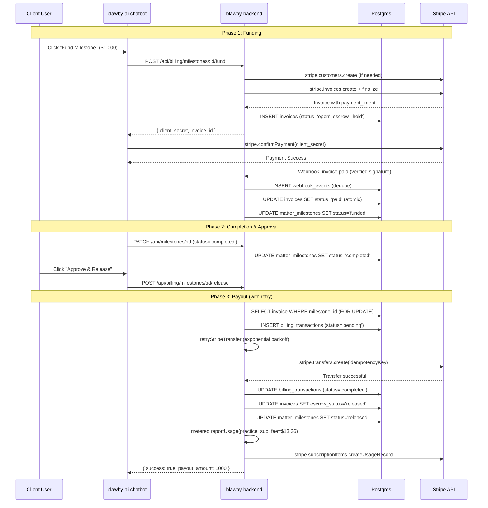
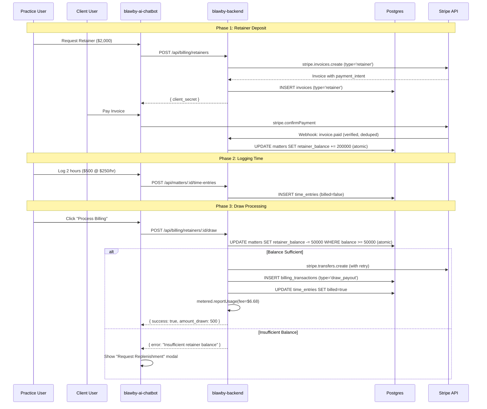

# Billing System Implementation Plan
## Team-Specific Issue Breakdown

**Document Version**: 3.0 (Production-Ready)  
**Last Updated**: 2024  
**Status**: ✅ Ready for Implementation (Security Hardened)

---

## PROJECT OVERVIEW

### Repositories & Responsibilities

| Repository | Tech Stack | Team | Purpose |
|------------|-----------|------|---------|
| `blawby-app` | PHP/Laravel | Backend (Legacy) | **SOURCE** - Extract billing logic, deprecate after migration |
| `blawby-backend` | Node/TypeScript/Drizzle | Backend | **TARGET** - Implement new billing module |
| `blawby-ai-chatbot` | Preact/TypeScript | Frontend | **UI** - Build payment/approval interfaces |

### Architecture Decision: Decoupled Fee via Metered Billing

**FINAL DECISION** (No alternatives):

```
Client Payment Flow (with Pre-Payout Controls):
1. Client pays $1,000 to Platform
   - Funds held in escrow until cleared
   - Practice payment method validated and tokenized with backup sources

2. Platform transfers $1,000 to Practice (full amount)
   CONDITIONAL ON:
   - Cleared funds/escrow complete (no chargebacks pending)
   - Practice subscription in good standing
   - Successful charge capture for metered fees OR pre-funded balance available
   - Credit hold period elapsed (configurable, e.g., 3-7 days for high-risk)

3. Platform reports $13.36 usage to Practice's metered subscription
   - Validates Practice has active payment method before payout
   - Implements automated dunning for failed metered-fee settlements
   - Escalating actions: email → service degradation → hold future payouts

4. Stripe bills Practice $13.36 + Monthly Sub at end of billing period
   - If payment fails: hold/reverse pending transfers
   - Automated retry with exponential backoff
   - Manual review queue for chronic failures

WHY: Consolidated billing for Practice (one invoice from Stripe)
RISK: Practice could fail to pay monthly bill after receiving payout
ENHANCED MITIGATION:
  - Pre-validate payment methods with $0.50 authorization test
  - Require backup payment source for high-volume Practices
  - Credit hold/escrow period for new Practices (first 30 days)
  - Automated dunning with escalating service restrictions
  - Hold/reversal triggers if subscription payment fails
  - Weekly reconciliation of metered fees vs collected payments
```

**Fee Calculation** (from verified legacy code):
- NOT a fixed 10%
- Formula: `Payout Amount × 0.013336` (1.33% of payout)
- Configured in `ApplicationSettings` as `payout.fee_percentage`
- New system will use same configurable approach

---

## SEQUENCE DIAGRAMS

### Milestone Escrow Flow



### Retainer Draw Flow



---

## BACKEND TEAM ISSUES

### Epic 1: Database Schema Migration

**Owner**: Backend Team  
**Estimated Time**: 1 day

#### Issue BE-1.1: Create Invoices Table (with Constraints)
**Priority**: P0 (Blocking)  
**Migration Source**: `blawby-app/database/migrations/2024_06_27_170448_create_invoice_table.php`

**Task**:
1. Create `src/modules/billing/database/schema/invoices.schema.ts`
2. Port fields from PHP migration with enhancements
3. Add CHECK constraints for data integrity

**Schema**:
```typescript
export const invoices = pgTable('invoices', {
  id: uuid('id').primaryKey().defaultRandom(),
  stripe_invoice_id: text('stripe_invoice_id').unique().notNull(),
  stripe_payment_intent_id: text('stripe_payment_intent_id'),
  organization_id: uuid('organization_id').references(() => organizations.id).notNull(),
  matter_id: uuid('matter_id').references(() => matters.id).notNull(),
  milestone_id: uuid('milestone_id').references(() => matterMilestones.id),
  customer_id: uuid('customer_id').references(() => userDetails.id).notNull(),
  amount_due: integer('amount_due').notNull(),
  amount_paid: integer('amount_paid').default(0).notNull(),
  amount_remaining: integer('amount_remaining').notNull(),
  currency: varchar('currency', { length: 3 }).default('usd').notNull(),
  application_fee_amount: integer('application_fee_amount').default(0).notNull(),
  status: varchar('status', { length: 20 }).default('draft').notNull(),
  escrow_status: varchar('escrow_status', { length: 20 }).default('none').notNull(),
  invoice_type: varchar('invoice_type', { length: 20 }).notNull(),
  due_date: timestamp('due_date', { withTimezone: true }),
  paid_at: timestamp('paid_at', { withTimezone: true }),
  created_at: timestamp('created_at', { withTimezone: true }).defaultNow().notNull(),
  updated_at: timestamp('updated_at', { withTimezone: true }).defaultNow().notNull(),
});
```

**Migration SQL**:
```sql
CREATE TABLE invoices (
  id UUID PRIMARY KEY DEFAULT gen_random_uuid(),
  stripe_invoice_id TEXT UNIQUE NOT NULL,
  stripe_payment_intent_id TEXT,
  organization_id UUID NOT NULL REFERENCES organizations(id),
  matter_id UUID NOT NULL REFERENCES matters(id),
  milestone_id UUID REFERENCES matter_milestones(id),
  customer_id UUID NOT NULL REFERENCES user_details(id),
  amount_due INTEGER NOT NULL,
  amount_paid INTEGER NOT NULL DEFAULT 0,
  amount_remaining INTEGER NOT NULL,
  currency VARCHAR(3) NOT NULL DEFAULT 'usd',
  application_fee_amount INTEGER NOT NULL DEFAULT 0,
  status VARCHAR(20) NOT NULL DEFAULT 'draft',
  escrow_status VARCHAR(20) NOT NULL DEFAULT 'none',
  invoice_type VARCHAR(20) NOT NULL,
  due_date TIMESTAMPTZ,
  paid_at TIMESTAMPTZ,
  created_at TIMESTAMPTZ NOT NULL DEFAULT NOW(),
  updated_at TIMESTAMPTZ NOT NULL DEFAULT NOW()
);

-- Indexes
CREATE INDEX idx_invoices_matter_id ON invoices(matter_id);
CREATE INDEX idx_invoices_milestone_id ON invoices(milestone_id);
CREATE INDEX idx_invoices_status_escrow ON invoices(status, escrow_status);

-- CHECK Constraints for Data Integrity
ALTER TABLE invoices 
ADD CONSTRAINT chk_invoices_amount_due_positive 
CHECK (amount_due >= 0);

ALTER TABLE invoices 
ADD CONSTRAINT chk_invoices_amount_paid_positive 
CHECK (amount_paid >= 0);

ALTER TABLE invoices 
ADD CONSTRAINT chk_invoices_amount_remaining_positive 
CHECK (amount_remaining >= 0);

ALTER TABLE invoices 
ADD CONSTRAINT chk_invoices_application_fee_positive 
CHECK (application_fee_amount >= 0);

ALTER TABLE invoices 
ADD CONSTRAINT chk_invoices_amount_consistency 
CHECK (amount_paid + amount_remaining = amount_due);

ALTER TABLE invoices 
ADD CONSTRAINT chk_invoices_status 
CHECK (status IN ('draft', 'open', 'paid', 'void', 'uncollectible'));

ALTER TABLE invoices 
ADD CONSTRAINT chk_invoices_escrow_status 
CHECK (escrow_status IN ('none', 'held', 'released'));

ALTER TABLE invoices 
ADD CONSTRAINT chk_invoices_type 
CHECK (invoice_type IN ('milestone', 'retainer'));

COMMENT ON TABLE invoices IS 'Tracks all billing invoices with data integrity constraints';
COMMENT ON CONSTRAINT chk_invoices_amount_consistency ON invoices IS 'Ensures amount_paid + amount_remaining = amount_due';
```

**Acceptance Criteria**:
- [ ] Migration runs successfully
- [ ] All CHECK constraints enforced
- [ ] Cannot insert negative amounts
- [ ] Cannot insert invalid enum values
- [ ] Amount consistency enforced
- [ ] Foreign keys validated
- [ ] Can insert/query test invoice

---

#### Issue BE-1.2: Create Billing Transactions Table
**Priority**: P0 (Blocking)  
**Source**: NEW (no legacy equivalent)

**Task**:
Create audit log for all transfers to Practice accounts.

**Schema**:
```typescript
export const billingTransactions = pgTable('billing_transactions', {
  id: uuid('id').primaryKey().defaultRandom(),
  invoice_id: uuid('invoice_id').references(() => invoices.id).notNull(),
  stripe_transfer_id: text('stripe_transfer_id').unique().notNull(),
  amount: integer('amount').notNull(),
  destination_account_id: text('destination_account_id').notNull(),
  type: varchar('type', { length: 20 }).default('payout').notNull(),
  status: varchar('status', { length: 20 }).default('pending').notNull(),
  retry_count: integer('retry_count').default(0).notNull(),
  last_error: text('last_error'),
  created_at: timestamp('created_at').defaultNow().notNull(),
  completed_at: timestamp('completed_at'),
});
```

**Migration SQL**:
```sql
CREATE TABLE billing_transactions (
  id UUID PRIMARY KEY DEFAULT gen_random_uuid(),
  invoice_id UUID NOT NULL REFERENCES invoices(id),
  stripe_transfer_id TEXT UNIQUE NOT NULL,
  amount INTEGER NOT NULL,
  destination_account_id TEXT NOT NULL,
  type VARCHAR(20) NOT NULL DEFAULT 'payout',
  status VARCHAR(20) NOT NULL DEFAULT 'pending',
  retry_count INTEGER NOT NULL DEFAULT 0,
  last_error TEXT,
  created_at TIMESTAMPTZ NOT NULL DEFAULT NOW(),
  completed_at TIMESTAMPTZ
);

CREATE INDEX idx_billing_transactions_invoice_id ON billing_transactions(invoice_id);
CREATE INDEX idx_billing_transactions_status ON billing_transactions(status) WHERE status = 'pending';

ALTER TABLE billing_transactions 
ADD CONSTRAINT chk_billing_transactions_amount_positive 
CHECK (amount >= 0);

ALTER TABLE billing_transactions 
ADD CONSTRAINT chk_billing_transactions_status 
CHECK (status IN ('pending', 'completed', 'failed'));

ALTER TABLE billing_transactions 
ADD CONSTRAINT chk_billing_transactions_type 
CHECK (type IN ('payout', 'draw_payout', 'refund', 'reversal'));
```

**Acceptance Criteria**:
- [ ] Migration runs successfully
- [ ] Can insert test transaction
- [ ] Foreign key to invoices works
- [ ] Retry tracking enabled

---

#### Issue BE-1.3: Add Retainer Balance to Matters Table (with Constraint)
**Priority**: P0 (Blocking)  
**Source**: NEW (no legacy equivalent)

**Task**:
Add column to track current retainer balance per matter with non-negative constraint.

**Migration SQL**:
```sql
ALTER TABLE matters 
ADD COLUMN retainer_balance INTEGER NOT NULL DEFAULT 0;

ALTER TABLE matters 
ADD CONSTRAINT chk_matters_retainer_balance_nonnegative 
CHECK (retainer_balance >= 0);

COMMENT ON COLUMN matters.retainer_balance IS 'Current retainer balance in cents (USD) - cannot be negative';

CREATE INDEX idx_matters_retainer_balance ON matters(retainer_balance) WHERE retainer_balance > 0;
```

**Acceptance Criteria**:
- [ ] Column added successfully
- [ ] Default value is 0
- [ ] Cannot set negative balance
- [ ] Can update balance via SQL
- [ ] Index created for performance

---

#### Issue BE-1.4: Create Webhook Events Table (for Idempotency)
**Priority**: P0 (Blocking)  
**Source**: NEW (security requirement)

**Task**:
Create table to track processed webhook events and prevent duplicate processing.

**Migration SQL**:
```sql
CREATE TABLE webhook_events (
  id UUID PRIMARY KEY DEFAULT gen_random_uuid(),
  event_id TEXT NOT NULL,
  event_type TEXT NOT NULL,
  processed_at TIMESTAMPTZ NOT NULL DEFAULT NOW(),
  payload JSONB,
  UNIQUE(event_id, event_type)
);

CREATE INDEX idx_webhook_events_type ON webhook_events(event_type);
CREATE INDEX idx_webhook_events_processed_at ON webhook_events(processed_at);

COMMENT ON TABLE webhook_events IS 'Idempotency log for Stripe webhooks - prevents duplicate processing';
```

**Acceptance Criteria**:
- [ ] Table created successfully
- [ ] Unique constraint on (event_id, event_type)
- [ ] Can insert test events
- [ ] Duplicate insert fails with unique violation

---

### Epic 2: Service Layer Migration

**Owner**: Backend Team  
**Estimated Time**: 3 days

#### Issue BE-2.1: Port Invoice Creation Logic
**Priority**: P0 (Blocking)  
**Migration Source**: `blawby-app/app/Services/StripeInvoiceService.php`

**File**: `src/modules/billing/services/invoice-generator.service.ts`

**Implementation**:
```typescript
import Stripe from 'stripe';

export class InvoiceGeneratorService {
  async generateMilestoneInvoice(params: {
    milestoneId: string;
    userId: string;
    organizationId: string;
  }) {
    // 1. Fetch milestone details
    const milestone = await this.getMilestone(params.milestoneId);
    
    // 2. Get or create Stripe customer (Platform account)
    const customerId = await this.customerService.getOrCreatePlatformCustomer(params.userId);
    
    // 3. Calculate application fee (1.33% of payout)
    const feePercentage = await this.getConfiguredFeePercentage();
    const applicationFee = Math.round(milestone.amount * feePercentage);
    
    // 4. Create Stripe invoice
    const stripeInvoice = await stripe.invoices.create({
      customer: customerId,
      collection_method: 'send_invoice',
      days_until_due: 0,
      auto_advance: true,
      metadata: {
        milestone_id: params.milestoneId,
        matter_id: milestone.matter_id,
        organization_id: params.organizationId,
      },
    });
    
    // 5. Add line item
    await stripe.invoiceItems.create({
      customer: customerId,
      invoice: stripeInvoice.id,
      amount: milestone.amount,
      currency: 'usd',
      description: milestone.description || 'Milestone payment',
    });
    
    // 6. Finalize
    const finalizedInvoice = await stripe.invoices.finalizeInvoice(stripeInvoice.id);
    
    // 7. Extract client_secret with type safety
    let clientSecret: string | undefined;
    if (finalizedInvoice.payment_intent) {
      if (typeof finalizedInvoice.payment_intent === 'string') {
        // PaymentIntent ID only - need to fetch
        const paymentIntent = await stripe.paymentIntents.retrieve(
          finalizedInvoice.payment_intent
        );
        clientSecret = paymentIntent.client_secret || undefined;
      } else if (typeof finalizedInvoice.payment_intent === 'object') {
        // Full PaymentIntent object
        const pi = finalizedInvoice.payment_intent as Stripe.PaymentIntent;
        clientSecret = pi.client_secret || undefined;
      }
    }
    
    if (!clientSecret) {
      throw new Error('Failed to retrieve payment intent client secret');
    }
    
    // 8. Store in DB
    const [dbInvoice] = await db.insert(invoices).values({
      stripe_invoice_id: finalizedInvoice.id,
      stripe_payment_intent_id: typeof finalizedInvoice.payment_intent === 'string' 
        ? finalizedInvoice.payment_intent 
        : (finalizedInvoice.payment_intent as Stripe.PaymentIntent)?.id,
      organization_id: params.organizationId,
      matter_id: milestone.matter_id,
      milestone_id: params.milestoneId,
      customer_id: params.userId,
      amount_due: milestone.amount,
      amount_paid: 0,
      amount_remaining: milestone.amount,
      application_fee_amount: applicationFee,
      status: 'open',
      escrow_status: 'held',
      invoice_type: 'milestone',
    }).returning();
    
    return {
      invoice: dbInvoice,
      clientSecret,
    };
  }
  
  private async getConfiguredFeePercentage(): Promise<number> {
    // Port from ApplicationSettings::getValue('payout.fee_percentage', 1.3336)
    // Convert to decimal: 1.3336 / 100 = 0.013336
    return 0.013336;
  }
}
```

**Acceptance Criteria**:
- [ ] Service creates Stripe invoice
- [ ] Invoice stored in database
- [ ] Client secret extracted with type safety
- [ ] Fee calculated correctly (1.33%)
- [ ] Unit tests pass

---

#### Issue BE-2.2: Port Transfer/Payout Logic (with Retry & Transactions)
**Priority**: P0 (Blocking)  
**Migration Source**: `blawby-app/app/Services/StripeTransfersService.php`

**File**: `src/modules/billing/services/escrow.service.ts`

**Helper Function** (Add to utils):
```typescript
// src/shared/utils/stripe-retry.ts
import Stripe from 'stripe';

interface RetryOptions {
  maxRetries?: number;
  initialDelayMs?: number;
  maxDelayMs?: number;
  timeoutMs?: number;
}

export async function retryStripeTransfer(
  transferFn: () => Promise<Stripe.Transfer>,
  idempotencyKey: string,
  context: {
    invoice_id: string;
    invoice_amount_paid: number;
    invoice_currency: string;
    invoice_matter_id: string;
    destination_account_id: string;
  },
  options: RetryOptions = {}
): Promise<Stripe.Transfer> {
  const {
    maxRetries = 3,
    initialDelayMs = 1000,
    maxDelayMs = 30000,
    timeoutMs = 60000,
  } = options;
  
  let lastError: Error | undefined;
  
  for (let attempt = 0; attempt <= maxRetries; attempt++) {
    try {
      // Create timeout promise
      const timeoutPromise = new Promise<never>((_, reject) => {
        setTimeout(() => reject(new Error('Stripe transfer timeout')), timeoutMs);
      });
      
      // Race between transfer and timeout
      const transfer = await Promise.race([
        transferFn(),
        timeoutPromise,
      ]);
      
      return transfer;
    } catch (error) {
      lastError = error as Error;
      const isRetriable = isRetriableStripeError(error);
      
      // Log attempt
      console.error(`Stripe transfer attempt ${attempt + 1}/${maxRetries + 1} failed:`, {
        error: lastError.message,
        isRetriable,
        context,
        idempotencyKey,
      });
      
      // Don't retry non-retriable errors
      if (!isRetriable || attempt === maxRetries) {
        break;
      }
      
      // Exponential backoff with jitter
      const delay = Math.min(
        initialDelayMs * Math.pow(2, attempt) + Math.random() * 1000,
        maxDelayMs
      );
      await new Promise(resolve => setTimeout(resolve, delay));
    }
  }
  
  // All retries failed - log comprehensive context
  console.error('Stripe transfer failed after all retries:', {
    invoice_id: context.invoice_id,
    invoice_amount_paid: context.invoice_amount_paid,
    invoice_currency: context.invoice_currency,
    invoice_matter_id: context.invoice_matter_id,
    destination_account_id: context.destination_account_id,
    retry_attempts: maxRetries + 1,
    final_error: lastError?.message,
    idempotencyKey,
  });
  
  throw lastError || new Error('Transfer failed for unknown reason');
}

function isRetriableStripeError(error: any): boolean {
  if (!error) return false;
  
  // Network/timeout errors
  if (error.code === 'ETIMEDOUT' || error.code === 'ECONNRESET') {
    return true;
  }
  
  // Stripe rate limit
  if (error.type === 'StripeRateLimitError') {
    return true;
  }
  
  // Stripe API errors (5xx)
  if (error.type === 'StripeAPIError' || error.statusCode >= 500) {
    return true;
  }
  
  return false;
}
```

**Main Service**:
```typescript
// src/modules/billing/services/escrow.service.ts
export class EscrowService {
  constructor(
    private meteredService: MeteredProductsService,
    private permissionService: PermissionService,
    private jobQueue: Queue
  ) {}

  async releaseFunds(params: {
    milestoneId: string;
    userId: string;
  }) {
    // 1. Transaction: Fetch and lock invoice, create pending transaction
    const { invoice, matter, milestone, transactionId } = await db.transaction(async (tx) => {
      // Fetch invoice with lock
      const [inv] = await tx.select()
        .from(invoices)
        .where(
          and(
            eq(invoices.milestone_id, params.milestoneId),
            eq(invoices.status, 'paid'),
            eq(invoices.escrow_status, 'held')
          )
        )
        .for('update')
        .limit(1);
        
      if (!inv) {
        throw new Error('No paid invoice found in escrow for this milestone');
      }
      
      // Fetch milestone for ownership verification
      const [ms] = await tx.select()
        .from(matterMilestones)
        .where(eq(matterMilestones.id, params.milestoneId))
        .limit(1);
        
      if (!ms) {
        throw new Error('Milestone not found');
      }
      
      // Enhanced authorization checks
      // 1. Verify milestone belongs to invoice
      if (inv.milestone_id !== ms.id) {
        throw new Error('Milestone does not match invoice');
      }
      
      // 2. Verify user is the client who paid
      if (inv.customer_id !== params.userId) {
        throw new Error('Unauthorized: Only the client who paid can release funds');
      }
      
      // 3. Verify milestone ownership (client_id or owner_id on milestone)
      if (ms.client_id !== params.userId && ms.owner_id !== params.userId) {
        throw new Error('Unauthorized: User does not own this milestone');
      }
      
      // Explicit role/permission check
      const hasPermission = await this.permissionService.userHasPermission(params.userId, inv.matter_id, 'release_funds');
      if (!hasPermission) {
        throw new Error('Unauthorized: User missing release_funds permission');
      }
      
      // Fetch matter for connected account
      const [mat] = await tx.select()
        .from(matters)
        .where(eq(matters.id, inv.matter_id))
        .limit(1);
        
      if (!mat || !mat.stripe_connected_account_id) {
        throw new Error('Practice does not have a connected Stripe account');
      }
      
      // Create pending transaction record
      const [transaction] = await tx.insert(billingTransactions).values({
        invoice_id: inv.id,
        stripe_transfer_id: `pending-${inv.id}`, // Temporary, will update after transfer
        amount: inv.amount_paid,
        destination_account_id: mat.stripe_connected_account_id,
        type: 'payout',
        status: 'pending',
        retry_count: 0,
      }).returning();
      
      return { invoice: inv, matter: mat, milestone: ms, transactionId: transaction.id };
    });
    
    // 2. Perform Stripe transfer (outside transaction, with retry)
    let transfer: Stripe.Transfer;
    try {
      transfer = await retryStripeTransfer(
        () => stripe.transfers.create({
          amount: invoice.amount_paid,
          currency: invoice.currency,
          destination: matter.stripe_connected_account_id!,
          metadata: {
            invoice_id: invoice.id,
            milestone_id: params.milestoneId,
            matter_id: invoice.matter_id,
          },
        }, {
          idempotencyKey: `release-${invoice.id}`,
        }),
        `release-${invoice.id}`,
        {
          invoice_id: invoice.id,
          invoice_amount_paid: invoice.amount_paid,
          invoice_currency: invoice.currency,
          invoice_matter_id: invoice.matter_id,
          destination_account_id: matter.stripe_connected_account_id!,
        }
      );
    } catch (error) {
      // Mark transaction as failed
      await db.update(billingTransactions)
        .set({ 
          status: 'failed',
          last_error: error instanceof Error ? error.message : 'Unknown error',
        })
        .where(eq(billingTransactions.id, transactionId));
      
      // Enqueue to background job for automated retry
      try {
        await this.jobQueue.add('retry_transfer', {
          transfer_params: {
            amount: invoice.amount_paid,
            currency: invoice.currency,
            destination: matter.stripe_connected_account_id,
            metadata: {
              invoice_id: invoice.id,
              milestone_id: params.milestoneId,
              matter_id: invoice.matter_id,
            }
          },
          idempotency_key: `release-${invoice.id}`,
          context: {
            invoice_id: invoice.id,
            error_message: error instanceof Error ? error.message : 'Unknown error'
          }
        }, {
          attempts: 5,
          backoff: {
            type: 'exponential',
            delay: 1000
          }
        });

        // Abort current flow but treat as "handled" via queue
        throw new Error('Transfer failed - queued for background retry');
      } catch (queueError) {
        // Only surface original error if enqueue fails
        throw error;
      }
    }
    
    // 3. Transaction: Update to completed state
    await db.transaction(async (tx) => {
      // Update transaction with actual transfer ID and status
      await tx.update(billingTransactions)
        .set({
          stripe_transfer_id: transfer.id,
          status: 'completed',
          completed_at: new Date(),
        })
        .where(eq(billingTransactions.id, transactionId));
      
      // Update invoice escrow status
      await tx.update(invoices)
        .set({ 
          escrow_status: 'released',
          updated_at: new Date(),
        })
        .where(eq(invoices.id, invoice.id));
      
      // Update milestone status
      await tx.update(matterMilestones)
        .set({ 
          status: 'released',
          updated_at: new Date(),
        })
        .where(eq(matterMilestones.id, params.milestoneId));
    });
    
    // 4. Report metered usage (after successful DB finalization)
    try {
      await this.meteredService.reportMeteredUsage({
        organizationId: invoice.organization_id,
        meteredType: 'payout_fee',
        quantity: invoice.application_fee_amount,
      });
    } catch (error) {
      console.error('Failed to report metered usage:', error);
      // Don't fail the release, but log for manual reconciliation
    }
    
    return { transfer, payoutAmount: invoice.amount_paid };
  }
}
```

**Acceptance Criteria**:
- [ ] Transfers full payout amount (no deduction)
- [ ] Enhanced authorization checks (customer + milestone ownership)
- [ ] Uses retry helper with exponential backoff
- [ ] Transaction boundaries prevent partial commits
- [ ] Idempotency prevents double-payouts
- [ ] Failed transfers logged with full context
- [ ] Updates all statuses correctly
- [ ] Unit tests pass

---

#### Issue BE-2.3: Implement Customer Management Service
**Priority**: P0 (Blocking)  
**Source**: NEW (no legacy equivalent)

**File**: `src/modules/billing/services/customer.service.ts`

**Implementation**:
```typescript
export class CustomerService {
  async getOrCreatePlatformCustomer(userId: string): Promise<string> {
    // 1. Check if user already has stripe_customer_id
    const [user] = await db.select()
      .from(users)
      .where(eq(users.id, userId))
      .limit(1);
      
    if (user?.stripe_customer_id) {
      return user.stripe_customer_id;
    }
    
    // 2. Get user details
    const [userDetail] = await db.select()
      .from(userDetails)
      .where(eq(userDetails.user_id, userId))
      .limit(1);
    
    // 3. Create Stripe customer
    const customer = await stripe.customers.create({
      email: userDetail?.email || undefined,
      name: userDetail?.name || undefined,
      metadata: {
        user_id: userId,
        created_by: 'blawby-billing',
      },
    });
    
    // 4. Store customer ID
    await db.update(users)
      .set({ stripe_customer_id: customer.id })
      .where(eq(users.id, userId));
    
    return customer.id;
  }
}
```

**Database Change Required**:
```sql
ALTER TABLE users 
ADD COLUMN stripe_customer_id TEXT;

CREATE UNIQUE INDEX idx_users_stripe_customer_id 
ON users(stripe_customer_id) 
WHERE stripe_customer_id IS NOT NULL;
```

**Acceptance Criteria**:
- [ ] Creates Stripe customer if missing
- [ ] Returns existing customer if present
- [ ] Stores customer ID in database
- [ ] Unit tests pass

---

#### Issue BE-2.4: Implement Retainer Draw Service (with Atomic Balance Check)
**Priority**: P1 (High)  
**Source**: NEW (no legacy equivalent)

**File**: `src/modules/billing/services/retainer.service.ts`

**Implementation**:
```typescript
export class RetainerService {
  constructor(
    private meteredService: MeteredProductsService
  ) {}

  async processDrawFromRetainer(params: {
    matterId: string;
    organizationId: string;
    timeEntryIds?: string[]; // Optional: specific entries to bill
  }) {
    // Generate deterministic idempotency key
    const idempotencyKey = this.generateDrawIdempotencyKey(params);
    
    // 1. Get unbilled time entries
    const whereClause = params.timeEntryIds 
      ? and(
          eq(timeEntries.matter_id, params.matterId),
          eq(timeEntries.billed, false),
          inArray(timeEntries.id, params.timeEntryIds)
        )
      : and(
          eq(timeEntries.matter_id, params.matterId),
          eq(timeEntries.billed, false)
        );
    
    const entries = await db.select()
      .from(timeEntries)
      .where(whereClause);
    
    if (entries.length === 0) {
      throw new Error('No unbilled time entries found');
    }
    
    // 2. Calculate total amount
    const totalAmount = entries.reduce((sum, entry) => sum + entry.amount, 0);
    
    // 3. Calculate fee
    const feePercentage = 0.013336;
    const applicationFee = Math.round(totalAmount * feePercentage);
    
    // 4. ATOMIC: Check balance and deduct in single transaction
    const result = await db.transaction(async (tx) => {
      // Single atomic update that decrements only if sufficient balance
      const [updatedMatter] = await tx.update(matters)
        .set({
          retainer_balance: sql`retainer_balance - ${totalAmount}`,
          updated_at: new Date(),
        })
        .where(
          and(
            eq(matters.id, params.matterId),
            sql`retainer_balance >= ${totalAmount}` // Atomic check
          )
        )
        .returning();
      
      if (!updatedMatter) {
        throw new Error('Insufficient retainer balance');
      }
      
      // Mark time entries as billed in same transaction
      await tx.update(timeEntries)
        .set({ billed: true, billed_at: new Date() })
        .where(
          and(
            eq(timeEntries.matter_id, params.matterId),
            inArray(timeEntries.id, entries.map(e => e.id))
          )
        );
      
      return updatedMatter;
    });
    
    // 5. Transfer to Practice (with retry)
    const transfer = await retryStripeTransfer(
      () => stripe.transfers.create({
        amount: totalAmount,
        currency: 'usd',
        destination: result.stripe_connected_account_id,
        metadata: {
          matter_id: params.matterId,
          type: 'retainer_draw',
          time_entry_count: entries.length,
        },
      }, {
        idempotencyKey,
      }),
      idempotencyKey,
      {
        invoice_id: `draw-${params.matterId}`,
        invoice_amount_paid: totalAmount,
        invoice_currency: 'usd',
        invoice_matter_id: params.matterId,
        destination_account_id: result.stripe_connected_account_id,
      }
    );
    
    // 6. Record transaction
    await db.insert(billingTransactions).values({
      invoice_id: null, // No invoice for retainer draws
      stripe_transfer_id: transfer.id,
      amount: totalAmount,
      destination_account_id: result.stripe_connected_account_id,
      type: 'draw_payout',
      status: 'completed',
      completed_at: new Date(),
    });
    
    // 7. Report metered usage
    await this.meteredService.reportMeteredUsage({
      organizationId: params.organizationId,
      meteredType: 'payout_fee',
      quantity: applicationFee,
    });
    
    return { transfer, totalAmount, applicationFee };
  }
  
  private generateDrawIdempotencyKey(params: {
    matterId: string;
    timeEntryIds?: string[];
  }): string {
    // Create deterministic hash from request parameters
    const crypto = require('crypto');
    const payload = {
      matter_id: params.matterId,
      time_entry_ids: params.timeEntryIds?.sort() || [],
    };
    const hash = crypto
      .createHash('sha256')
      .update(JSON.stringify(payload))
      .digest('hex')
      .substring(0, 16);
    
    return `draw-${params.matterId}-${hash}`;
  }
}
```

**Acceptance Criteria**:
- [ ] Atomic balance check and deduction
- [ ] No race conditions on balance updates
- [ ] Deterministic idempotency keys
- [ ] Transfers full amount to Practice
- [ ] Reports fee via metered billing
- [ ] Marks time entries as billed
- [ ] Unit tests pass

---

### Epic 3: API Handlers & Routes

**Owner**: Backend Team  
**Estimated Time**: 2 days

#### Issue BE-3.1: Create Billing API Handlers (with Error Handling)
**Priority**: P0 (Blocking)  
**Source**: NEW (no legacy API)

**File**: `src/modules/billing/handlers.ts`

**Endpoints to Implement**:

1. **POST /api/billing/milestones/:id/fund**
```typescript
export async function fundMilestoneHandler(c: Context) {
  try {
    const milestoneId = c.req.param('id');
    const user = c.get('user')!;
    const organizationId = c.get('organizationId')!;
    
    const result = await invoiceGenerator.generateMilestoneInvoice({
      milestoneId,
      userId: user.id,
      organizationId,
    });
    
    return response.created(c, {
      invoice_id: result.invoice.id,
      client_secret: result.clientSecret,
      amount_total: result.invoice.amount_due,
      status: result.invoice.status,
    });
  } catch (error) {
    c.get('logger')?.error('Error funding milestone:', {
      error: error instanceof Error ? error.message : 'Unknown error',
      milestoneId: c.req.param('id'),
      userId: c.get('user')?.id,
    });
    
    return response.internalServerError(c, { 
      message: error instanceof Error ? error.message : 'Failed to create invoice' 
    });
  }
}
```

2. **POST /api/billing/milestones/:id/release**
```typescript
export async function releaseMilestoneHandler(c: Context) {
  try {
    const milestoneId = c.req.param('id');
    const user = c.get('user')!;
    
    const result = await escrowService.releaseFunds({
      milestoneId,
      userId: user.id,
    });
    
    return response.ok(c, {
      transfer_id: result.transfer.id,
      payout_amount: result.payoutAmount,
      status: 'released',
    });
  } catch (error) {
    c.get('logger')?.error('Error releasing funds:', {
      error: error instanceof Error ? error.message : 'Unknown error',
      milestoneId: c.req.param('id'),
      userId: c.get('user')?.id,
    });
    
    if (error instanceof Error && error.message.includes('Unauthorized')) {
      return response.forbidden(c, { message: error.message });
    }
    
    return response.internalServerError(c, { 
      message: error instanceof Error ? error.message : 'Failed to release funds' 
    });
  }
}
```

3. **POST /api/billing/retainers/:matterId/draw**
```typescript
export async function drawFromRetainerHandler(c: Context) {
  try {
    const matterId = c.req.param('matterId');
    const organizationId = c.get('organizationId')!;
    const body = await c.req.json();
    
    const result = await retainerService.processDrawFromRetainer({
      matterId,
      organizationId,
      timeEntryIds: body.timeEntryIds, // Optional
    });
    
    return response.ok(c, {
      transfer_id: result.transfer.id,
      amount_drawn: result.totalAmount,
      fee_reported: result.applicationFee,
    });
  } catch (error) {
    c.get('logger')?.error('Error processing retainer draw:', {
      error: error instanceof Error ? error.message : 'Unknown error',
      matterId: c.req.param('matterId'),
    });
    
    if (error instanceof Error && error.message.includes('Insufficient')) {
      return response.badRequest(c, { message: error.message });
    }
    
    return response.internalServerError(c, { 
      message: error instanceof Error ? error.message : 'Failed to process draw' 
    });
  }
}
```

4. **GET /api/billing/invoices** (with Pagination)
```typescript
export async function listInvoicesHandler(c: Context) {
  try {
    const organizationId = c.get('organizationId')!;
    
    // Parse pagination parameters
    const page = parseInt(c.req.query('page') || '1', 10);
    const pageSize = Math.min(
      parseInt(c.req.query('pageSize') || '50', 10),
      100 // Max 100 per page
    );
    
    if (page < 1 || pageSize < 1) {
      return response.badRequest(c, { 
        message: 'Invalid pagination parameters' 
      });
    }
    
    const offset = (page - 1) * pageSize;
    
    // Get total count
    const [{ count }] = await db.select({ count: sql<number>`count(*)` })
      .from(invoices)
      .where(eq(invoices.organization_id, organizationId));
    
    // Get paginated invoices
    const invoiceList = await db.select()
      .from(invoices)
      .where(eq(invoices.organization_id, organizationId))
      .orderBy(desc(invoices.created_at))
      .limit(pageSize)
      .offset(offset);
    
    return response.ok(c, {
      invoices: invoiceList,
      pagination: {
        page,
        pageSize,
        total: count,
        totalPages: Math.ceil(count / pageSize),
      },
    });
  } catch (error) {
    c.get('logger')?.error('Error listing invoices:', {
      error: error instanceof Error ? error.message : 'Unknown error',
    });
    
    return response.internalServerError(c, { 
      message: 'Failed to list invoices' 
    });
  }
}
```

**Acceptance Criteria**:
- [ ] All handlers have try-catch error handling
- [ ] Errors logged with context
- [ ] Responses wrapped using `response` utils
- [ ] Proper HTTP status codes (400, 403, 500)
- [ ] Pagination implemented with limits
- [ ] Integration tests pass

---

### Epic 4: Webhook Handlers (with Security)

**Owner**: Backend Team  
**Estimated Time**: 1 day

#### Issue BE-4.1: Implement Stripe Webhook Handler (with Signature Verification & Idempotency)
**Priority**: P0 (Blocking)  
**Source**: Partial migration from `blawby-app/app/Http/Controllers/StripeWebhookController.php`

**File**: `src/modules/billing/webhooks/stripe.webhook.ts`

**Main Webhook Handler**:
```typescript
export async function stripeWebhookHandler(c: Context) {
  // 1. Get raw body and signature
  const rawBody = await c.req.text();
  const signature = c.req.header('stripe-signature');
  
  if (!signature) {
    c.get('logger')?.warn('Webhook rejected: missing signature');
    return c.json({ error: 'Missing stripe-signature header' }, 401);
  }
  
  // 2. Verify signature
  let event: Stripe.Event;
  try {
    event = stripe.webhooks.constructEvent(
      rawBody,
      signature,
      process.env.STRIPE_WEBHOOK_SECRET!
    );
  } catch (error) {
    c.get('logger')?.warn('Webhook rejected: invalid signature', {
      error: error instanceof Error ? error.message : 'Unknown error',
    });
    return c.json({ error: 'Invalid signature' }, 401);
  }
  
  // 3. Process event
  try {
    await handleStripeEvent(event);
    return c.json({ received: true }, 200);
  } catch (error) {
    c.get('logger')?.error('Webhook processing error:', {
      eventId: event.id,
      eventType: event.type,
      error: error instanceof Error ? error.message : 'Unknown error',
    });
    return c.json({ error: 'Processing failed' }, 500);
  }
}

async function handleStripeEvent(event: Stripe.Event) {
  switch (event.type) {
    case 'invoice.paid':
      await handleInvoicePaid(event);
      break;
      
    case 'invoice.payment_failed':
      await handleInvoicePaymentFailed(event);
      break;
      
    case 'transfer.created':
      // Optional: Track transfer creation
      break;
      
    case 'transfer.failed':
      await handleTransferFailed(event);
      break;
      
    default:
      console.log(`Unhandled event type: ${event.type}`);
  }
}
```

**Invoice Paid Handler (with Idempotency)**:
```typescript
async function handleInvoicePaid(event: Stripe.Event) {
  const stripeInvoice = event.data.object as Stripe.Invoice;
  
  // Idempotency guard: check if already processed
  await db.transaction(async (tx) => {
    // Try to insert webhook event
    try {
      await tx.insert(webhookEvents).values({
        event_id: event.id,
        event_type: event.type,
        payload: event as any, // Store full payload
      });
    } catch (error) {
      // Unique constraint violation = already processed
      if (error.code === '23505') { // PostgreSQL unique violation
        console.log(`Webhook ${event.id} already processed, skipping`);
        return; // Exit early, no-op
      }
      throw error;
    }
    
    // Fetch invoice from our DB
    const [invoice] = await tx.select()
      .from(invoices)
      .where(eq(invoices.stripe_invoice_id, stripeInvoice.id))
      .limit(1);
      
    if (!invoice) {
      console.error('Invoice not found:', stripeInvoice.id);
      return;
    }
    
    // Update invoice status
    await tx.update(invoices)
      .set({
        status: 'paid',
        amount_paid: stripeInvoice.amount_paid,
        amount_remaining: 0,
        paid_at: new Date(stripeInvoice.status_transitions.paid_at! * 1000),
        updated_at: new Date(),
      })
      .where(eq(invoices.id, invoice.id));
    
    // Update milestone status if applicable
    if (invoice.milestone_id) {
      await tx.update(matterMilestones)
        .set({ 
          status: 'funded',
          updated_at: new Date(),
        })
        .where(eq(matterMilestones.id, invoice.milestone_id));
    }
    
    // Update retainer balance if retainer invoice (ATOMIC)
    if (invoice.invoice_type === 'retainer') {
      await tx.update(matters)
        .set({
          retainer_balance: sql`retainer_balance + ${invoice.amount_paid}`,
          updated_at: new Date(),
        })
        .where(eq(matters.id, invoice.matter_id));
    }
  });
}
```

**Other Handlers**:
```typescript
async function handleInvoicePaymentFailed(event: Stripe.Event) {
  const stripeInvoice = event.data.object as Stripe.Invoice;
  
  // Idempotency guard
  await db.transaction(async (tx) => {
    try {
      await tx.insert(webhookEvents).values({
        event_id: event.id,
        event_type: event.type,
      });
    } catch (error) {
      if (error.code === '23505') return;
      throw error;
    }
    
    await tx.update(invoices)
      .set({
        status: 'open', // Keep open for retry
        updated_at: new Date(),
      })
      .where(eq(invoices.stripe_invoice_id, stripeInvoice.id));
  });
  
  // TODO: Send notification to user about payment failure
}

async function handleTransferFailed(event: Stripe.Event) {
  const stripeTransfer = event.data.object as Stripe.Transfer;
  
  await db.update(billingTransactions)
    .set({ 
      status: 'failed',
      last_error: `Transfer failed: ${stripeTransfer.failure_message || 'Unknown'}`,
    })
    .where(eq(billingTransactions.stripe_transfer_id, stripeTransfer.id));
  
  // Alert administrators
  console.error('Transfer failed:', stripeTransfer);
  // TODO: Send admin alert
}
```

**Acceptance Criteria**:
- [ ] Webhook signature verification implemented
- [ ] Rejects requests with missing/invalid signatures
- [ ] Uses raw body (not parsed JSON) for verification
- [ ] Idempotency via webhook_events table
- [ ] Duplicate events ignored (no-op)
- [ ] All critical events handled
- [ ] Atomic retainer balance updates
- [ ] Error logging for unhandled events
- [ ] Integration tests with Stripe CLI

---

### Epic 5: Testing & Deployment

**Owner**: Backend Team  
**Estimated Time**: 3 days

#### Issue BE-5.1: Unit Tests (Extended)
**Priority**: P1 (High)

**Files to Test**:
- `invoice-generator.service.spec.ts`
- `escrow.service.spec.ts`
- `retainer.service.spec.ts`
- `customer.service.spec.ts`
- `stripe-retry.spec.ts`

**Test Coverage Requirements**:
- [ ] Service methods > 80% coverage
- [ ] Fee calculation accuracy tests
- [ ] Error case handling
- [ ] Idempotency tests
- [ ] Atomic transaction tests
- [ ] Authorization/permission tests

**New Test Categories**:

**Security Testing**:
- [ ] Webhook signature verification (valid/invalid/missing)
- [ ] Authorization bypass attempts (wrong user releasing funds)
- [ ] SQL injection prevention in pagination params
- [ ] Rate limiting on payment endpoints
- [ ] CSRF token validation
- [ ] XSS prevention in error messages

**Load/Performance Testing**:
- [ ] Concurrent payment processing (100 simultaneous invoices)
- [ ] High-volume webhook handling (1000 events/min)
- [ ] Database connection pool under load
- [ ] Stripe API rate limit handling
- [ ] Query performance with 10k+ invoices

**Failure Scenario Testing**:
- [ ] Stripe API timeouts (network failures)
- [ ] Stripe API 5xx errors (transient failures)
- [ ] Database connection failures mid-transaction
- [ ] Partial payment scenarios (race conditions)
- [ ] Double-payment prevention (concurrent release attempts)

**Financial Integrity Testing**:
- [ ] Idempotency across all operations
- [ ] Balance consistency (retainer balance never negative)
- [ ] Amount consistency (amount_paid + amount_remaining = amount_due)
- [ ] No lost updates (concurrent webhook deliveries)
- [ ] Reconciliation: metered fees vs actual transfers

**Test Tooling**:
- Load runner: k6 or Artillery
- Fuzz testing: sqlmap for SQL injection
- Stripe test webhooks: Stripe CLI
- Mock Stripe: stripe-mock for offline testing

**Minimum Acceptance Criteria**:
- [ ] 80% unit test coverage
- [ ] All security tests pass
- [ ] API response time < 200ms (p95)
- [ ] Webhook processing < 500ms (p95)
- [ ] Zero duplicate transfers under load
- [ ] Zero negative balances under concurrent load

---

#### Issue BE-5.2: Integration Tests (Extended)
**Priority**: P1 (High)

**Scenarios to Test**:
- [ ] End-to-end milestone funding flow
- [ ] End-to-end funds release flow (with retry simulation)
- [ ] Retainer draw with sufficient balance
- [ ] Retainer draw with insufficient balance
- [ ] Webhook processing (use Stripe test webhooks)
- [ ] Concurrent release attempts (verify only one succeeds)
- [ ] Transfer retry on transient Stripe failures
- [ ] Idempotency key collision handling

**New Test Categories**:

**Stress Testing**:
- [ ] 1000 concurrent invoice creations
- [ ] 500 concurrent webhook deliveries
- [ ] Database deadlock detection under load
- [ ] Stripe idempotency key reuse patterns

**Chaos Engineering**:
- [ ] Random Stripe API failures (30% failure rate)
- [ ] Random database disconnections
- [ ] Network latency injection (500ms-2000ms)
- [ ] Verify system recovers gracefully

**Data Integrity Tests**:
- [ ] Retainer balance never goes negative
- [ ] Invoices always satisfy amount consistency constraint
- [ ] No orphaned transactions (all have valid invoice_id)
- [ ] Webhook events deduplicated across retries

**Test Data**:
- 1000 test invoices across different states
- 100 test milestones in various stages
- 50 test retainers with varying balances
- Mock Stripe events for all webhook types

**Acceptance Criteria**:
- [ ] All happy path scenarios pass
- [ ] All error scenarios handled gracefully
- [ ] No data corruption under stress
- [ ] System recovers from all injected failures
- [ ] Zero duplicate payments across all tests

---

#### Issue BE-5.3: Database Migration Deployment (with Rollback)
**Priority**: P0 (Blocking)

**Pre-Deployment Checklist**:
- [ ] Full database backup created
- [ ] Backup verified (restore test on staging)
- [ ] Rollback scripts prepared and tested
- [ ] Migration dry-run on production clone
- [ ] CHECK constraints won't violate existing data

**Deployment Steps**:
1. [ ] Create migration files
2. [ ] Test migrations on staging database
3. [ ] Verify CHECK constraints on staging data
4. [ ] Run migrations on production (low-traffic window)
5. [ ] Verify all constraints active
6. [ ] Verify data integrity post-migration
7. [ ] Test rollback script (on clone, not production)
8. [ ] Keep rollback script ready for 24 hours

**Rollback Scripts**:
```sql
-- Rollback invoices table
ALTER TABLE invoices DROP CONSTRAINT IF EXISTS chk_invoices_amount_due_positive;
ALTER TABLE invoices DROP CONSTRAINT IF EXISTS chk_invoices_amount_paid_positive;
ALTER TABLE invoices DROP CONSTRAINT IF EXISTS chk_invoices_amount_remaining_positive;
ALTER TABLE invoices DROP CONSTRAINT IF EXISTS chk_invoices_application_fee_positive;
ALTER TABLE invoices DROP CONSTRAINT IF EXISTS chk_invoices_amount_consistency;
ALTER TABLE invoices DROP CONSTRAINT IF EXISTS chk_invoices_status;
ALTER TABLE invoices DROP CONSTRAINT IF EXISTS chk_invoices_escrow_status;
ALTER TABLE invoices DROP CONSTRAINT IF EXISTS chk_invoices_type;
DROP TABLE IF EXISTS invoices;

-- Rollback billing_transactions table
DROP TABLE IF EXISTS billing_transactions;

-- Rollback webhook_events table
DROP TABLE IF EXISTS webhook_events;

-- Rollback matters retainer_balance
ALTER TABLE matters DROP CONSTRAINT IF EXISTS chk_matters_retainer_balance_nonnegative;
ALTER TABLE matters DROP COLUMN IF EXISTS retainer_balance;

-- Rollback users stripe_customer_id
ALTER TABLE users DROP COLUMN IF EXISTS stripe_customer_id;
```

**Acceptance Criteria**:
- [ ] Migrations run successfully on production
- [ ] All CHECK constraints active
- [ ] No data integrity violations
- [ ] Rollback script tested and ready
- [ ] Backup verified and accessible

---

## FRONTEND TEAM ISSUES

### Epic 6: Stripe Integration

**Owner**: Frontend Team  
**Estimated Time**: 2 days

#### Issue FE-6.1: Install Stripe Dependencies
**Priority**: P0 (Blocking)

**Task**:
```bash
cd blawby-ai-chatbot
npm install @stripe/stripe-js @stripe/react-stripe-js
```

**Environment Variables**:
```env
VITE_STRIPE_PUBLISHABLE_KEY=pk_test_...
```

**Acceptance Criteria**:
- [ ] Dependencies installed
- [ ] Environment variable configured
- [ ] Stripe loads successfully

---

#### Issue FE-6.2: Create Stripe Provider Wrapper
**Priority**: P0 (Blocking)

**File**: `src/shared/providers/StripeProvider.tsx`

```typescript
import { h, ComponentChildren } from 'preact';
import { loadStripe } from '@stripe/stripe-js';

const stripePromise = loadStripe(import.meta.env.VITE_STRIPE_PUBLISHABLE_KEY);

export function StripeProvider({ children }: { children: ComponentChildren }) {
  return children; // Elements provider will be per-component
}
```

**Acceptance Criteria**:
- [ ] Provider created
- [ ] Stripe initializes correctly
- [ ] No console errors

---

### Epic 7: Payment Components

**Owner**: Frontend Team  
**Estimated Time**: 3 days

#### Issue FE-7.1: Create Fund Milestone Modal (with Modal-Friendly Payment Flow)
**Priority**: P0 (Blocking)

**File**: `src/features/billing/components/FundMilestoneModal.tsx`

**Requirements**:
- Uses Stripe Payment Element
- Shows milestone details (name, amount, description)
- Handles payment confirmation without forced redirect
- Shows loading states
- Displays error messages

**Implementation**:
```typescript
import { h } from 'preact';
import { useState, useEffect } from 'preact/hooks';
import { loadStripe } from '@stripe/stripe-js';
import { Elements, PaymentElement, useStripe, useElements } from '@stripe/react-stripe-js';
import { fundMilestone } from '@/shared/lib/apiClient';

const stripePromise = loadStripe(import.meta.env.VITE_STRIPE_PUBLISHABLE_KEY);

function CheckoutForm({ milestone, onSuccess }: any) {
  const stripe = useStripe();
  const elements = useElements();
  const [isProcessing, setIsProcessing] = useState(false);
  const [error, setError] = useState<string | null>(null);

  const handleSubmit = async (e: Event) => {
    e.preventDefault();
    if (!stripe || !elements) return;
    
    setIsProcessing(true);
    setError(null);
    
    try {
      // Confirm payment WITHOUT return_url for modal-friendly flow
      const { error: submitError, paymentIntent } = await stripe.confirmPayment({
        elements,
        redirect: 'if_required', // Only redirect if absolutely necessary (3D Secure)
      });
      
      if (submitError) {
        setError(submitError.message || 'Payment failed');
      } else if (paymentIntent?.status === 'requires_action') {
        // 3D Secure or similar - Stripe will handle redirect automatically
        // User will be redirected and returned to return_url if needed
      } else if (paymentIntent?.status === 'succeeded') {
        // Payment succeeded without redirect
        onSuccess();
      } else {
        setError('Payment is processing. Please wait.');
      }
    } catch (err) {
      setError('An unexpected error occurred');
    } finally {
      setIsProcessing(false);
    }
  };

  return (
    <form onSubmit={handleSubmit}>
      <PaymentElement />
      {error && <div className="text-red-600 mt-2">{error}</div>}
      <button
        type="submit"
        disabled={!stripe || isProcessing}
        className="mt-4 w-full bg-blue-600 text-white py-2 rounded disabled:opacity-50"
      >
        {isProcessing ? 'Processing...' : `Pay $${(milestone.amount / 100).toFixed(2)}`}
      </button>
    </form>
  );
}

export function FundMilestoneModal({ milestone, onSuccess, onCancel }: any) {
  const [clientSecret, setClientSecret] = useState<string | null>(null);
  const [isLoading, setIsLoading] = useState(true);

  useEffect(() => {
    fundMilestone(milestone.id)
      .then(response => setClientSecret(response.client_secret))
      .catch(err => console.error('Failed to create invoice:', err))
      .finally(() => setIsLoading(false));
  }, [milestone.id]);

  if (isLoading) return <div>Loading payment form...</div>;
  if (!clientSecret) return <div>Failed to initialize payment.</div>;

  return (
    <div className="fixed inset-0 bg-black bg-opacity-50 flex items-center justify-center z-50">
      <div className="bg-white p-6 rounded-lg max-w-md w-full">
        <h2 className="text-xl font-bold mb-4">Fund Milestone: {milestone.name}</h2>
        <p className="mb-4">{milestone.description}</p>
        <p className="text-2xl font-bold mb-6">${(milestone.amount / 100).toFixed(2)}</p>
        
        <Elements 
          stripe={stripePromise} 
          options={{ 
            clientSecret,
            appearance: { theme: 'stripe' },
          }}
        >
          <CheckoutForm milestone={milestone} onSuccess={onSuccess} />
        </Elements>
        
        <button onClick={onCancel} className="mt-4 w-full border py-2 rounded">
          Cancel
        </button>
      </div>
    </div>
  );
}
```

**Acceptance Criteria**:
- [ ] Modal displays correctly
- [ ] Payment Element renders
- [ ] Payment processing works in-modal (no forced redirect)
- [ ] 3D Secure redirects only when required
- [ ] Success callback triggered
- [ ] Error states display properly
- [ ] Modal remains open during processing

---

#### Issue FE-7.2: Create Milestone Action Row Component
**Priority**: P0 (Blocking)

**File**: `src/features/matters/components/MilestoneActionRow.tsx`

**Requirements**:
- Shows different buttons based on milestone status
- Integrates with Fund Milestone Modal
- Calls release API on approval
- Shows loading states

**Implementation**:
```typescript
import { h } from 'preact';
import { useState } from 'preact/hooks';
import { releaseMilestoneFunds } from '@/shared/lib/apiClient';
import { FundMilestoneModal } from '@/features/billing/components/FundMilestoneModal';

export function MilestoneActionRow({ milestone, isClient, onStatusChange }: any) {
  const [showFundModal, setShowFundModal] = useState(false);
  const [isReleasing, setIsReleasing] = useState(false);

  const handleRelease = async () => {
    if (!confirm('Release funds to the practice? This action cannot be undone.')) {
      return;
    }
    
    setIsReleasing(true);
    try {
      await releaseMilestoneFunds(milestone.id);
      onStatusChange();
    } catch (err) {
      alert('Failed to release funds. Please try again.');
    } finally {
      setIsReleasing(false);
    }
  };

  return (
    <div className="flex items-center justify-between p-4 border rounded">
      <div>
        <h3 className="font-semibold">{milestone.name}</h3>
        <p className="text-sm text-gray-600">${(milestone.amount / 100).toFixed(2)}</p>
      </div>
      
      <div>
        {milestone.status === 'pending_funding' && isClient && (
          <button
            onClick={() => setShowFundModal(true)}
            className="bg-blue-600 text-white px-4 py-2 rounded"
          >
            Fund Escrow
          </button>
        )}
        
        {milestone.status === 'funded' && (
          <span className="bg-green-100 text-green-800 px-3 py-1 rounded">
            Funds Secured
          </span>
        )}
        
        {milestone.status === 'completed' && isClient && (
          <button
            onClick={handleRelease}
            disabled={isReleasing}
            className="bg-green-600 text-white px-4 py-2 rounded disabled:opacity-50"
          >
            {isReleasing ? 'Releasing...' : 'Approve & Pay'}
          </button>
        )}
        
        {milestone.status === 'released' && (
          <span className="bg-gray-100 text-gray-800 px-3 py-1 rounded">
            Paid
          </span>
        )}
      </div>
      
      {showFundModal && (
        <FundMilestoneModal
          milestone={milestone}
          onSuccess={() => {
            setShowFundModal(false);
            onStatusChange();
          }}
          onCancel={() => setShowFundModal(false)}
        />
      )}
    </div>
  );
}
```

**Acceptance Criteria**:
- [ ] Correct buttons show for each status
- [ ] Fund modal opens/closes properly
- [ ] Release confirmation works
- [ ] Status updates after actions
- [ ] Loading states display

---

### Epic 8: API Client Integration

**Owner**: Frontend Team  
**Estimated Time**: 1 day

#### Issue FE-8.1: Add Billing API Methods
**Priority**: P0 (Blocking)

**File**: `src/shared/lib/apiClient.ts`

**Methods to Add**:

```typescript
// Add these interfaces
export interface FundMilestoneResponse {
  invoice_id: string;
  client_secret: string;
  amount_total: number;
  status: string;
}

export interface ReleaseFundsResponse {
  transfer_id: string;
  payout_amount: number;
  status: 'released';
}

export interface InvoiceListResponse {
  invoices: Array<{
    id: string;
    amount_due: number;
    status: string;
    // ... other fields
  }>;
  pagination: {
    page: number;
    pageSize: number;
    total: number;
    totalPages: number;
  };
}

// Add these functions
export async function fundMilestone(
  milestoneId: string,
  config?: Pick<AxiosRequestConfig, 'signal'>
): Promise<FundMilestoneResponse> {
  const response = await apiClient.post(
    `/api/billing/milestones/${encodeURIComponent(milestoneId)}/fund`,
    {},
    { signal: config?.signal }
  );
  
  const data = unwrapApiData(response.data);
  if (!isRecord(data)) {
    throw new Error('Invalid response');
  }
  
  return {
    invoice_id: String(data.invoice_id ?? ''),
    client_secret: String(data.client_secret ?? ''),
    amount_total: Number(data.amount_total ?? 0),
    status: String(data.status ?? 'unknown'),
  };
}

export async function releaseMilestoneFunds(
  milestoneId: string,
  config?: Pick<AxiosRequestConfig, 'signal'>
): Promise<ReleaseFundsResponse> {
  const response = await apiClient.post(
    `/api/billing/milestones/${encodeURIComponent(milestoneId)}/release`,
    {},
    { signal: config?.signal }
  );
  
  const data = unwrapApiData(response.data);
  if (!isRecord(data)) {
    throw new Error('Invalid response');
  }
  
  return {
    transfer_id: String(data.transfer_id ?? ''),
    payout_amount: Number(data.payout_amount ?? 0),
    status: 'released',
  };
}

export async function drawFromRetainer(
  matterId: string,
  timeEntryIds?: string[],
  config?: Pick<AxiosRequestConfig, 'signal'>
): Promise<{ transfer_id: string; amount_drawn: number }> {
  const response = await apiClient.post(
    `/api/billing/retainers/${encodeURIComponent(matterId)}/draw`,
    { timeEntryIds },
    { signal: config?.signal }
  );
  
  const data = unwrapApiData(response.data);
  return {
    transfer_id: String(data.transfer_id ?? ''),
    amount_drawn: Number(data.amount_drawn ?? 0),
  };
}

export async function listInvoices(
  page: number = 1,
  pageSize: number = 50,
  config?: Pick<AxiosRequestConfig, 'signal'>
): Promise<InvoiceListResponse> {
  const response = await apiClient.get(
    '/api/billing/invoices',
    {
      params: { page, pageSize },
      signal: config?.signal,
    }
  );
  
  const data = unwrapApiData(response.data);
  if (!isRecord(data)) {
    throw new Error('Invalid response');
  }
  
  return {
    invoices: Array.isArray(data.invoices) ? data.invoices : [],
    pagination: isRecord(data.pagination) ? {
      page: Number(data.pagination.page ?? 1),
      pageSize: Number(data.pagination.pageSize ?? 50),
      total: Number(data.pagination.total ?? 0),
      totalPages: Number(data.pagination.totalPages ?? 1),
    } : { page: 1, pageSize: 50, total: 0, totalPages: 1 },
  };
}
```

**Acceptance Criteria**:
- [ ] All methods added
- [ ] TypeScript types defined
- [ ] Response unwrapping works
- [ ] Error handling included
- [ ] Pagination support for list

---

### Epic 9: Retainer UI

**Owner**: Frontend Team  
**Estimated Time**: 2 days

#### Issue FE-9.1: Create Retainer Balance Display
**Priority**: P1 (High)

**File**: `src/features/matters/components/RetainerBalance.tsx`

**Requirements**:
- Shows current retainer balance
- Shows "low balance" warning if < $500
- Button to process draw (Practice only)
- Button to request replenishment (Practice only)

**Acceptance Criteria**:
- [ ] Balance displays correctly
- [ ] Warning shows when low
- [ ] Process draw button works
- [ ] Replenishment request works

---

#### Issue FE-9.2: Create Request Replenishment Modal
**Priority**: P2 (Medium)

**File**: `src/features/billing/components/RequestReplenishmentModal.tsx`

**Requirements**:
- Practice enters amount to request
- Generates invoice for client
- Client receives notification
- Modal closes on success

**Acceptance Criteria**:
- [ ] Modal displays correctly
- [ ] Amount validation works
- [ ] Invoice created successfully
- [ ] Client notified

---

### Epic 10: Testing

**Owner**: Frontend Team  
**Estimated Time**: 1 day

#### Issue FE-10.1: Component Tests
**Priority**: P1 (High)

**Files to Test**:
- `FundMilestoneModal.spec.tsx`
- `MilestoneActionRow.spec.tsx`
- `RetainerBalance.spec.tsx`

**Test Coverage**:
- [ ] Component rendering
- [ ] User interactions
- [ ] API call mocking
- [ ] Error states
- [ ] Loading states
- [ ] Modal open/close behavior
- [ ] Payment flow (without redirect)

---

#### Issue FE-10.2: Integration Tests
**Priority**: P2 (Medium)

**Scenarios**:
- [ ] Complete milestone funding flow
- [ ] Complete funds release flow
- [ ] Retainer draw flow
- [ ] Error handling
- [ ] Pagination of invoice list

---

## DEPLOYMENT SEQUENCE

### Pre-Deployment Checklist

**Database Backups**:
- [ ] Full production database backup created
- [ ] Backup verified via restore test on staging clone
- [ ] Backup accessible to ops team (S3/backup service)
- [ ] Point-in-time recovery window confirmed (e.g., last 7 days)

**Rollback Preparation**:
- [ ] Rollback SQL scripts tested on staging
- [ ] Rollback scripts saved in secure location
- [ ] Database migration versioning documented
- [ ] Time estimate for rollback: < 10 minutes

**Feature Flags**:
- [ ] Feature flag `billing_v2_enabled` created (default: false)
- [ ] Flag can disable billing UI in frontend
- [ ] Flag can disable billing API endpoints in backend
- [ ] Flag rollout plan: 0% → 5% → 25% → 100%

---

### Phase 1: Database (Day 1)
1. Backend: Issue BE-1.1, BE-1.2, BE-1.3, BE-1.4
2. Verify migrations on staging
3. Run migrations on production (maintenance window: 2am-3am UTC)
4. Verify all constraints active
5. Test rollback on clone (not production)

---

### Phase 2: Backend Core (Days 2-4)
1. Backend: Issues BE-2.1, BE-2.2, BE-2.3, BE-2.4
2. Backend: Issues BE-3.1, BE-3.2
3. Backend: Issue BE-4.1
4. Run unit tests (BE-5.1)
5. Run integration tests (BE-5.2)

---

### Phase 3: Frontend Core (Days 5-7)
1. Frontend: Issues FE-6.1, FE-6.2
2. Frontend: Issues FE-7.1, FE-7.2
3. Frontend: Issue FE-8.1
4. Run component tests (FE-10.1)

---

### Phase 4: Retainer Features (Days 8-9)
1. Frontend: Issues FE-9.1, FE-9.2
2. Integration testing

---

### Phase 5: Production Deployment (Day 10)

**Canary Rollout**:
1. [ ] Deploy backend to staging
2. [ ] Deploy frontend to staging
3. [ ] End-to-end smoke tests on staging
4. [ ] Enable `billing_v2_enabled` flag for 5% of users
5. [ ] Monitor for 2 hours
6. [ ] If metrics healthy: increase to 25%
7. [ ] Monitor for 4 hours
8. [ ] If metrics healthy: increase to 100%

**Monitoring Windows**:
- Hour 0-2: Critical monitoring (5% traffic)
- Hour 2-6: Active monitoring (25% traffic)
- Hour 6-24: Standard monitoring (100% traffic)
- Day 1-7: Extended observation period

**Escalation**:
- On-call engineer: [Name/Contact]
- Escalation path: Engineer → Team Lead → CTO
- Runbook location: [Wiki/Confluence URL]

**Automated Rollback Triggers**:
- Payment success rate < 95%
- API error rate > 5%
- Webhook processing time > 2 seconds (p95)
- Duplicate transfer detected

---

### Post-Deployment Monitoring

**Metrics & Alert Thresholds**:

**Payment Metrics**:
- [ ] Payment success rate > 98% (alert if < 95%)
- [ ] Invoice creation time < 2s (p95)
- [ ] Payment confirmation time < 5s (p95)

**API Performance**:
- [ ] API response time < 200ms (p95, alert if > 500ms)
- [ ] API error rate < 1% (alert if > 2%)
- [ ] Database query time < 50ms (p95)

**Webhook Processing**:
- [ ] Webhook processing time < 500ms (p95, alert if > 2s)
- [ ] Webhook signature verification failures < 0.1%
- [ ] Duplicate webhook events detected < 0.01%

**Financial Integrity**:
- [ ] Duplicate transfers: 0 (alert on any)
- [ ] Negative retainer balances: 0 (alert on any)
- [ ] Amount consistency violations: 0 (alert on any)
- [ ] Failed transfers > 0.1% (alert if > 1%)

**Business Metrics**:
- [ ] Milestone funding conversion rate
- [ ] Average time from funded → released
- [ ] Retainer balance utilization
- [ ] Platform fee collection rate

**Monitoring Tools**:
- Application: Datadog/New Relic
- Logs: CloudWatch/Splunk
- Alerts: PagerDuty/OpsGenie
- Dashboard: Grafana

---

### Rollback Criteria

**Immediate Rollback** (within 1 hour):
- Payment success rate < 90%
- Duplicate transfers detected (any)
- Negative balances detected (any)
- Data corruption detected
- Critical security vulnerability

**Staged Rollback** (within 4 hours):
- Payment success rate 90-95%
- API error rate > 5%
- Webhook processing failures > 5%
- Performance degradation > 100%

**Rollback Procedure**:
1. Set `billing_v2_enabled` flag to 0% (instant)
2. Deploy previous backend version (5 min)
3. Deploy previous frontend version (5 min)
4. Verify metrics recover (15 min)
5. If metrics don't recover: run database rollback (10 min)
6. Post-incident review within 24 hours

**Rollback Time Estimates**:
- Feature flag disable: < 1 minute
- Code rollback: 5-10 minutes
- Database rollback: 10-15 minutes
- Full system recovery: 30 minutes (worst case)

---

### On-Call Runbook

**Critical Scenarios**:

**Scenario 1: Duplicate Transfer Detected**
- Alert: "Duplicate transfer detected for invoice X"
- Action: Immediately disable billing_v2_enabled flag
- Investigate: Check billing_transactions table for duplicates
- Resolve: Refund duplicate transfer via Stripe dashboard
- Root cause: Review idempotency key generation

**Scenario 2: Webhook Processing Failure**
- Alert: "Webhook processing time > 2s"
- Action: Check webhook_events table for backlog
- Investigate: Identify slow queries or Stripe API issues
- Resolve: Scale webhook workers if needed
- Mitigation: Replay failed webhooks manually

**Scenario 3: Payment Failure Spike**
- Alert: "Payment success rate < 95%"
- Action: Check Stripe status page
- Investigate: Review error logs for common failure patterns
- Resolve: If Stripe issue: wait for resolution. If code issue: rollback
- Communication: Notify users if widespread

**Scenario 4: Negative Balance Detected**
- Alert: "Negative retainer balance detected"
- Action: Immediately disable retainer draws
- Investigate: Check for race condition in draw logic
- Resolve: Manually correct balance, identify root cause
- Prevention: Add additional locking if needed

---

## SUCCESS CRITERIA

- [ ] Client can fund milestone via UI
- [ ] Funds held in escrow until approval
- [ ] Client can release funds to Practice (with enhanced auth)
- [ ] Full payout transferred to Practice (with retry on failure)
- [ ] Fee reported to metered subscription (NOT deducted)
- [ ] Practice can draw from retainer balance (atomic operation)
- [ ] All webhooks process correctly (with signature verification)
- [ ] No double-payouts possible (idempotency enforced)
- [ ] No negative balances possible (CHECK constraints)
- [ ] All database constraints enforced
- [ ] All tests passing (unit, integration, security, load)
- [ ] Monitoring and alerts configured
- [ ] Rollback plan tested and ready
- [ ] On-call runbook documented
- [ ] Payment success rate > 98%
- [ ] API performance within SLAs
- [ ] Zero financial integrity violations

---

## APPENDIX: REMAINING IMPLEMENTATIONS

The following items need completion in future phases:

1. **Notification System**: Email alerts for payment failures, low retainer balance
2. **Refund Handling**: UI and logic for disputed milestones
3. **Admin Dashboard**: Manual intervention for failed transfers
4. **Reconciliation Reports**: Weekly audit of metered fees vs collected payments
5. **Practice Payment Method Validation**: Pre-authorize payment methods
6. **Automated Dunning**: Escalating reminders for failed subscription payments

---

**END OF IMPLEMENTATION PLAN**