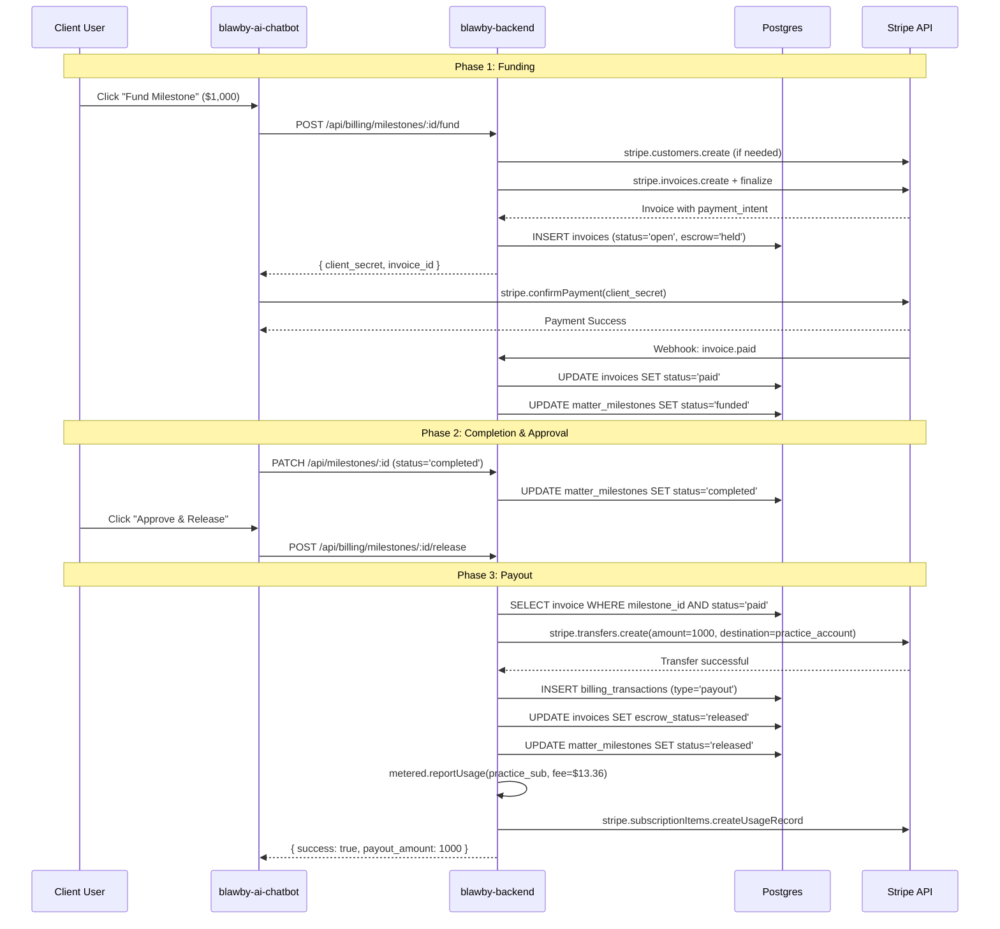
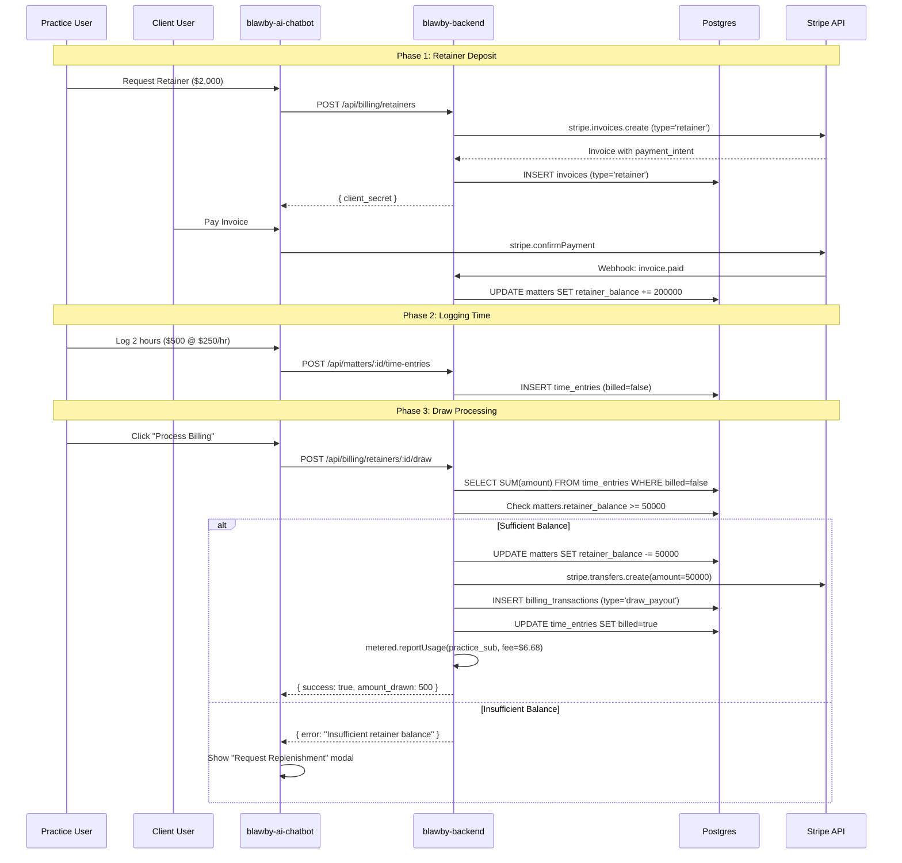

# Billing System Implementation Plan
## Team-Specific Issue Breakdown

**Document Version**: 2.0 (Final)  
**Last Updated**: 2024  
**Status**: ✅ Ready for Implementation

---

## PROJECT OVERVIEW

### Repositories & Responsibilities

| Repository | Tech Stack | Team | Purpose |
|------------|-----------|------|---------|
| `blawby-app` | PHP/Laravel | Backend (Legacy) | **SOURCE** - Extract billing logic, deprecate after migration |
| `blawby-backend` | Node/TypeScript/Drizzle | Backend | **TARGET** - Implement new billing module |
| `blawby-ai-chatbot` | Preact/TypeScript | Frontend | **UI** - Build payment/approval interfaces |

### Architecture Decision: Decoupled Fee via Metered Billing

**FINAL DECISION** (No alternatives):

```
Client Payment Flow:
1. Client pays $1,000 to Platform
2. Platform transfers $1,000 to Practice (full amount)
3. Platform reports $100 usage to Practice's metered subscription
4. Stripe bills Practice $100 + Monthly Sub at end of billing period

WHY: Consolidated billing for Practice (one invoice from Stripe)
RISK: Practice could fail to pay monthly bill after receiving payout
MITIGATION: Suspend services if subscription payment fails
```

**Fee Calculation** (from verified legacy code):
- NOT a fixed 10%
- Formula: `Payout Amount × 0.013336` (1.33% of payout)
- Configured in `ApplicationSettings` as `payout.fee_percentage`
- New system will use same configurable approach

---

## SEQUENCE DIAGRAMS

### Milestone Escrow Flow



### Retainer Draw Flow



---

## BACKEND TEAM ISSUES

### Epic 1: Database Schema Migration

**Owner**: Backend Team  
**Estimated Time**: 1 day

#### Issue BE-1.1: Create Invoices Table
**Priority**: P0 (Blocking)  
**Migration Source**: `blawby-app/database/migrations/2024_06_27_170448_create_invoice_table.php`

**Task**:
1. Create `src/modules/billing/database/schema/invoices.schema.ts`
2. Port these fields from PHP migration:
   - ✅ `stripe_invoice_id` → `stripe_invoice_id`
   - ✅ `amount` → `amount_due`
   - ✅ `status` → `status`
   - ❌ DROP: `user_id` (not needed - we use `customer_id` instead)
   - ➕ ADD: `organization_id`, `matter_id`, `milestone_id`, `customer_id`
   - ➕ ADD: `escrow_status`, `invoice_type`
   - ➕ ADD: `application_fee_amount`

**Schema**:
```typescript
export const invoices = pgTable('invoices', {
  id: uuid('id').primaryKey().defaultRandom(),
  stripe_invoice_id: text('stripe_invoice_id').unique().notNull(),
  stripe_payment_intent_id: text('stripe_payment_intent_id'),
  organization_id: uuid('organization_id').references(() => organizations.id).notNull(),
  matter_id: uuid('matter_id').references(() => matters.id).notNull(),
  milestone_id: uuid('milestone_id').references(() => matterMilestones.id),
  customer_id: uuid('customer_id').references(() => userDetails.id).notNull(),
  amount_due: integer('amount_due').notNull(),
  amount_paid: integer('amount_paid').default(0).notNull(),
  amount_remaining: integer('amount_remaining').notNull(),
  currency: varchar('currency', { length: 3 }).default('usd').notNull(),
  application_fee_amount: integer('application_fee_amount').default(0).notNull(),
  status: varchar('status', { length: 20 }).default('draft').notNull(),
  escrow_status: varchar('escrow_status', { length: 20 }).default('none').notNull(),
  invoice_type: varchar('invoice_type', { length: 20 }).notNull(),
  due_date: timestamp('due_date', { withTimezone: true }),
  paid_at: timestamp('paid_at', { withTimezone: true }),
  created_at: timestamp('created_at', { withTimezone: true }).defaultNow().notNull(),
  updated_at: timestamp('updated_at', { withTimezone: true }).defaultNow().notNull(),
});
```

**Migration SQL**:
```sql
CREATE TABLE invoices (
  id UUID PRIMARY KEY DEFAULT gen_random_uuid(),
  stripe_invoice_id TEXT UNIQUE NOT NULL,
  stripe_payment_intent_id TEXT,
  organization_id UUID NOT NULL REFERENCES organizations(id),
  matter_id UUID NOT NULL REFERENCES matters(id),
  milestone_id UUID REFERENCES matter_milestones(id),
  customer_id UUID NOT NULL REFERENCES user_details(id),
  amount_due INTEGER NOT NULL,
  amount_paid INTEGER NOT NULL DEFAULT 0,
  amount_remaining INTEGER NOT NULL,
  currency VARCHAR(3) NOT NULL DEFAULT 'usd',
  application_fee_amount INTEGER NOT NULL DEFAULT 0,
  status VARCHAR(20) NOT NULL DEFAULT 'draft',
  escrow_status VARCHAR(20) NOT NULL DEFAULT 'none',
  invoice_type VARCHAR(20) NOT NULL,
  due_date TIMESTAMPTZ,
  paid_at TIMESTAMPTZ,
  created_at TIMESTAMPTZ NOT NULL DEFAULT NOW(),
  updated_at TIMESTAMPTZ NOT NULL DEFAULT NOW()
);

CREATE INDEX idx_invoices_matter_id ON invoices(matter_id);
CREATE INDEX idx_invoices_milestone_id ON invoices(milestone_id);
CREATE INDEX idx_invoices_status_escrow ON invoices(status, escrow_status);
```

**Acceptance Criteria**:
- [ ] Migration runs successfully
- [ ] All indexes created
- [ ] Foreign keys validated
- [ ] Can insert/query test invoice

---

#### Issue BE-1.2: Create Billing Transactions Table
**Priority**: P0 (Blocking)  
**Source**: NEW (no legacy equivalent)

**Task**:
Create audit log for all transfers to Practice accounts.

**Schema**:
```typescript
export const billingTransactions = pgTable('billing_transactions', {
  id: uuid('id').primaryKey().defaultRandom(),
  invoice_id: uuid('invoice_id').references(() => invoices.id).notNull(),
  stripe_transfer_id: text('stripe_transfer_id').unique().notNull(),
  amount: integer('amount').notNull(),
  destination_account_id: text('destination_account_id').notNull(),
  type: varchar('type', { length: 20 }).default('payout').notNull(),
  status: varchar('status', { length: 20 }).default('pending').notNull(),
  created_at: timestamp('created_at').defaultNow().notNull(),
  completed_at: timestamp('completed_at'),
});
```

**Migration SQL**:
```sql
CREATE TABLE billing_transactions (
  id UUID PRIMARY KEY DEFAULT gen_random_uuid(),
  invoice_id UUID NOT NULL REFERENCES invoices(id),
  stripe_transfer_id TEXT UNIQUE NOT NULL,
  amount INTEGER NOT NULL,
  destination_account_id TEXT NOT NULL,
  type VARCHAR(20) NOT NULL DEFAULT 'payout',
  status VARCHAR(20) NOT NULL DEFAULT 'pending',
  created_at TIMESTAMPTZ NOT NULL DEFAULT NOW(),
  completed_at TIMESTAMPTZ
);

CREATE INDEX idx_billing_transactions_invoice_id ON billing_transactions(invoice_id);
```

**Acceptance Criteria**:
- [ ] Migration runs successfully
- [ ] Can insert test transaction
- [ ] Foreign key to invoices works

---

#### Issue BE-1.3: Add Retainer Balance to Matters Table
**Priority**: P0 (Blocking)  
**Source**: NEW (no legacy equivalent)

**Task**:
Add column to track current retainer balance per matter.

**Migration SQL**:
```sql
ALTER TABLE matters 
ADD COLUMN retainer_balance INTEGER NOT NULL DEFAULT 0;

COMMENT ON COLUMN matters.retainer_balance IS 'Current retainer balance in cents (USD)';

CREATE INDEX idx_matters_retainer_balance ON matters(retainer_balance) WHERE retainer_balance > 0;
```

**Acceptance Criteria**:
- [ ] Column added successfully
- [ ] Default value is 0
- [ ] Can update balance via SQL
- [ ] Index created for performance

---

### Epic 2: Service Layer Migration

**Owner**: Backend Team  
**Estimated Time**: 3 days

#### Issue BE-2.1: Port Invoice Creation Logic
**Priority**: P0 (Blocking)  
**Migration Source**: `blawby-app/app/Services/StripeInvoiceService.php`

**What to Migrate**:
- ✅ Method: `createStripeInvoice()` → Becomes `InvoiceGeneratorService.generateMilestoneInvoice()`
- ✅ Stripe calls: `stripe.invoices.create()`, `stripe.invoices.finalizeInvoice()`
- ✅ Database writes: `INSERT INTO invoices`
- ❌ DROP: `on_behalf_of` parameter (we're NOT using Destination Charges)
- ➕ ADD: Metered usage reporting after payout

**File**: `src/modules/billing/services/invoice-generator.service.ts`

**Implementation**:
```typescript
export class InvoiceGeneratorService {
  async generateMilestoneInvoice(params: {
    milestoneId: string;
    userId: string;
    organizationId: string;
  }) {
    // 1. Fetch milestone details
    const milestone = await this.getMilestone(params.milestoneId);
    
    // 2. Get or create Stripe customer (Platform account)
    const customerId = await this.customerService.getOrCreatePlatformCustomer(params.userId);
    
    // 3. Calculate application fee (1.33% of payout)
    const feePercentage = await this.getConfiguredFeePercentage();
    const applicationFee = Math.round(milestone.amount * feePercentage);
    
    // 4. Create Stripe invoice
    const stripeInvoice = await stripe.invoices.create({
      customer: customerId,
      collection_method: 'send_invoice',
      days_until_due: 0,
      auto_advance: true,
      metadata: {
        milestone_id: params.milestoneId,
        matter_id: milestone.matter_id,
        organization_id: params.organizationId,
      },
    });
    
    // 5. Add line item
    await stripe.invoiceItems.create({
      customer: customerId,
      invoice: stripeInvoice.id,
      amount: milestone.amount,
      currency: 'usd',
      description: milestone.description || 'Milestone payment',
    });
    
    // 6. Finalize
    const finalizedInvoice = await stripe.invoices.finalizeInvoice(stripeInvoice.id);
    
    // 7. Store in DB
    const dbInvoice = await db.insert(invoices).values({
      stripe_invoice_id: finalizedInvoice.id,
      stripe_payment_intent_id: finalizedInvoice.payment_intent as string,
      organization_id: params.organizationId,
      matter_id: milestone.matter_id,
      milestone_id: params.milestoneId,
      customer_id: params.userId,
      amount_due: milestone.amount,
      amount_paid: 0,
      amount_remaining: milestone.amount,
      application_fee_amount: applicationFee,
      status: 'open',
      escrow_status: 'held',
      invoice_type: 'milestone',
    }).returning();
    
    return {
      invoice: dbInvoice[0],
      clientSecret: (finalizedInvoice.payment_intent as any)?.client_secret,
    };
  }
  
  private async getConfiguredFeePercentage(): Promise<number> {
    // Port from ApplicationSettings::getValue('payout.fee_percentage', 1.3336)
    // Convert to decimal: 1.3336 / 100 = 0.013336
    return 0.013336;
  }
}
```

**Acceptance Criteria**:
- [ ] Service creates Stripe invoice
- [ ] Invoice stored in database
- [ ] Client secret returned for frontend
- [ ] Fee calculated correctly (1.33%)
- [ ] Unit tests pass

---

#### Issue BE-2.2: Port Transfer/Payout Logic
**Priority**: P0 (Blocking)  
**Migration Source**: `blawby-app/app/Services/StripeTransfersService.php`

**What to Migrate**:
- ✅ Method: `transferInvoiceAmountToConnectedAccount()` → Becomes `EscrowService.releaseFunds()`
- ✅ Stripe calls: `stripe.transfers.create()`
- ✅ Validation: Check invoice is paid before transferring
- ➕ ADD: Metered usage reporting
- ➕ ADD: Idempotency key to prevent double-payouts

**File**: `src/modules/billing/services/escrow.service.ts`

**Implementation**:
```typescript
export class EscrowService {
  constructor(
    private meteredService: MeteredProductsService
  ) {}

  async releaseFunds(params: {
    milestoneId: string;
    userId: string;
  }) {
    // 1. Fetch invoice
    const invoice = await this.getInvoiceByMilestone(params.milestoneId);
    
    if (invoice.status !== 'paid') {
      throw new Error('Invoice must be paid before releasing funds');
    }
    
    if (invoice.escrow_status === 'released') {
      throw new Error('Funds already released');
    }
    
    // 2. Authorization check
    if (invoice.customer_id !== params.userId) {
      throw new Error('Unauthorized: Only the client can release funds');
    }
    
    // 3. Get Practice connected account
    const matter = await this.getMatter(invoice.matter_id);
    if (!matter.stripe_connected_account_id) {
      throw new Error('Practice does not have a connected account');
    }
    
    // 4. Transfer FULL AMOUNT to Practice (no deduction)
    const transfer = await stripe.transfers.create({
      amount: invoice.amount_paid,
      currency: invoice.currency,
      destination: matter.stripe_connected_account_id,
      metadata: {
        invoice_id: invoice.id,
        milestone_id: params.milestoneId,
        matter_id: invoice.matter_id,
      },
    }, {
      idempotencyKey: `release-${invoice.id}`,
    });
    
    // 5. Record transaction
    await db.insert(billingTransactions).values({
      invoice_id: invoice.id,
      stripe_transfer_id: transfer.id,
      amount: invoice.amount_paid,
      destination_account_id: matter.stripe_connected_account_id,
      type: 'payout',
      status: 'completed',
      completed_at: new Date(),
    });
    
    // 6. Update statuses
    await db.update(invoices)
      .set({ escrow_status: 'released', updated_at: new Date() })
      .where(eq(invoices.id, invoice.id));
      
    await db.update(matterMilestones)
      .set({ status: 'released', updated_at: new Date() })
      .where(eq(matterMilestones.id, params.milestoneId));
    
    // 7. Report metered usage (NOT deducted from transfer)
    await this.meteredService.reportMeteredUsage({
      organizationId: invoice.organization_id,
      meteredType: 'payout_fee',
      quantity: invoice.application_fee_amount,
    });
    
    return { transfer, payoutAmount: invoice.amount_paid };
  }
}
```

**Acceptance Criteria**:
- [ ] Transfers full payout amount (no deduction)
- [ ] Reports fee to metered subscription
- [ ] Idempotency prevents double-payouts
- [ ] Updates all statuses correctly
- [ ] Unit tests pass

---

#### Issue BE-2.3: Implement Customer Management Service
**Priority**: P0 (Blocking)  
**Source**: NEW (no legacy equivalent)

**Task**:
Create service to manage Stripe customers on Platform account.

**File**: `src/modules/billing/services/customer.service.ts`

**Implementation**:
```typescript
export class CustomerService {
  async getOrCreatePlatformCustomer(userId: string): Promise<string> {
    // 1. Check if user already has stripe_customer_id
    const user = await db.select()
      .from(users)
      .where(eq(users.id, userId))
      .limit(1);
      
    if (user[0]?.stripe_customer_id) {
      return user[0].stripe_customer_id;
    }
    
    // 2. Get user details
    const userDetail = await db.select()
      .from(userDetails)
      .where(eq(userDetails.user_id, userId))
      .limit(1);
    
    // 3. Create Stripe customer
    const customer = await stripe.customers.create({
      email: userDetail[0]?.email || undefined,
      name: userDetail[0]?.name || undefined,
      metadata: {
        user_id: userId,
        created_by: 'blawby-billing',
      },
    });
    
    // 4. Store customer ID
    await db.update(users)
      .set({ stripe_customer_id: customer.id })
      .where(eq(users.id, userId));
    
    return customer.id;
  }
}
```

**Database Change Required**:
```sql
ALTER TABLE users 
ADD COLUMN stripe_customer_id TEXT;

CREATE UNIQUE INDEX idx_users_stripe_customer_id ON users(stripe_customer_id) WHERE stripe_customer_id IS NOT NULL;
```

**Acceptance Criteria**:
- [ ] Creates Stripe customer if missing
- [ ] Returns existing customer if present
- [ ] Stores customer ID in database
- [ ] Unit tests pass

---

#### Issue BE-2.4: Implement Retainer Draw Service
**Priority**: P1 (High)  
**Source**: NEW (no legacy equivalent)

**Task**:
Create service to process billable time entries against retainer balance.

**File**: `src/modules/billing/services/retainer.service.ts`

**Implementation**:
```typescript
export class RetainerService {
  constructor(
    private meteredService: MeteredProductsService
  ) {}

  async processDrawFromRetainer(params: {
    matterId: string;
    organizationId: string;
  }) {
    // 1. Get unbilled time entries
    const timeEntries = await db.select()
      .from(timeEntries)
      .where(
        and(
          eq(timeEntries.matter_id, params.matterId),
          eq(timeEntries.billed, false)
        )
      );
    
    if (timeEntries.length === 0) {
      throw new Error('No unbilled time entries found');
    }
    
    // 2. Calculate total amount
    const totalAmount = timeEntries.reduce((sum, entry) => sum + entry.amount, 0);
    
    // 3. Check retainer balance
    const matter = await db.select()
      .from(matters)
      .where(eq(matters.id, params.matterId))
      .limit(1);
      
    if (matter[0].retainer_balance < totalAmount) {
      throw new Error('Insufficient retainer balance');
    }
    
    // 4. Calculate fee
    const feePercentage = 0.013336;
    const applicationFee = Math.round(totalAmount * feePercentage);
    
    // 5. Deduct from retainer balance
    await db.update(matters)
      .set({
        retainer_balance: sql`retainer_balance - ${totalAmount}`,
        updated_at: new Date(),
      })
      .where(eq(matters.id, params.matterId));
    
    // 6. Transfer to Practice (FULL AMOUNT)
    const transfer = await stripe.transfers.create({
      amount: totalAmount,
      currency: 'usd',
      destination: matter[0].stripe_connected_account_id,
      metadata: {
        matter_id: params.matterId,
        type: 'retainer_draw',
      },
    }, {
      idempotencyKey: `draw-${params.matterId}-${Date.now()}`,
    });
    
    // 7. Mark time entries as billed
    await db.update(timeEntries)
      .set({ billed: true, billed_at: new Date() })
      .where(
        and(
          eq(timeEntries.matter_id, params.matterId),
          eq(timeEntries.billed, false)
        )
      );
    
    // 8. Report metered usage
    await this.meteredService.reportMeteredUsage({
      organizationId: params.organizationId,
      meteredType: 'payout_fee',
      quantity: applicationFee,
    });
    
    return { transfer, totalAmount, applicationFee };
  }
}
```

**Acceptance Criteria**:
- [ ] Validates retainer balance before draw
- [ ] Transfers full amount to Practice
- [ ] Reports fee via metered billing
- [ ] Marks time entries as billed
- [ ] Unit tests pass

---

### Epic 3: API Handlers & Routes

**Owner**: Backend Team  
**Estimated Time**: 2 days

#### Issue BE-3.1: Create Billing API Handlers
**Priority**: P0 (Blocking)  
**Source**: NEW (no legacy API)

**File**: `src/modules/billing/handlers.ts`

**Endpoints to Implement**:

1. **POST /api/billing/milestones/:id/fund**
```typescript
export async function fundMilestoneHandler(c: Context) {
  const milestoneId = c.req.param('id');
  const user = c.get('user')!;
  const organizationId = c.get('organizationId')!;
  
  const result = await invoiceGenerator.generateMilestoneInvoice({
    milestoneId,
    userId: user.id,
    organizationId,
  });
  
  return response.created(c, {
    invoice_id: result.invoice.id,
    client_secret: result.clientSecret,
    amount_total: result.invoice.amount_due,
    status: result.invoice.status,
  });
}
```

2. **POST /api/billing/milestones/:id/release**
```typescript
export async function releaseMilestoneHandler(c: Context) {
  const milestoneId = c.req.param('id');
  const user = c.get('user')!;
  
  const result = await escrowService.releaseFunds({
    milestoneId,
    userId: user.id,
  });
  
  return response.ok(c, {
    transfer_id: result.transfer.id,
    payout_amount: result.payoutAmount,
    status: 'released',
  });
}
```

3. **POST /api/billing/retainers/:matterId/draw**
```typescript
export async function drawFromRetainerHandler(c: Context) {
  const matterId = c.req.param('matterId');
  const organizationId = c.get('organizationId')!;
  
  const result = await retainerService.processDrawFromRetainer({
    matterId,
    organizationId,
  });
  
  return response.ok(c, {
    transfer_id: result.transfer.id,
    amount_drawn: result.totalAmount,
    fee_reported: result.applicationFee,
  });
}
```

4. **GET /api/billing/invoices**
```typescript
export async function listInvoicesHandler(c: Context) {
  const organizationId = c.get('organizationId')!;
  
  const invoiceList = await db.select()
    .from(invoices)
    .where(eq(invoices.organization_id, organizationId))
    .orderBy(desc(invoices.created_at));
  
  return response.ok(c, { invoices: invoiceList });
}
```

**Acceptance Criteria**:
- [ ] All handlers return proper HTTP status codes
- [ ] Responses wrapped using `response` utils
- [ ] Error handling with try/catch
- [ ] Integration tests pass

---

#### Issue BE-3.2: Create OpenAPI Route Definitions
**Priority**: P1 (High)  
**Source**: NEW

**File**: `src/modules/billing/routes.ts`

**Task**:
Define OpenAPI schemas for all billing endpoints using `@hono/zod-openapi`.

**Acceptance Criteria**:
- [ ] All endpoints documented
- [ ] Request/response schemas defined with Zod
- [ ] API docs auto-generate correctly

---

### Epic 4: Webhook Handlers

**Owner**: Backend Team  
**Estimated Time**: 1 day

#### Issue BE-4.1: Implement Stripe Webhook Handler
**Priority**: P0 (Blocking)  
**Source**: Partial migration from `blawby-app/app/Http/Controllers/StripeWebhookController.php`

**File**: `src/modules/billing/webhooks/stripe.webhook.ts`

**Events to Handle**:

1. **invoice.paid** (CRITICAL)
```typescript
async function handleInvoicePaid(stripeInvoice: any) {
  // Update invoice status
  await db.update(invoices)
    .set({
      status: 'paid',
      amount_paid: stripeInvoice.amount_paid,
      amount_remaining: 0,
      paid_at: new Date(stripeInvoice.status_transitions.paid_at * 1000),
    })
    .where(eq(invoices.stripe_invoice_id, stripeInvoice.id));
  
  // Update milestone status if applicable
  const invoice = await getInvoiceByStripeId(stripeInvoice.id);
  if (invoice.milestone_id) {
    await db.update(matterMilestones)
      .set({ status: 'funded' })
      .where(eq(matterMilestones.id, invoice.milestone_id));
  }
  
  // Update retainer balance if retainer invoice
  if (invoice.invoice_type === 'retainer') {
    await db.update(matters)
      .set({ retainer_balance: sql`retainer_balance + ${invoice.amount_paid}` })
      .where(eq(matters.id, invoice.matter_id));
  }
}
```

2. **invoice.payment_failed**
```typescript
async function handleInvoicePaymentFailed(stripeInvoice: any) {
  await db.update(invoices)
    .set({ status: 'open' })
    .where(eq(invoices.stripe_invoice_id, stripeInvoice.id));
  
  // TODO: Send notification to user
}
```

3. **transfer.failed**
```typescript
async function handleTransferFailed(stripeTransfer: any) {
  await db.update(billingTransactions)
    .set({ status: 'failed' })
    .where(eq(billingTransactions.stripe_transfer_id, stripeTransfer.id));
  
  // Alert administrators
  console.error('Transfer failed:', stripeTransfer);
}
```

**Webhook Endpoint**: `/api/webhooks/stripe`

**Acceptance Criteria**:
- [ ] Webhook signature verification implemented
- [ ] All critical events handled
- [ ] Idempotency check (prevent duplicate processing)
- [ ] Error logging for unhandled events
- [ ] Integration tests with Stripe CLI

---

### Epic 5: Testing & Deployment

**Owner**: Backend Team  
**Estimated Time**: 2 days

#### Issue BE-5.1: Unit Tests
**Priority**: P1 (High)

**Files to Test**:
- `invoice-generator.service.spec.ts`
- `escrow.service.spec.ts`
- `retainer.service.spec.ts`
- `customer.service.spec.ts`

**Test Coverage Requirements**:
- [ ] Service methods > 80% coverage
- [ ] Fee calculation accuracy tests
- [ ] Error case handling
- [ ] Idempotency tests

---

#### Issue BE-5.2: Integration Tests
**Priority**: P1 (High)

**Scenarios to Test**:
- [ ] End-to-end milestone funding flow
- [ ] End-to-end funds release flow
- [ ] Retainer draw with sufficient balance
- [ ] Retainer draw with insufficient balance
- [ ] Webhook processing (use Stripe test webhooks)

---

#### Issue BE-5.3: Database Migration Deployment
**Priority**: P0 (Blocking)

**Deployment Steps**:
1. [ ] Create migration files
2. [ ] Test migrations on staging database
3. [ ] Run migrations on production
4. [ ] Verify data integrity
5. [ ] Create rollback scripts

---

## FRONTEND TEAM ISSUES

### Epic 6: Stripe Integration

**Owner**: Frontend Team  
**Estimated Time**: 2 days

#### Issue FE-6.1: Install Stripe Dependencies
**Priority**: P0 (Blocking)

**Task**:
```bash
cd blawby-ai-chatbot
npm install @stripe/stripe-js @stripe/react-stripe-js
```

**Environment Variables**:
```env
VITE_STRIPE_PUBLISHABLE_KEY=pk_test_...
```

**Acceptance Criteria**:
- [ ] Dependencies installed
- [ ] Environment variable configured
- [ ] Stripe loads successfully

---

#### Issue FE-6.2: Create Stripe Provider Wrapper
**Priority**: P0 (Blocking)

**File**: `src/shared/providers/StripeProvider.tsx`

```typescript
import { h, ComponentChildren } from 'preact';
import { loadStripe } from '@stripe/stripe-js';

const stripePromise = loadStripe(import.meta.env.VITE_STRIPE_PUBLISHABLE_KEY);

export function StripeProvider({ children }: { children: ComponentChildren }) {
  return children; // Elements provider will be per-component
}
```

**Acceptance Criteria**:
- [ ] Provider created
- [ ] Stripe initializes correctly
- [ ] No console errors

---

### Epic 7: Payment Components

**Owner**: Frontend Team  
**Estimated Time**: 3 days

#### Issue FE-7.1: Create Fund Milestone Modal
**Priority**: P0 (Blocking)

**File**: `src/features/billing/components/FundMilestoneModal.tsx`

**Requirements**:
- Uses Stripe Payment Element
- Shows milestone details (name, amount, description)
- Handles payment confirmation
- Shows loading states
- Displays error messages

**Implementation**:
```typescript
import { h } from 'preact';
import { useState, useEffect } from 'preact/hooks';
import { loadStripe } from '@stripe/stripe-js';
import { Elements, PaymentElement, useStripe, useElements } from '@stripe/react-stripe-js';
import { fundMilestone } from '@/shared/lib/apiClient';

const stripePromise = loadStripe(import.meta.env.VITE_STRIPE_PUBLISHABLE_KEY);

function CheckoutForm({ milestone, onSuccess }: any) {
  const stripe = useStripe();
  const elements = useElements();
  const [isProcessing, setIsProcessing] = useState(false);
  const [error, setError] = useState<string | null>(null);

  const handleSubmit = async (e: Event) => {
    e.preventDefault();
    if (!stripe || !elements) return;
    
    setIsProcessing(true);
    
    try {
      const { error: submitError } = await stripe.confirmPayment({
        elements,
        confirmParams: {
          return_url: window.location.href,
        },
      });
      
      if (submitError) {
        setError(submitError.message || 'Payment failed');
      } else {
        onSuccess();
      }
    } catch (err) {
      setError('An unexpected error occurred');
    } finally {
      setIsProcessing(false);
    }
  };

  return (
    <form onSubmit={handleSubmit}>
      <PaymentElement />
      {error && <div className="text-red-600 mt-2">{error}</div>}
      <button
        type="submit"
        disabled={!stripe || isProcessing}
        className="mt-4 w-full bg-blue-600 text-white py-2 rounded disabled:opacity-50"
      >
        {isProcessing ? 'Processing...' : `Pay $${(milestone.amount / 100).toFixed(2)}`}
      </button>
    </form>
  );
}

export function FundMilestoneModal({ milestone, onSuccess, onCancel }: any) {
  const [clientSecret, setClientSecret] = useState<string | null>(null);
  const [isLoading, setIsLoading] = useState(true);

  useEffect(() => {
    fundMilestone(milestone.id)
      .then(response => setClientSecret(response.client_secret))
      .catch(err => console.error('Failed to create invoice:', err))
      .finally(() => setIsLoading(false));
  }, [milestone.id]);

  if (isLoading) return <div>Loading payment form...</div>;
  if (!clientSecret) return <div>Failed to initialize payment.</div>;

  return (
    <div className="fixed inset-0 bg-black bg-opacity-50 flex items-center justify-center z-50">
      <div className="bg-white p-6 rounded-lg max-w-md w-full">
        <h2 className="text-xl font-bold mb-4">Fund Milestone: {milestone.name}</h2>
        <p className="mb-4">{milestone.description}</p>
        <p className="text-2xl font-bold mb-6">${(milestone.amount / 100).toFixed(2)}</p>
        
        <Elements stripe={stripePromise} options={{ clientSecret }}>
          <CheckoutForm milestone={milestone} onSuccess={onSuccess} />
        </Elements>
        
        <button onClick={onCancel} className="mt-4 w-full border py-2 rounded">
          Cancel
        </button>
      </div>
    </div>
  );
}
```

**Acceptance Criteria**:
- [ ] Modal displays correctly
- [ ] Payment Element renders
- [ ] Payment processing works
- [ ] Success callback triggered
- [ ] Error states display properly

---

#### Issue FE-7.2: Create Milestone Action Row Component
**Priority**: P0 (Blocking)

**File**: `src/features/matters/components/MilestoneActionRow.tsx`

**Requirements**:
- Shows different buttons based on milestone status
- Integrates with Fund Milestone Modal
- Calls release API on approval
- Shows loading states

**Implementation**:
```typescript
import { h } from 'preact';
import { useState } from 'preact/hooks';
import { releaseMilestoneFunds } from '@/shared/lib/apiClient';
import { FundMilestoneModal } from '@/features/billing/components/FundMilestoneModal';

export function MilestoneActionRow({ milestone, isClient, onStatusChange }: any) {
  const [showFundModal, setShowFundModal] = useState(false);
  const [isReleasing, setIsReleasing] = useState(false);

  const handleRelease = async () => {
    if (!confirm('Release funds to the practice? This action cannot be undone.')) {
      return;
    }
    
    setIsReleasing(true);
    try {
      await releaseMilestoneFunds(milestone.id);
      onStatusChange();
    } catch (err) {
      alert('Failed to release funds. Please try again.');
    } finally {
      setIsReleasing(false);
    }
  };

  return (
    <div className="flex items-center justify-between p-4 border rounded">
      <div>
        <h3 className="font-semibold">{milestone.name}</h3>
        <p className="text-sm text-gray-600">${(milestone.amount / 100).toFixed(2)}</p>
      </div>
      
      <div>
        {milestone.status === 'pending_funding' && isClient && (
          <button
            onClick={() => setShowFundModal(true)}
            className="bg-blue-600 text-white px-4 py-2 rounded"
          >
            Fund Escrow
          </button>
        )}
        
        {milestone.status === 'funded' && (
          <span className="bg-green-100 text-green-800 px-3 py-1 rounded">
            Funds Secured
          </span>
        )}
        
        {milestone.status === 'completed' && isClient && (
          <button
            onClick={handleRelease}
            disabled={isReleasing}
            className="bg-green-600 text-white px-4 py-2 rounded disabled:opacity-50"
          >
            {isReleasing ? 'Releasing...' : 'Approve & Pay'}
          </button>
        )}
        
        {milestone.status === 'released' && (
          <span className="bg-gray-100 text-gray-800 px-3 py-1 rounded">
            Paid
          </span>
        )}
      </div>
      
      {showFundModal && (
        <FundMilestoneModal
          milestone={milestone}
          onSuccess={() => {
            setShowFundModal(false);
            onStatusChange();
          }}
          onCancel={() => setShowFundModal(false)}
        />
      )}
    </div>
  );
}
```

**Acceptance Criteria**:
- [ ] Correct buttons show for each status
- [ ] Fund modal opens/closes properly
- [ ] Release confirmation works
- [ ] Status updates after actions
- [ ] Loading states display

---

### Epic 8: API Client Integration

**Owner**: Frontend Team  
**Estimated Time**: 1 day

#### Issue FE-8.1: Add Billing API Methods
**Priority**: P0 (Blocking)

**File**: `src/shared/lib/apiClient.ts`

**Methods to Add**:

```typescript
// Add these interfaces
export interface FundMilestoneResponse {
  invoice_id: string;
  client_secret: string;
  amount_total: number;
  status: string;
}

export interface ReleaseFundsResponse {
  transfer_id: string;
  payout_amount: number;
  status: 'released';
}

// Add these functions
export async function fundMilestone(
  milestoneId: string,
  config?: Pick<AxiosRequestConfig, 'signal'>
): Promise<FundMilestoneResponse> {
  const response = await apiClient.post(
    `/api/billing/milestones/${encodeURIComponent(milestoneId)}/fund`,
    {},
    { signal: config?.signal }
  );
  
  const data = unwrapApiData(response.data);
  if (!isRecord(data)) {
    throw new Error('Invalid response');
  }
  
  return {
    invoice_id: String(data.invoice_id ?? ''),
    client_secret: String(data.client_secret ?? ''),
    amount_total: Number(data.amount_total ?? 0),
    status: String(data.status ?? 'unknown'),
  };
}

export async function releaseMilestoneFunds(
  milestoneId: string,
  config?: Pick<AxiosRequestConfig, 'signal'>
): Promise<ReleaseFundsResponse> {
  const response = await apiClient.post(
    `/api/billing/milestones/${encodeURIComponent(milestoneId)}/release`,
    {},
    { signal: config?.signal }
  );
  
  const data = unwrapApiData(response.data);
  if (!isRecord(data)) {
    throw new Error('Invalid response');
  }
  
  return {
    transfer_id: String(data.transfer_id ?? ''),
    payout_amount: Number(data.payout_amount ?? 0),
    status: 'released',
  };
}

export async function drawFromRetainer(
  matterId: string,
  config?: Pick<AxiosRequestConfig, 'signal'>
): Promise<{ transfer_id: string; amount_drawn: number }> {
  const response = await apiClient.post(
    `/api/billing/retainers/${encodeURIComponent(matterId)}/draw`,
    {},
    { signal: config?.signal }
  );
  
  const data = unwrapApiData(response.data);
  return {
    transfer_id: String(data.transfer_id ?? ''),
    amount_drawn: Number(data.amount_drawn ?? 0),
  };
}
```

**Acceptance Criteria**:
- [ ] All methods added
- [ ] TypeScript types defined
- [ ] Response unwrapping works
- [ ] Error handling included

---

### Epic 9: Retainer UI

**Owner**: Frontend Team  
**Estimated Time**: 2 days

#### Issue FE-9.1: Create Retainer Balance Display
**Priority**: P1 (High)

**File**: `src/features/matters/components/RetainerBalance.tsx`

**Requirements**:
- Shows current retainer balance
- Shows "low balance" warning if < $500
- Button to process draw (Practice only)
- Button to request replenishment (Practice only)

**Acceptance Criteria**:
- [ ] Balance displays correctly
- [ ] Warning shows when low
- [ ] Process draw button works
- [ ] Replenishment request works

---

#### Issue FE-9.2: Create Request Replenishment Modal
**Priority**: P2 (Medium)

**File**: `src/features/billing/components/RequestReplenishmentModal.tsx`

**Requirements**:
- Practice enters amount to request
- Generates invoice for client
- Client receives notification
- Modal closes on success

**Acceptance Criteria**:
- [ ] Modal displays correctly
- [ ] Amount validation works
- [ ] Invoice created successfully
- [ ] Client notified

---

### Epic 10: Testing

**Owner**: Frontend Team  
**Estimated Time**: 1 day

#### Issue FE-10.1: Component Tests
**Priority**: P1 (High)

**Files to Test**:
- `FundMilestoneModal.spec.tsx`
- `MilestoneActionRow.spec.tsx`
- `RetainerBalance.spec.tsx`

**Test Coverage**:
- [ ] Component rendering
- [ ] User interactions
- [ ] API call mocking
- [ ] Error states

---

#### Issue FE-10.2: Integration Tests
**Priority**: P2 (Medium)

**Scenarios**:
- [ ] Complete milestone funding flow
- [ ] Complete funds release flow
- [ ] Retainer draw flow
- [ ] Error handling

---

## DEPLOYMENT SEQUENCE

### Phase 1: Database (Day 1)
1. Backend: Issue BE-1.1, BE-1.2, BE-1.3
2. Verify migrations on staging

### Phase 2: Backend Core (Days 2-4)
1. Backend: Issues BE-2.1, BE-2.2, BE-2.3, BE-2.4
2. Backend: Issues BE-3.1, BE-3.2
3. Backend: Issue BE-4.1
4. Run unit tests

### Phase 3: Frontend Core (Days 5-7)
1. Frontend: Issues FE-6.1, FE-6.2
2. Frontend: Issues FE-7.1, FE-7.2
3. Frontend: Issue FE-8.1
4. Run component tests

### Phase 4: Retainer Features (Days 8-9)
1. Frontend: Issues FE-9.1, FE-9.2
2. Integration testing

### Phase 5: Production Deployment (Day 10)
1. Deploy backend to staging
2. Deploy frontend to staging
3. End-to-end testing
4. Deploy to production
5. Monitor for 24 hours

---

## SUCCESS CRITERIA

- [ ] Client can fund milestone via UI
- [ ] Funds held in escrow until approval
- [ ] Client can release funds to Practice
- [ ] Full payout transferred to Practice
- [ ] Fee reported to metered subscription (NOT deducted)
- [ ] Practice can draw from retainer balance
- [ ] All webhooks process correctly
- [ ] No double-payouts possible
- [ ] All tests passing