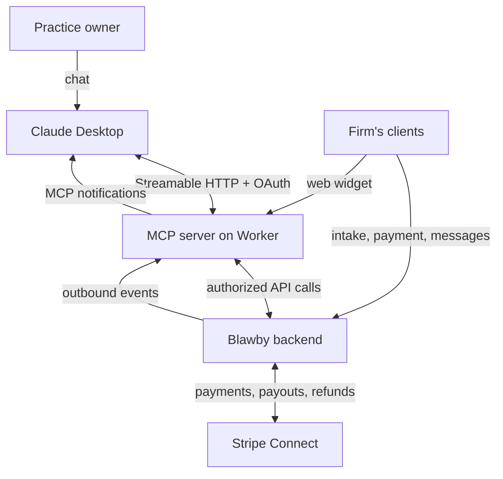

# Blawby MCP Agent Surface

## Summary

A remote Model Context Protocol server, hosted on the Cloudflare Worker, that gives technically-skilled practice owners a Claude Desktop surface for the firm operations Blawby owns — intake triage, matter management, invoicing, payments, client messaging, payouts — plus a push-based event subscription so Claude is directly informed when intakes arrive, payments clear, and clients reply. The wedge against Clio and other practice-management SaaS is that the firm pings the lawyer's agent, not the lawyer's inbox.

---

## Problem Frame

Blawby's beta customer, North Carolina Legal Services (NCLS), is led by a technically capable practice owner who uses Claude Desktop daily — currently as a reading and synthesis surface for Clio's email digests, Google Calendar, and incoming client mail. The pattern is: a Clio email lands, Claude is asked to summarize and suggest actions, then the lawyer leaves Claude, opens a browser tab, logs into Clio (or Stripe, or Gmail, or Blawby), and performs the action manually.

The pain has two shapes:

1. **Read latency.** Clio's email digests are the lawyer's only practice-state feed inside Claude. Email is asynchronous and batched, so Claude's understanding of "what's happening at the firm right now" is a snapshot of whenever the last email arrived.
2. **Triggerless reading.** Even when Claude correctly identifies a needed action — "you should send this client an invoice," "this intake should be triaged" — Claude cannot perform the action. The lawyer becomes the manual bridge between Claude's recommendation and the SaaS UI that executes it.

The practice owner has explicitly framed this as the differentiator he wants from Blawby. The bet that motivates the work is that future legal practice owners will increasingly default to agent surfaces over web SaaS dashboards, and that being agent-native first earns ICP loyalty that Clio's web-first positioning can't easily counter.

---

## Architecture

The MCP server is a same-origin endpoint on the existing Worker. The Backend is the source of truth for all business state; the MCP layer is an authenticated translation surface between Claude and the Backend, plus the event channel that pushes Backend state changes to active MCP sessions.

---

## Actors

- A1. **Practice owner (agent-native).** Logs into Claude Desktop, authorizes the Blawby MCP once via OAuth, then operates the firm through chat. NCLS is the canonical instance.
- A2. **Practice owner (web-only).** Continues using the existing Blawby web UI. Not the target of this work, but must retain feature parity with A1 going forward.
- A3. **Firm client.** Submits intakes, pays invoices, exchanges messages with the practice. Unaware of whether the practice runs via web UI or MCP.
- A4. **Claude Desktop (the agent).** Holds the MCP session, reads tool descriptions, calls tools, receives event notifications, and renders tool output and confirmations to the lawyer.
- A5. **Blawby Worker.** Hosts the MCP endpoint, terminates Streamable HTTP sessions, fans out backend events to subscribed MCP sessions, and forwards tool calls to the Backend with the session's authorization context.
- A6. **Blawby Backend.** Source of truth for practices, intakes, matters, invoices, clients, Stripe Connect state. Issues OAuth tokens with scoped capabilities, emits lifecycle events, records the agent audit log, enforces idempotency and pending-action approval state.

---

## Key Flows

- F1. **MCP authorization (one-time per practice owner)**
  - **Trigger:** Lawyer adds the Blawby MCP URL in Claude Desktop and starts a session.
  - **Actors:** A1, A4, A5, A6.
  - **Steps:** Claude initiates OAuth against the Worker's MCP authorization endpoint. The Worker redirects the lawyer's browser to the Backend's consent screen, which shows the requested capability scopes and the configured money-action approval threshold for confirmation. Lawyer approves. Backend mints a long-lived refresh token bound to the practice, the lawyer, and the granted scopes. Token is returned to Claude. Subsequent tool calls and event notifications use this token's scopes for authorization.
  - **Outcome:** A persistent, scope-bound MCP session connects Claude Desktop to the lawyer's practice.
  - **Covered by:** R1, R2, R3, R4.

- F2. **Event-driven briefing (the "kill the email digest" flow)**
  - **Trigger:** A lifecycle event occurs in the Backend (e.g., a new intake is submitted, an invoice payment clears, a client sends a message).
  - **Actors:** A3, A6, A5, A4, A1.
  - **Steps:** Backend emits an outbound event. The Worker receives it, identifies all active MCP sessions whose granted scopes cover the event class, and forwards the event as an MCP notification to each. Claude surfaces the event in the lawyer's chat thread (either as an unsolicited notification or in response to the lawyer's next message, depending on Claude Desktop's surfacing rules). The lawyer asks Claude what to do; Claude calls read tools to gather context; Claude proposes an action.
  - **Outcome:** The lawyer learns about firm state changes through Claude rather than email, and acts on them in the same conversation.
  - **Covered by:** R5, R6, R7.

- F3. **Low-risk action (direct execution)**
  - **Trigger:** Claude calls a tool whose risk class is "direct" — read tools, native-audited writes (Blawby-internal client message, matter note, time entry), and read-only synthesis tools.
  - **Actors:** A4, A5, A6.
  - **Steps:** Worker validates the session's scope covers the tool. Worker forwards the call to the Backend with the session's token. Backend executes, records the action in the per-practice agent audit log with the token, scope, action, target, and outcome, and returns the result. Claude renders the result.
  - **Outcome:** Action completes inline in the Claude conversation. No browser middleman.
  - **Covered by:** R8, R9, R13, R14.

- F4. **High-risk action (tiered approval)**
  - **Trigger:** Claude calls a tool whose risk class is "money-moving" (e.g., sending an invoice, refunding a payment, recording a manual payment) or "email-shaped client communication" (e.g., requesting documents from a client over email).
  - **Actors:** A4, A5, A6, A1.
  - **Steps:** Worker validates scope and forwards to Backend. Backend creates a pending action record and returns a pending action identifier plus an approval instruction shaped by the practice's configured threshold:
    - Non-monetary high-risk actions return an in-Claude two-step instruction: Claude must call a separate approval tool with the pending action identifier in a later turn. (At the default $0 threshold, no money-moving tools use this path; it remains a defined capability for future non-monetary high-risk tools.)
    - Money-moving actions at or above the practice's configured threshold return an out-of-band confirmation channel (browser confirm link, optionally SMS) along with the pending action identifier. At the default $0 threshold, every money-moving action routes here.
    - When the lawyer (in-Claude) or the practice owner (out-of-band) confirms, the Backend executes the pending action and records both the original call and the approval in the audit log.
  - **Outcome:** The action only executes after a deliberate second step by the lawyer, defeating single-turn prompt injection.
  - **Covered by:** R10, R11, R12, R13, R14.

---

## Requirements

**Authorization and identity**
- R1. The Backend exposes a non-browser-initiated authorization flow suitable for issuing a long-lived refresh token to an MCP session, scoped to a single practice owner within a single practice.
- R2. Authorization is granted at the level of capability scopes, not all-or-nothing. The minimum scope vocabulary covers, separately: reading and writing intakes; reading and writing matters; reading invoices, sending invoices, and refunding invoices; reading clients; reading conversations and sending messages as the practice; reading payments, refunding payments, and triggering payouts; reading team members; subscribing to events.
- R3. The consent screen presented during authorization shows the requested scopes in plain language and shows the per-practice money-action approval threshold. The default is $0 — every money-moving action routes to out-of-band confirmation. A practice may raise the threshold from the Blawby web UI settings surface after authorization; raising it does not require re-consent.
- R4. Authorization can be revoked by the lawyer at any time from a settings surface in the Blawby web UI. Revocation invalidates active MCP sessions before the next tool call completes.

**Event subscription**
- R5. The Backend emits lifecycle events for at minimum: intake submitted, intake payment succeeded, intake triaged, matter status changed, invoice sent, invoice paid, invoice overdue, payment received, payout completed, message received from a client, engagement signed.
- R6. The Worker forwards events to active MCP sessions whose granted scopes cover the event class. Sessions without `events:subscribe` (or the relevant read scope) do not receive events for that class.
- R7. Event delivery is durable: if an MCP session is disconnected, the lawyer does not miss events. Reconnection includes a cursor or equivalent so any backlog is replayed before live delivery resumes. The maximum replayable backlog window is 7 days; events older than 7 days at reconnect time are not replayed.

**Tool surface**
- R8. The MCP exposes read tools covering: listing and getting intakes; listing and getting matters with their notes, milestones, tasks, time entries, and retainer balance; listing and getting invoices; listing clients and conversations; getting Stripe balance, listing payouts, listing payments; listing team members.
- R9. The MCP exposes a `get_practice_briefing` synthesis tool that returns, in a single call, a categorized digest of unread practice-state changes since the last call (or a specified cursor): new intakes pending triage, recent payments, overdue invoices, unread client messages, retainer balances below threshold.
- R10. The MCP exposes mutating tools whose risk class is "direct": triage an intake; convert an intake to a matter; update a matter; add a matter note; log a time entry; send a message to a client in the Blawby conversation channel; request documents from a client in the Blawby conversation channel.
- R11. The MCP exposes mutating tools whose risk class is "high-risk": send an invoice; record a payment; refund a payment.
- R12. Each high-risk tool, on initial call, returns a pending action identifier and an approval instruction (in-Claude two-step or out-of-band confirmation channel) selected by comparing the action's monetary value to the practice's configured threshold. Action execution does not occur until the corresponding approval is recorded.

**Audit, idempotency, and parity**
- R13. The Backend records every mutating action (direct or high-risk) in a per-practice agent audit log capturing: token identifier, granted scopes, tool name, target resource, request payload digest, outcome, and timestamp. Approvals on pending actions are recorded as their own audit entries.
- R14. All mutating Backend endpoints invoked by the MCP support idempotency, such that a retried call with the same idempotency key never causes a duplicate Stripe object, duplicate invoice, duplicate message, or duplicate matter conversion.
- R15. Every practice-owner capability that exists in the MCP tool surface also has a Blawby web UI surface that achieves the same outcome. New practice-owner features added going forward ship to both surfaces.

---

## Acceptance Examples

- AE1. **Covers R5, R6, R7.** Given a Claude Desktop session authorized with `intakes:read` and `events:subscribe` is active, when a new intake is submitted via the public widget, the lawyer's Claude session receives a notification describing the new intake within seconds. If the lawyer's machine is asleep for an hour during which three intakes arrive and one payment clears, on next wake all four events are delivered before any live event from after the wake.
- AE2. **Covers R10, R13.** Given a session has `matters:write`, when Claude calls the "add matter note" tool, the note is created on the matter and a single audit log entry records the token, the `matters:write` scope use, the matter target, and the success outcome.
- AE3. **Covers R11, R12, R13, R14.** Given a session has `invoices:send`, the practice's threshold is $500, and Claude calls "send invoice" for $200, the tool returns a pending action identifier and an instruction to call the approval tool in a subsequent turn. Until that approval tool is called with the matching identifier, no Stripe invoice exists. When the approval tool is called once, the Stripe invoice is created exactly once; a second approval call with the same identifier is a no-op.
- AE4. **Covers R11, R12.** Given the same setup as AE3 but Claude calls "send invoice" for $5,000 (over the $500 threshold), the tool returns a pending action identifier and an out-of-band confirmation channel — a browser confirm URL, and an SMS to the practice owner's number if SMS is configured. The Stripe invoice is not created from any in-Claude approval call; it is created only when the lawyer completes the browser or SMS confirmation.
- AE5. **Covers R4.** Given a lawyer has an active Claude Desktop session and revokes the MCP authorization in the Blawby web UI, the next tool call from that session is rejected with an authorization error and the session is removed from event fan-out.
- AE6. **Covers R15.** Given a new practice-owner capability ships in a release, when the release notes are reviewed, both the MCP tool surface and the web UI surface for that capability are present and reach feature parity.

---

## Success Criteria

- NCLS's owner reports that he no longer needs to read Blawby's email notifications to know what is happening in his practice — Claude is sufficient.
- NCLS's owner triggers at least one invoice send, intake triage decision, and client message per business day from inside Claude Desktop without leaving Claude for the action itself.
- The MCP tool surface and the web UI surface for practice-owner features are demonstrably at parity at each release boundary; any feature that ships to one ships to the other in the same release.
- A downstream planner reviewing this document can identify every named requirement, every scope class, every risk class, and every event class without needing to ask the brainstorm originator clarifying questions about product behavior or scope boundaries.
- No customer-visible incident traces to a money-moving MCP action that was executed without recorded explicit approval.

---

## Scope Boundaries

### Deferred for later

- Expanding Blawby's domain model to absorb litigation lifecycle concepts currently lived in Clio (richer matter state machine, first-class Deadlines, typed Documents with stage and status, formal Conflict Check workflow step, FPL-tiered eligibility on Contact). This is a separate roadmap question and is not committed to or pre-empted here.
- SMS as a confirmation channel for over-threshold pending actions is acceptable to ship if convenient, but the doc treats only browser-confirm as required; SMS is a fast-follow.
- A non-OAuth alternative authorization flow (e.g., manually-minted personal access tokens for self-hosters, automation use cases, or staff service accounts) is not in scope here.
- Multi-user-per-practice agent sessions where a paralegal and an attorney each have their own scoped MCP session against the same practice. Possible later; not specified here.

### Outside this product's identity

- Wrapping the Clio API as additional MCP tools so Blawby's MCP becomes a unified agent control plane for Blawby plus Clio. Rejected in favor of Position 1: Blawby's MCP exposes Blawby's domain only. Lawyers who want Clio access via agent connect Clio's own MCP separately.
- MCP-first positioning where the practice-side web UI freezes and practice-owner features ship to MCP only. Rejected in favor of "MCP-additive with parity maintained." This is a deliberate identity decision: Blawby remains usable by non-Claude lawyers.
- A local `npx`-packaged MCP that runs over stdio. Rejected in favor of remote MCP via OAuth.
- Replacing Clio. Even with parity to Clio in the long run, the product framing in this doc is "Blawby is the agent-native surface for the operations Blawby owns," not "Blawby is the Clio replacement."

---

## Key Decisions

- **MCP-additive with web-UI parity (not MCP-first).** Keeps non-Claude lawyers reachable and the existing ICP intact. The acknowledged cost is permanent doubled practice-side surface area going forward; the benefit is that the agent-native bet is hedged against the load-bearing durability assumption being wrong.
- **Position 1: Blawby-only domain (not Position 2 "replace Clio" or Position 3 "unified control plane").** The MCP build is sized for Blawby's existing surface; absorbing Clio's domain or wrapping its API is a separate roadmap question. Position 3 is the play with the strongest differentiation moat and is explicitly rejected here as out-of-identity for the current product framing.
- **Tiered approval (C3) with per-practice money-action threshold, defaulting to $0.** Direct execution for read tools and Blawby-native audited writes; out-of-band confirmation (browser, optionally SMS) for every money-moving action at the default threshold. The in-Claude two-step path is specified for non-monetary high-risk tools that may be added later, but no v1 tool uses it. Preserves the "no browser middleman" wedge for high-frequency work and intake/matter operations; routes every dollar-moving action through deliberate confirmation.
- **Blawby-chat-only client messaging (no SMTP-style email tools).** Sharpens the wedge against email digests and keeps every client-facing communication inside Blawby's native audit channel. Accepts that prospects who haven't joined the practice's client portal are unreachable from the MCP — they remain on the public widget path.
- **Remote MCP over Streamable HTTP with OAuth (not local stdio / npx).** No install, no version drift across lawyer machines, OAuth-native consent screen. Requires the Worker to host live MCP sessions and the Backend to ship a non-browser authorization flow.
- **Worker hosts the MCP endpoint; Backend remains source of truth.** Tool calls translate to authenticated Backend requests; events originate in the Backend and the Worker fans them out. No business state lives in the Worker beyond ephemeral session and cursor data.

---

## Dependencies / Assumptions

- **Load-bearing durability bet:** that legal practice owners — initially the technically-skilled segment NCLS represents, increasingly the median over time — will default to agent surfaces over web SaaS dashboards. This is the assumption the entire MCP-as-differentiator framing rests on. It is not tested by this brainstorm and is recorded here so a future reader can re-evaluate it explicitly rather than treat it as established.
- **Backend authorization plugin support:** the existing Better Auth setup in `blawby-backend` will be extended to issue scoped, non-browser-initiated tokens. The brainstorm assumes this is mechanically possible and does not specify which plugin pattern is used.
- **Backend already exposes most of the operations the MCP needs.** The `llms.txt` contract at `staging-api.blawby.com` and the existing proxied endpoints in `worker/index.ts` cover the majority of read and write capabilities listed in the Tool Surface section. Where they don't, planning will surface the gap.
- **Graphile Worker is the natural seat for outbound event emission.** Already used by the Backend; assumed available for the eventing requirement without significant architectural change.
- **Stripe Connect onboarding remains a browser flow.** Stripe's hosted onboarding is the canonical KYC entry point; the MCP returns a hosted onboarding URL where needed and does not attempt to drive KYC from Claude. This is not a "deferred decision" — it is a fact about the external Stripe contract that shapes the design.
- **NCLS as sole production beta.** Tool surface decisions risk overfitting to NCLS's workflow. The doc tries to mitigate this by naming tools at the level of Blawby's existing resources rather than NCLS-specific workflow shapes, but a second tech-forward beta before locking surface conventions would reduce overfit risk.
- **Conversation-visibility invariant.** Blawby conversations are visible to a client only when they have an accepted intake AND have joined the practice's org. Prospects pre-acceptance are not reachable via `message_client` or `request_documents_from_client`. This is a consequence of the Blawby-chat-only decision combined with existing conversation visibility rules; not a defect.

---

## Outstanding Questions

### Deferred to Planning

- [Affects R1][Technical] Concrete authorization flow: OAuth 2.1 device authorization grant (RFC 8628) vs. a Better Auth plugin pattern for confidential clients. Decision turns on Better Auth's plugin capabilities and the Claude Desktop OAuth client model.
- [Affects R5, R7][Technical] Concrete event delivery shape between Backend and Worker (webhook fan-out into Worker, SSE pull from Worker, or polling endpoint with cursor). Decision turns on operational characteristics of the existing notification queue and Graphile Worker.
- [Affects R13][Technical] Storage model for the agent audit log: extension of existing audit tables (if any) vs. new table per practice. Resolve when reviewing the current backend audit surface.
- [Affects R14][Needs research] Which existing mutating Backend endpoints already support idempotency keys and which need to be added. Survey before scoping the backfill.
- [Affects R8, R9][Technical] Exact tool descriptions and parameter shapes — wording matters for how Claude calls them. Polish during planning with at least one round of dogfooding against NCLS's actual asks.
