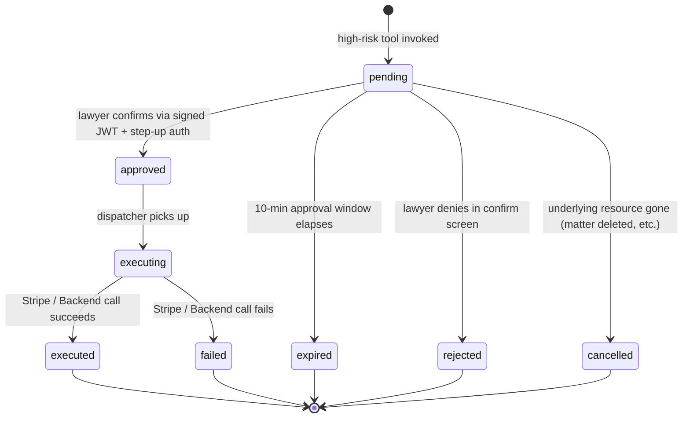

# feat: Blawby MCP agent surface

**Target repos:** `blawby-ai-chatbot` (Worker; this repo) and `blawby-backend` (sibling Node service). Implementation units below state `**Repo:**` explicitly when the work lands outside `blawby-ai-chatbot`. All paths inside each unit are repo-relative.

## Summary

Remote MCP server hosted on the Cloudflare Worker exposes Blawby's firm-operations surface to Claude Desktop. Approach: Backend (Better Auth) acts as OAuth 2.1 authorization server issuing audience-bound, scope-limited tokens via DCR and authorization-code+PKCE+RFC 8707; Worker is the resource server, hosting Streamable HTTP MCP via Cloudflare's `agents` SDK `McpAgent` Durable Objects, with SSE fan-out and 7-day D1 replay buffer; mutating tools land in the Backend transactionally with audit and idempotency, and money-moving tools route through a per-practice approval queue with step-up-auth browser confirmation.

---

## Problem Frame

NCLS's owner runs his practice from Claude Desktop today by reading Clio's email digests and asking Claude to summarize, then leaving Claude to act in a browser. The plan eliminates that round-trip for Blawby-owned operations — Claude receives push notifications of state changes and can trigger Blawby actions directly under scoped authorization with audit trail. Full context in the origin requirements doc.

---

## Requirements

**Authorization, identity, and trust**
- R1. Backend issues scoped, audience-bound OAuth 2.1 access tokens via authorization-code + PKCE + RFC 8707 resource indicator, with Dynamic Client Registration for Claude Desktop. Access tokens ≤ 5 min; refresh tokens rotated per OAuth 2.1 with a 30s grace window for in-flight refreshes.
- R2. Scope vocabulary: `intakes:read`, `intakes:write`, `matters:read`, `matters:write`, `invoices:read`, `invoices:send`, `invoices:refund`, `clients:read`, `conversations:read`, `messages:send_as_practice`, `payments:read`, `payments:refund`, `team:read`, `events:subscribe`. Consent is atomic — the lawyer approves or denies the requested set; partial downscoping is not supported in v1.
- R3. Consent screen displays scopes in plain language and the per-practice money-action approval threshold (default $0). Threshold is mutable post-consent from the web UI; in-flight pending actions retain the threshold they were minted under.
- R4. Revocation propagates within ≤ 30s. Mechanism: per-practice revocation epoch stored in KV checked on every tool call and event emission; emergency `jti` denylist for fast-path immediate revocation.
- R5. The Backend emits lifecycle events transactionally with the underlying state change (outbox pattern): intake submitted, intake payment succeeded, intake triaged, matter status changed, invoice sent, invoice paid, invoice overdue, payment received, payout completed, message received from a client, engagement signed, pending action completed.
- R6. Worker fans events to sessions whose granted scopes cover the event class. Filtering at fan-out time (not subscribe time) so scope changes mid-session take effect immediately.
- R7. Event delivery is durable with `Last-Event-ID`-based replay up to 7 days. Reconnects with a cursor older than 7 days receive a single `events.truncated` notification with the skipped count before live delivery resumes.

**Tool surface**
- R8. Read tools cover intakes, matters (notes/milestones/tasks/time/retainer), invoices, clients, conversations, payments, payouts, team. Plus `get_practice_briefing` synthesis tool returning a categorized digest of unread state changes since a caller-provided cursor.
- R9. Direct-execution writes (no out-of-band confirmation): `triage_intake`, `convert_intake_to_matter`, `update_matter`, `add_matter_note`, `log_time_entry`, `message_client` (Blawby chat), `request_documents_from_client` (Blawby chat). Messaging tools enforce the conversation-visibility invariant — Blawby conversations are deliverable only to clients with both an accepted intake AND practice-org membership (see `worker/utils/intakeVisibility.ts`); pre-acceptance prospects are unreachable via these tools.
- R10. High-risk writes (out-of-band confirmation at the $0 default threshold): `send_invoice`, `record_payment`, `refund_payment`. Each returns a `pending_action_id` and an approval URL.
- R11. `get_pending_action` read tool and `pending_action.completed` push event class provide Claude with a defined way to learn the outcome of an OOB-confirmed action. Pending-action state machine: `pending → approved → executing → executed | failed | expired | rejected | cancelled`. Terminal states are `executed`, `failed`, `expired`, `rejected`, `cancelled`.
- R12. Approval URL identifies a `pending_action_id` only; the lawyer's identity is established via step-up auth in their existing browser session, bound to the practice. The signed approval JWT is server-bound (one-time-use `jti`, 10-minute TTL).

**Audit, idempotency, parity, and trust-account gating**
- R13. Backend appends to a per-practice agent audit log on every mutating MCP-invoked action: token `jti`, granted scopes snapshot, tool name, action category, target resource type+id, request payload **digest** (SHA-256 of canonical params, never raw client-communication content), idempotency key, outcome, correlation id, timestamp. Append-only with hash-chain row-linking. Audit write is in the same transaction as the action; audit-or-nothing.
- R14. All MCP-invoked mutating Backend endpoints honor `Idempotency-Key` with IETF draft semantics: replay returns the original status+body; in-flight duplicate returns 409; param-fingerprint mismatch returns 422. 24-hour TTL. Key scope: `(practice_id, tool_name, idempotency_key)`. Worker derives keys from `IDEMPOTENCY_SALT` (currently declared but unused).
- R15. Every practice-owner capability in the MCP tool surface has a Blawby web UI surface that achieves the same outcome. Future practice-owner features ship to both surfaces in the same release.
- R16. **(Added by plan)** v1 MCP money tools (`send_invoice`, `record_payment`, `refund_payment`) refuse to operate on matters flagged as trust-account / IOLTA. Trust-account operations remain web-UI-only and are tracked as deferred scope. The refusal carries a structured error code (`TRUST_ACCOUNT_NOT_SUPPORTED`) and a description Claude can surface to the lawyer.
- R17. **(Added by plan)** A single `(practice_id, user_id)` may hold N concurrent authorized MCP sessions. Each session has its own session id, event cursor, and revocation handle. The web UI lists active sessions with last-seen and per-session revoke; "revoke all sessions for this user" is also available. This is single-user-per-practice — multi-user-per-practice sessions (where a paralegal and an attorney each authorize their own scoped sessions against the same practice) remains deferred per origin's Scope Boundaries.
- R18. **(Added by plan)** Per-session and per-practice MCP tool-call rate limits. v1 constants: 60 calls/min per session, 600 calls/min per practice, 10 high-risk approvals/min per practice. Exceeded calls return JSON-RPC error `data.code: "RATE_LIMITED"` with `data.retry_after_ms`. Per-practice configuration is deferred.
- R19. **(Added by plan)** PII surfacing to Claude is governed by scope. `clients:read` returns identity-minimal projections (client_id, display_name, primary contact channel); full PII (address, DOB, financial details) requires a future `clients:read_pii` scope which is not part of v1 default consent. Tool descriptions instruct Claude to ask the lawyer before requesting full-PII data. Audit log captures whenever a full-PII read occurs.
- R20. **(Added by plan)** The MCP exposes a `revoke_my_session` tool (scope: `events:subscribe` — present on every session) that revokes the calling session. Use case: Claude detects prompt injection in its own context, or the lawyer says "stop using MCP." The tool triggers the same revocation epoch increment + denylist add as the web UI revoke.

**Origin actors:** A1 (Practice owner, agent-native), A2 (Practice owner, web-only), A3 (Firm client), A4 (Claude Desktop), A5 (Blawby Worker), A6 (Blawby Backend).
**Origin flows:** F1 (MCP authorization), F2 (Event-driven briefing), F3 (Low-risk action), F4 (High-risk action).
**Origin acceptance examples:** AE1 (covers R5,R6,R7), AE2 (covers R9/origin-R10,R13), AE3 (covers R10/origin-R11,R12,R13,R14), AE4 (covers R10/origin-R11,R12), AE5 (covers R4), AE6 (covers R15). The plan renumbered origin's R10→plan R9 (direct writes) and origin's R11→plan R10 (high-risk writes); the slash notation makes the cross-reference explicit.

**Event payload contracts:** `pending_action.completed` carries `{pending_action_id, tool_name, outcome, outcome_summary}` where `outcome` is one of the five terminal states (`executed | failed | expired | rejected | cancelled`) and `outcome_summary` is an allow-listed subset of fields (e.g., for `failed`: `{stripe_error_code: string, stripe_error_decline_code: string | null}`); full Stripe error objects and underlying-resource detail stay in the backend `pending_actions.state_reason` column and are accessible only via authenticated Backend API. Field-level schema lives in `event-outbox.schema.ts` (U4) and is enforced in the outbox emit helper, not at each caller.

**Event-type → required-scope mapping (source of truth in backend U4; verbatim copy in worker U8):**
- `intake:submitted`, `intake:triaged`, `intake:payment_succeeded` → `intakes:read`
- `matter:status_changed` → `matters:read`
- `invoice:sent`, `invoice:paid`, `invoice:overdue` → `invoices:read`
- `payment:received`, `payout:completed` → `payments:read`
- `message:received_from_client` → `conversations:read`
- `engagement:signed` → `matters:read`
- `pending_action.completed` → derived from the originating tool's scope (`send_invoice` → `invoices:send`; `refund_payment` → `payments:refund`; `record_payment` → `invoices:send`)

---

## Scope Boundaries

### Deferred for later

(Carried from origin — product/version sequencing.)

- Expanding Blawby's domain to absorb Clio's litigation lifecycle (richer matter state machine, first-class Deadlines, typed Documents with stage and status, formal Conflict Check workflow step, FPL-tiered eligibility on Contact).
- SMS as a confirmation channel for over-threshold pending actions — browser-confirm is the required path; SMS is a fast-follow.
- Non-OAuth authorization paths (manually-minted personal access tokens for self-hosters or staff service accounts).
- Multi-user-per-practice agent sessions where a paralegal and an attorney each hold their own scoped MCP session bound to one practice.
- Trust-account / IOLTA MCP money tools (per R16 — v1 refuses; web-UI-only for now).

### Outside this product's identity

(Carried from origin — positioning rejection.)

- Wrapping Clio's API as additional MCP tools to make Blawby's MCP a unified agent control plane. Position 1 stands: Blawby's MCP exposes Blawby's domain only.
- MCP-first positioning where the practice-side web UI freezes. MCP-additive parity is the chosen identity.
- Local `npx`-packaged MCP that runs over stdio. Remote MCP via OAuth only.
- Replacing Clio. Even with parity over time, the product framing remains "Blawby is the agent-native surface for the operations Blawby owns."

### Deferred to Follow-Up Work

(Plan-local — implementation work intentionally split off.)

- Performance and load testing of the SSE fan-out under high event volume. Separate stress-test PR after v1 production rollout.
- Per-practice/per-tool rate limiting beyond a global default. Initial limits ship as constants; per-practice configuration is a follow-up.
- Daily-digest email summarizing each lawyer's agent activity ("yesterday your agent triaged 4 intakes, drafted 2 invoices"). Separate notification template work in `blawby-backend/src/modules/notifications/`.
- Read-only audit-log export API for firm SIEM ingestion. Separate endpoint and auth model.
- Tamper-evident hash-chain verification CLI for compliance review. Separate tooling repo.

---

## Context & Research

### Relevant Code and Patterns

**Worker (`blawby-ai-chatbot`):**
- `worker/index.ts` — route table (`RouteEntry[]` at lines ~105-221, with `mode: 'proxy' | 'owned'` annotation). New MCP routes register here. Locked by `tests/unit/worker/route-table.test.ts`.
- `worker/utils/proxy.ts` — canonical proxy implementation (`proxyToBackend()` at ~239-309). Forward headers, rewrite `Set-Cookie` domain via `tldts.getDomain`. Reuse for all MCP→Backend calls; do not build a parallel HTTP client.
- `worker/routes/aiChatShared.ts` — `createSseResponse()` SSE primitive at lines ~24-49 (TransformStream + `text/event-stream` + `X-Accel-Buffering: no`). Reuse for the MCP Streamable HTTP server-to-client channel.
- `worker/routes/aiChatIntake.ts` — function-calling tool definitions for the intake-time AI. Mirror this shape (JSON Schema or zod-derived) for MCP tool descriptions to keep the in-process AI tool pattern and the MCP tool pattern visually aligned.
- `worker/middleware/compose.ts` + `worker/middleware/auth.ts` — middleware composition (`withAuth`, `withRateLimit`) and remote-validation pattern. Build `withMCPAuth` alongside, do not modify `withAuth`.
- `worker/middleware/practiceContext.ts` — practice-from-auth resolution with query-param token rejection (lines ~28-48). MCP OAuth callbacks must NOT route through this middleware.
- `worker/utils/intakeVisibility.ts` — conversation-visibility invariant (`getAcceptedIntakeConversationIds`, `materializeAcceptedConversations`). MCP `message_client` and `request_documents_from_client` enforce visibility via this module.
- `worker/durable-objects/ChatRoom.ts` — message-write entry point (`/internal/message` POST at ~160-165). MCP message-sending tools call this seam.
- `worker/services/BackendEventService.ts` — existing Worker→Backend POST channel with `WIDGET_AUTH_TOKEN_SECRET` bearer. The new Backend→Worker channel is the mirror: a new Worker route receives the Backend's POSTs, authenticated with a **distinct** `MCP_BACKEND_TOKEN` (not the widget secret).
- `worker/services/SessionAuditService.ts` — exists, but is conversation-keyed (`session_audit_events` table); not suitable as the per-practice agent audit log. Agent audit log lives on the Backend.
- `worker/schema.sql` + `worker/migrations/` — D1 conventions. New migrations follow `YYYYMMDD_short_description.sql`.
- `worker/wrangler.toml` — env bindings. New bindings: `OAUTH_KV` (for OAuth `state` and `code_verifier` storage if needed), `MCP_BACKEND_TOKEN`, plus DO binding for the new `McpSession` class. Existing `IDEMPOTENCY_SALT` env var (declared but unused) is repurposed.
- `vite.config.ts` `workerEndpoints` — every new Worker-owned `/api/*` prefix MUST be listed here or local-dev requests fall through to the backend proxy and 404.

**Backend (`blawby-backend`):**
- Better Auth `^1.3.13` with `oauth-provider` plugin (NOT `oidc-provider`, which is deprecated). Confirm version is 1.5+ before assuming DCR `.well-known` listing bug is fixed.
- Graphile Worker job processor — natural seat for the event outbox dispatcher.
- Existing fund-router with `applicationFeeAmount = 0` (platform fees billed via metered usage). Money tools must read backend reconciliation, not infer revenue from Stripe events.
- `practice_client_intakes.service.ts`, `matters.service.ts`, `invoices.service.ts` — existing service layer where audit middleware wraps mutating methods.

### Institutional Learnings

- `docs/solutions/` does not exist in this repo. `CLAUDE.md` + `AGENTS.md` carry the de facto critical-patterns rules.
- `AGENTS.md` greenfield + fail-fast rules apply: surface backend errors verbatim from MCP tools; do not mask, retry-on-unknown, or substitute defaults. The MCP error envelope is a thin pass-through with structured JSON-RPC error data, not a masking layer.
- `CLAUDE.md` API-contract rule: if the Backend returns malformed data to an MCP tool, fix the Backend contract first. No Worker-side shimming.
- `docs/engineering/AUTHENTICATION_ARCHITECTURE.md` is the canonical reference for cookie-domain rewriting and session boundary; the new MCP auth path must coexist with it without changing its semantics.
- `docs/architecture/state.md` cache anti-pattern: do not create a new caching layer on the Worker for MCP state. Reuse `worker/utils/edgeCache.ts` where caching is needed.
- `docs/audits/api-parallel-requests-567.md` confirms invoice-list-style endpoints are fully proxied. Backend-shape changes are coordinated PRs in `blawby-backend`, not Worker-side wrappers.
- After this plan lands, seed `docs/solutions/` with the MCP-specific learnings (OAuth, scoped tokens, audit, idempotency, eventing) — none of these exist in repo today.

### External References

- MCP Spec 2025-11-25 — Transports (Streamable HTTP, `MCP-Session-Id`, `Last-Event-ID` replay): <https://modelcontextprotocol.io/specification/2025-11-25/basic/transports>
- MCP Spec 2025-06-18 — Authorization (OAuth 2.1, PKCE S256, RFC 8707 resource indicator, RFC 9728 protected-resource metadata, RFC 7591 DCR): <https://modelcontextprotocol.io/specification/2025-06-18/basic/authorization>
- Cloudflare Agents SDK (`McpAgent` DO pattern): <https://developers.cloudflare.com/agents/guides/remote-mcp-server/> and v0.4.0 changelog adding custom OAuth provider support: <https://developers.cloudflare.com/changelog/post/2026-02-09-agents-sdk-v040/>
- Better Auth OAuth Provider plugin: <https://better-auth.com/docs/plugins/oauth-provider> (use this, not the deprecated `oidc-provider`)
- Stripe Idempotency: <https://docs.stripe.com/api/idempotent_requests> and design rationale: <https://stripe.com/blog/idempotency>
- IETF draft `draft-ietf-httpapi-idempotency-key-header-07`: <https://www.ietf.org/archive/id/draft-ietf-httpapi-idempotency-key-header-07.html>
- OWASP MCP Tool Poisoning attack class: <https://owasp.org/www-community/attacks/MCP_Tool_Poisoning>
- ABA Model Rule 1.6 (Confidentiality): <https://www.americanbar.org/groups/professional_responsibility/publications/model_rules_of_professional_conduct/rule_1_6_confidentiality_of_information/>
- Tool description patterns digest: synthesized from Notion, Linear, Atlassian, Stripe MCPs (see research notes in this session).

---

## Key Technical Decisions

- **Backend (Better Auth) is the OAuth Authorization Server; Worker is the Resource Server only.** No business state lives on the Worker. Worker validates JWTs against Better Auth's JWKS endpoint with a per-isolate 30-second cache via `jose`. The plan does NOT rely on Cloudflare Agents SDK's `createMcpOAuthProvider` (Feb 2026 v0.4.0) — that API is for the SDK acting as an MCP *client* connecting to other servers, not for customizing OAuth on a server you host. Worker-side path: validate Bearer JWT externally in `withMCPAuth`; let `McpAgent` (or raw `@modelcontextprotocol/sdk`) see only the post-auth request. (Origin Key Decision: "Worker hosts the MCP endpoint; Backend remains source of truth.")
- **`McpAgent` Durable Object per active MCP session, using WebSocket transport for the server-to-client channel.** Cloudflare's `agents` SDK provides session pinning the MCP spec implicitly requires, and DO hibernation works with WebSockets (`acceptWebSocket()`) but NOT with long-lived SSE (SSE is a held-open HTTP handler with an in-memory `TransformStream` writer; DOs cannot hibernate while that handler is open). MCP `2025-11-25` Streamable HTTP transport supports both SSE and WebSocket; we negotiate WebSocket on the server-to-client channel and use Streamable HTTP request/response for client-to-server. Per-session cursor lives in DO SQLite storage; **per-session event replay buffer also lives in DO SQLite storage**, not D1 — keeps the 7-day buffer isolated per session and avoids global D1 write contention under Stripe-webhook bursts.
- **Distinct `MCP_BACKEND_TOKEN` + HMAC-signed request bodies for the Backend→Worker internal events channel.** Reusing `WIDGET_AUTH_TOKEN_SECRET` would double-purpose an already-overloaded secret. The static bearer is the first auth factor; an HMAC-SHA256 signature over `(timestamp || canonical_body)` is the second — Worker rejects on timestamp skew > 60s or HMAC mismatch even if the bearer leaks. Mirrors the existing outbound-direction pattern in `worker/services/BackendEventService.ts`.
- **Tokens: 5-minute access, rotating refresh, 30-second rotation grace window.** Combined with the per-practice revocation epoch (KV, read on every tool call and event emit), gives R4's "≤ 30s revocation propagation" without making every tool call a JWKS round-trip.
- **Approve URL carries `pending_action_id`, not a bearer.** The signed JWT is one-time-use via `jti` consumption record; step-up auth in the existing browser session establishes the lawyer's identity. Pasting the URL into Slack does NOT grant access. Multi-org browser sessions must show the practice name prominently and require practice-match before step-up. **Approval JWT also carries `actor_user_id`** — the confirm controller verifies `session.user_id === jwt.actor_user_id` and refuses with "this action was requested by a different team member" if mismatched. Without this binding, in a multi-attorney firm, a different attorney with practice access could approve another's pending action; the audit log would record a valid approval but not the intended approver. JWT algorithm is **RS256** (asymmetric), private key on Backend only; key rotation handled by staging the new public key and waiting for in-flight JWTs to expire (10-min TTL).
- **Audit-or-nothing.** Mutating action and audit write share a Postgres transaction. If audit write fails, the action rolls back. Bar-discipline pressure on Rule 5.3 (Supervision) makes this load-bearing.
- **Audit chain model: per-practice sequence + per-day Merkle root, not a forever linear hash chain.** A naive `prev_row_hash` chain serializes all writes within a practice — under concurrent agent tool calls, two writers reading the same "latest" row produce forks at insert time, forcing serial writes via advisory locks and capping per-practice throughput at ~200 ops/sec on Postgres. Instead: every row carries a monotonic `practice_seq` (per-practice sequence, gap-free via a `practice_audit_seq` table with `FOR UPDATE` on a single counter row — cheap, ~1ms lock). End-of-day (or every N=1000 rows, whichever first) a background job computes a Merkle root over the day's rows and signs it with the audit-chain key; the signed root is stored separately. Tamper-evidence is preserved at day-granularity; verification reconstructs the Merkle tree and checks the signature. Trade-off: cannot detect single-row tampering until the day-batch closes, but in practice forensic review queries are run on closed days. Throughput ceiling per practice rises from ~200 ops/sec to ~5000 ops/sec.
- **Audit stores hashes, not raw client-communication content.** `request_payload_digest` is SHA-256 of canonical params (with body fields hashed before inclusion in the digest). Raw note bodies, message contents, intake details live in the resource row (matter note, conversation message, intake metadata) under existing retention; audit is metadata-only to avoid privilege waiver via eDiscovery. `target_resource_id` is preserved for compliance reconstruction but the audit log access pattern requires the same privilege-review gate as the underlying matter files — documented in `docs/engineering/MCP_ARCHITECTURE.md` and gating the deferred SIEM-export endpoint.
- **Outbox pattern for events.** Events emitted transactionally with state change into a backend `event_outbox` table; Graphile Worker dispatches to the Worker via authenticated POST. No event for a state change that rolls back.
- **Trust-account / IOLTA matters are excluded from MCP money tools in v1.** Money tools check `matter.trust_account_flag` at the Backend write boundary and return `TRUST_ACCOUNT_NOT_SUPPORTED` if set. The matter row gains a flag; existing matters default false; lawyers can flag matters as trust-only from the web UI.
- **Snake_case wire types, snake_case tool names** (`send_invoice`, `list_matters`). Mirrors the existing `worker/types/wire/` convention and the convention converged on by Notion, Linear, Stripe MCPs.
- **JSON-RPC errors carry `data.code` (string), `data.retryable` (boolean), `data.retry_after_ms` (number, when applicable).** Stable codes Claude can program against without parsing English (e.g., `TRUST_ACCOUNT_NOT_SUPPORTED`, `BACKEND_UNAVAILABLE`, `SCOPE_INSUFFICIENT`, `RATE_LIMITED`, `IDEMPOTENCY_KEY_MISMATCH`).

---

## Open Questions

### Resolved During Planning

- **Concrete authorization flow:** OAuth 2.1 authorization-code + PKCE S256 + RFC 8707 resource indicator + DCR. Device authorization grant rejected — MCP spec doesn't use it and Better Auth doesn't support it.
- **Event delivery shape:** Backend transactional outbox → Backend dispatcher → Worker internal POST route → per-session `McpSession` DO → SSE to client. Replay via D1-backed cursor.
- **Audit log storage:** New per-practice append-only Postgres table on the Backend. Hash-chained rows. Worker only emits; does not store.
- **Idempotency strategy:** `IETF draft-ietf-httpapi-idempotency-key-header-07` semantics. Worker derives keys with `IDEMPOTENCY_SALT`; key shape `sha256(practice_id || tool_name || canonical_json(params) || mcp_session_id || tool_call_seq)`. 24h TTL. Backend stores per-`(practice_id, tool_name, idempotency_key)`.
- **Transport version:** Support both MCP `2025-06-18` and `2025-11-25` via the standard `MCP-Protocol-Version` negotiation.
- **Approval token shape:** Signed JWT with `jti`, `sub`, `practice_id`, `action_id`, `amount_cents`, `currency`, `tool_name`, `iat`, `exp` (10 min). One-time-use enforced via `jti` consumption row on Backend. URL path: `https://app.blawby.com/approve/<jwt>`.
- **Consent semantics:** Atomic in v1 (approve-all or deny). Partial scope grant deferred.
- **Stripe Connect onboarding remains a browser handoff.** MCP returns the hosted onboarding URL when relevant; no KYC over MCP.

### Deferred to Implementation

- **Survey of which existing Backend mutating endpoints already honor `Idempotency-Key` and which need backfill.** First investigation in the Backend repo at U2 kickoff; surface findings inline with U2 work.
- **Exact tool description wording and parameter shape polish.** Initial pass during U9–U11; second pass after one dogfooding session with NCLS.
- **Exact JWKS caching window.** 30s is the starting point; tune based on revocation-propagation observation during U7 development.
- **Replay-buffer pagination size on reconnect.** Starting point: 1000 events per page. Tune based on first real reconnect observation.
- **Where in the web UI the consent/settings/approval surfaces land.** Specific component placement decided during U5 (Backend repo, but visible to frontend repo via existing routes).

---

## Output Structure

New directories and significant new files. Per-unit `**Files:**` sections are authoritative; this is the at-a-glance shape:

```
blawby-ai-chatbot/                              (this repo)
  worker/
    routes/
      mcp/
        index.ts                                MCP route handlers (initialize, message, GET sse, well-known)
        tools/
          read.ts                               read-tool implementations
          writes-direct.ts                      direct-execution write tools
          writes-high-risk.ts                   high-risk tools (return pending_action_id)
          briefing.ts                           get_practice_briefing synthesis tool
        toolDefinitions.ts                      JSON Schema descriptions for all MCP tools
        events.ts                               internal Backend→Worker events route
    durable-objects/
      McpSession.ts                             per-session DO (SSE, cursor, replay)
    middleware/
      mcpAuth.ts                                Bearer JWT validation, scope check, revocation epoch
    services/
      MCPSessionStore.ts                        D1 access for sessions + cursors + replay buffer
      MCPIdempotency.ts                         key derivation, header propagation
    migrations/
      20260520_mcp_session_state.sql            session metadata, cursors, replay buffer
  src/                                           (no MCP-specific frontend changes in v1)

blawby-backend/                                  (sibling repo)
  src/
    modules/
      oauth/                                    Better Auth oauth-provider integration
        oauth.config.ts                         scopes, audiences, DCR allowlist
        revocation.service.ts                   revocation epoch + jti denylist
      agent-audit/
        agent-audit.schema.ts
        agent-audit.service.ts                  append + hash-chain
        agent-audit.middleware.ts               transactional wrapper
      idempotency/
        idempotency.middleware.ts               IETF semantics
        idempotency.store.ts                    per-(practice, tool, key) record
      pending-actions/
        pending-actions.schema.ts               state machine table
        pending-actions.service.ts
        approval-jwt.service.ts
        approve.controller.ts                   browser confirm screen + step-up + execute
      event-outbox/
        event-outbox.schema.ts
        event-outbox.service.ts
        event-dispatcher.worker.ts              Graphile Worker job
    migrations/
      <next>-mcp-oauth-scopes.sql
      <next>-agent-audit-log.sql
      <next>-idempotency-records.sql
      <next>-pending-actions.sql
      <next>-event-outbox.sql
      <next>-matters-trust-account-flag.sql
```

---

## High-Level Technical Design

> *This illustrates the intended approach and is directional guidance for review, not implementation specification. The implementing agent should treat it as context, not code to reproduce.*

### Authorization flow (F1)

```mermaid
sequenceDiagram
    participant Lawyer
    participant CD as Claude Desktop
    participant W as Worker (RS)
    participant B as Backend (AS)

    Lawyer->>CD: "Add Blawby MCP"
    CD->>W: GET /mcp/ (no token)
    W-->>CD: 401 WWW-Authenticate (resource_metadata=...)
    CD->>W: GET /.well-known/oauth-protected-resource
    W-->>CD: { authorization_servers: [Backend AS URL] }
    CD->>B: GET /.well-known/oauth-authorization-server
    B-->>CD: AS metadata (endpoints, scopes_supported)
    CD->>B: POST /oauth2/register (DCR, redirect_uri=loopback)
    B-->>CD: { client_id }
    CD->>CD: generate PKCE (S256), state, code_verifier
    CD->>Lawyer: launch browser → /oauth2/authorize?client_id=...&code_challenge=...&resource=https://mcp.blawby.com&scope=...
    Lawyer->>B: consent screen (scopes + $0 threshold + practice context)
    Lawyer-->>B: approve
    B-->>CD: redirect to loopback with code
    CD->>B: POST /oauth2/token (code, code_verifier, resource)
    B-->>CD: { access_token (5min, aud=mcp.blawby.com), refresh_token, scope }
    CD->>W: MCP request with Authorization: Bearer ...
    W->>B: GET /.well-known/jwks.json (cached 30s)
    W->>W: validate aud, exp, scope; check revocation epoch (KV)
    W-->>CD: MCP response
```

### Event subscription (F2)

```mermaid
sequenceDiagram
    participant Client as Firm client
    participant B as Backend (AS + outbox)
    participant DispatchW as Backend dispatcher (Graphile)
    participant W as Worker (/api/mcp/internal/events)
    participant DO as McpSession DO
    participant CD as Claude Desktop

    Client->>B: pay invoice (Stripe webhook)
    B->>B: BEGIN; update invoice; INSERT event_outbox; COMMIT
    DispatchW->>B: poll event_outbox
    DispatchW->>W: POST /api/mcp/internal/events (Authorization: Bearer MCP_BACKEND_TOKEN)
    W->>W: validate service token; persist to D1 replay buffer
    W->>DO: stub.fetch (/internal/event) for each (practice_id, session_id) with covering scope
    DO->>DO: SSE event id = backend event_id, data = event payload
    DO-->>CD: SSE event (over the long-lived GET stream)
    Note over CD: on reconnect with Last-Event-ID: 12345
    CD->>DO: GET /mcp (Last-Event-ID: 12345)
    DO->>W: query D1 replay buffer (event_id > 12345 AND age < 7d, scope-filtered)
    alt cursor older than 7d
        DO-->>CD: events.truncated notification (count=N)
    end
    DO-->>CD: replay events in order, then live
```

### Pending-action state machine (F4)



Terminal states (`executed`, `failed`, `expired`, `rejected`, `cancelled`) cannot transition further. Re-issuance after a terminal state requires a fresh `pending_action_id` minted by a new tool call. Tool descriptions instruct Claude not to auto-retry rejected approvals without lawyer confirmation.

### Tool definition shape (mirrors `worker/routes/aiChatIntake.ts`)

> *Directional sketch; do not copy. Actual definitions in `worker/routes/mcp/toolDefinitions.ts`.*

```text
{
  name: "send_invoice",
  description: "Send an invoice from this practice to a client. Requires lawyer confirmation
                via a browser link (the tool returns pending_action_id and an approval URL).
                Idempotent for 24 hours on identical parameters. Use list_matters and
                list_clients to locate IDs.",
  inputSchema: {
    type: "object",
    properties: {
      matter_id:   { type: "string", description: "Matter id, e.g. 'mat_01...'" },
      client_id:   { type: "string", description: "Recipient client id" },
      line_items:  { type: "array", items: { ... } },
      due_date:    { type: "string", format: "date" },
      idempotency_key: { type: "string", description: "Optional; auto-generated if omitted" }
    },
    required: ["matter_id", "client_id", "line_items"]
  },
  _meta: { risk_tier: "high", requires_approval: true }
}
```

---

## Implementation Units

### U1. Backend OAuth provider + scope vocabulary + DCR + revocation infrastructure

**Repo:** `blawby-backend`

**Goal:** Better Auth `oauth-provider` plugin issues audience-bound access tokens (5min) and rotating refresh tokens via authorization-code + PKCE + RFC 8707, with DCR for Claude Desktop. RFC 9728 protected-resource metadata served from the Backend. Per-practice revocation epoch (Redis or DB) and `jti` denylist mechanism exposed via revoke API.

**Requirements:** R1, R2, R4, R17

**Dependencies:** None

**Files:**
- Create: `src/modules/oauth/oauth.config.ts`
- Create: `src/modules/oauth/revocation.service.ts`
- Create: `src/migrations/<next>-mcp-oauth-scopes.sql` (scope persistence if Better Auth doesn't carry it)
- Modify: Better Auth bootstrap (existing — confirm version ≥ 1.5 for DCR `.well-known` bug fix)
- Modify: API server route mount (add `/.well-known/oauth-protected-resource`, `/.well-known/oauth-authorization-server`)
- Test: `src/modules/oauth/__tests__/oauth.config.test.ts`, `src/modules/oauth/__tests__/revocation.service.test.ts`

**Approach:**
- Enable `oauth-provider` plugin with `allowDynamicClientRegistration: true`, `allowUnauthenticatedClientRegistration: true`, `validAudiences: ["https://mcp.blawby.com", "https://mcp.blawby.com/mcp"]`, full scope vocabulary from R2, `clientRegistrationAllowedScopes: <full set>`.
- Strict DCR `redirect_uri` allowlist. Loopback per RFC 8252 §7.3 (`http://127.0.0.1:*/callback`, `http://localhost:*/callback`) is universal. For Claude Desktop custom URI scheme: pin to the exact published Anthropic redirect URI (verify by capturing one real handshake before allowlist deploy — do NOT ship a `claude-desktop://*` wildcard, which is an open redirect-URI registration vector since custom URI schemes can be hijacked on macOS/Windows). For `claude.ai` web: pin to the exact path Anthropic publishes, not a `https://claude.ai/*` wildcard. Reject everything else with `invalid_redirect_uri`.
- DCR rate-limit + dedupe by `(client_name, software_id, redirect_uris_hash)` to defend against client-side reconnect churn.
- **Token endpoint rate limit:** max 10 refresh-token exchanges per `(practice_id, client_id)` per 60-second window. RFC 6819 §5.2.2.3 refresh-token-theft detection: if two distinct requests present the same RT within the 30s rotation grace window and neither is the expected rotation, treat as theft → revoke all tokens for that `(practice_id, client_id)`, increment revocation epoch, emit alert.
- Per-practice revocation epoch: monotonic integer in a DB column or Redis key, incremented on session revoke. Worker reads it (KV-cached 30s) on every tool call.
- `jti` denylist: short-TTL Redis set, 1-hour entries (covers the 5-min access-token lifetime + buffer). On revoke, the affected access token's `jti` is added.
- Web UI endpoints for revocation come in U5.

**Patterns to follow:**
- Better Auth plugin config conventions used elsewhere in the backend.
- Existing service-token model for inter-service auth (used by `WIDGET_AUTH_TOKEN_SECRET`) — same env-var-injection pattern for the new secrets.

**Test scenarios:**
- Happy path: DCR with valid loopback `redirect_uri` returns a `client_id`. Subsequent auth code → token exchange with matching `resource` returns an access token whose `aud` claim equals the canonical MCP URL.
- Happy path: refresh-token rotation issues a new RT and invalidates the prior; the 30s grace window allows the prior RT to refresh once within grace.
- Edge case: DCR with `redirect_uri` outside the allowlist (e.g., `https://evil.example.com/cb`) is rejected with `invalid_redirect_uri`. **Covers AE5.**
- Edge case: token request with mismatched `resource` parameter (different from authorization-time value) is rejected.
- Edge case: token request without `resource` is rejected with `invalid_target`.
- Edge case: PKCE with `code_challenge_method=plain` is rejected; only S256 accepted.
- Error path: AS returns `server_error` during token exchange — retryable signal in response, idempotent code-redemption.
- Error path: Concurrent code redemption — second redemption returns invalid_grant; only one succeeds.
- Integration: revoking a session increments the practice revocation epoch and adds active `jti`s to the denylist; a Worker reading the epoch within the next 30s sees the new value (verified via Worker integration test seam, see U7).

**Verification:**
- DCR endpoint returns `client_id` for allowed `redirect_uri`s and rejects others.
- Token endpoint emits JWTs with `aud` matching the requested `resource`.
- Revocation epoch increments on revoke; `jti` denylist correctly rejects within TTL.
- Better Auth `.well-known` endpoints serve the expected RFC 8414 + RFC 9728 documents (DCR enabled flag, scopes list, audience).

---

### U2. Backend mutating-endpoint infrastructure: agent audit log + idempotency

**Repo:** `blawby-backend`

**Goal:** New per-practice agent audit log table (append-only, hash-chained). Audit middleware wraps every MCP-invoked mutating endpoint and writes the audit row in the same transaction as the action. `Idempotency-Key` support with IETF draft semantics across the same endpoints. Survey existing endpoints; add support where missing.

**Requirements:** R13, R14

**Dependencies:** U1 (audit middleware needs the token claims set up by oauth-provider)

**Execution note:** Start with a survey of which mutating endpoints already accept `Idempotency-Key`. Some Stripe-wrapping endpoints may already be idempotent; many are not. Survey output drives the per-endpoint backfill list.

**Files:**
- Create: `src/modules/agent-audit/agent-audit.schema.ts`, `agent-audit.service.ts`, `agent-audit.middleware.ts`
- Create: `src/modules/idempotency/idempotency.middleware.ts`, `idempotency.store.ts`
- Create: `src/migrations/<next>-agent-audit-log.sql`, `<next>-idempotency-records.sql`
- Modify: each mutating endpoint touched by an MCP tool (list determined by survey; expected targets include `practice-client-intakes` triage + convert routes, `matters` update + note + time-entry routes, `invoices` send + record-payment + refund routes, `clients` create/update if MCP exposes them later)
- Test: `src/modules/agent-audit/__tests__/agent-audit.service.test.ts`, `src/modules/idempotency/__tests__/idempotency.middleware.test.ts`, integration tests per affected endpoint

**Approach:**
- `agent_audit_log` table columns: `id` (ULID), `practice_id`, `actor_user_id`, `actor_token_jti`, `actor_token_scopes` (jsonb snapshot), `tool_name`, `action_category`, `target_resource_type`, `target_resource_id`, `request_payload_digest` (sha256 hex of canonical params), `idempotency_key`, `correlation_id` (= `mcp_session_id`), `outcome` (success/failure/rejected/timeout), `outcome_detail` (jsonb), `prev_row_hash`, `row_hash`, `created_at`. Indexes on `(practice_id, created_at desc)` and `(actor_token_jti)`.
- `agent-audit.middleware.ts`: wraps a service method, computes `row_hash`, inserts the row in the same transaction as the action. On rollback, both the action and the audit attempt are rolled back; on commit, both land. Audit-or-nothing.
- `request_payload_digest` is computed over canonical-JSON params **with client-communication content stripped** (`add_matter_note.body`, `message_client.body`, `request_documents_from_client.description`) — those fields contribute only their SHA-256 hash to the digest, not raw text. Privilege-waiver mitigation.
- `idempotency_records` table: `(practice_id, tool_name, idempotency_key)` PK + `params_fingerprint` (sha256 of canonical params, full), `status_code`, `response_body`, `state` (in_progress, complete), `created_at`, `completed_at`. 24h TTL via scheduled cleanup.
- `idempotency.middleware.ts`: on entry, look up `(practice_id, tool_name, Idempotency-Key)`. If found + complete + fingerprint matches → replay original. If found + complete + fingerprint mismatches → 422. If found + in_progress → 409. If not found → insert row with state=in_progress, proceed, write result on completion.
- The two middlewares compose: idempotency outermost (replays the cached response without running audit twice), audit innermost (transactional with the action).

**Patterns to follow:**
- Existing service-layer transaction patterns in `practice-client-intakes.service.ts` and `matters.service.ts`.
- Existing migration filename + structure conventions in `blawby-backend/src/migrations/`.

**Test scenarios:**
- Happy path: mutating call writes both the resource change and the audit row; reading the audit log returns the row with all required fields populated. **Covers AE2.**
- Happy path: replay with same `Idempotency-Key` + identical params returns the cached response without re-executing the action; audit log shows one entry, not two.
- Edge case: replay with same key + different params returns 422 `IDEMPOTENCY_KEY_MISMATCH` and does not execute or audit.
- Edge case: concurrent calls with same key — second returns 409 with `Retry-After` while first is in flight; audit log shows one entry.
- Edge case: `request_payload_digest` for a `add_matter_note` call computes over `{body_hash: sha256(body)}` not `{body: "..."}` — verify by inspecting the digest input.
- Error path: action throws after audit row pre-write; transaction rolls back; audit row does not persist.
- Error path: audit row insert fails (e.g., DB hash-chain conflict from concurrent writer) — action rolls back; client gets 5xx with structured error.
- Integration: hash-chain integrity holds across 1000 sequential inserts; `prev_row_hash` of row N equals `row_hash` of row N-1.

**Verification:**
- Survey doc lists every MCP-invoked mutating endpoint and its current idempotency status.
- After backfill, every endpoint in the survey accepts `Idempotency-Key` and behaves per IETF semantics.
- Audit table populates correctly on every mutating call; audit-or-nothing invariant verified by integration test (forcing a post-audit error and asserting both rollback).

---

### U3. Backend pending-action state machine + approval JWT + browser confirm flow + trust-account gating

**Repo:** `blawby-backend`

**Goal:** Pending-action table with state machine. Approval JWT minting (10-min TTL, one-time-use `jti`). Browser confirm controller with step-up auth, atomic state transition, and execution dispatcher. Trust-account flag on matters; money tools refuse when set.

**Requirements:** R10, R11, R12, R16

**Dependencies:** U1 (need token identity), U2 (execution runs through audit + idempotency middleware)

**Files:**
- Create: `src/modules/pending-actions/pending-actions.schema.ts`, `pending-actions.service.ts`, `approval-jwt.service.ts`, `approve.controller.ts`
- Create: `src/migrations/<next>-pending-actions.sql`, `<next>-matters-trust-account-flag.sql`
- Modify: `matters.schema.ts` adds `trust_account_flag` boolean (default false, not null)
- Modify: money-tool service methods (`invoices.service.ts` send/refund, `payments.service.ts` record) — check `trust_account_flag` and short-circuit with `TRUST_ACCOUNT_NOT_SUPPORTED` if true
- Modify: API server mounts `/api/pending-actions/:id/approve` (called by the browser confirm screen, not by the MCP)
- Modify: web UI routes mount `/approve/:jwt` (the public confirm screen URL the lawyer clicks from Claude)
- Test: `src/modules/pending-actions/__tests__/*.test.ts`, plus integration tests in `tests/integration/pending-actions/`

**Approach:**
- `pending_actions` table: `id` (ULID), `practice_id`, `actor_user_id`, `actor_token_jti`, `tool_name`, `tool_params` (jsonb), `threshold_cents` (the threshold this action was minted under, immutable after creation), `amount_cents`, `currency`, `state` (enum: pending/approved/executing/executed/failed/expired/rejected/cancelled), `state_reason` (jsonb when terminal), `approval_jti` (set on approve), `created_at`, `state_changed_at`, `expires_at` (created_at + 10 min).
- `approval-jwt.service.ts`: mints HS256 (or RS256 if a shared signing key with Worker is desired) JWT with claims `{jti, sub, practice_id, action_id, amount_cents, currency, tool_name, iat, exp}`. Stores `jti` in a separate `approval_jti_consumption` table on first valid use.
- `approve.controller.ts`: handler for the browser confirm URL. Steps:
  1. Verify JWT signature (RS256), `exp`, audience.
  2. Lookup `pending_actions.id` from JWT `action_id`. Verify state is `pending`.
  3. Check session — if missing or stale, redirect to step-up auth (existing Better Auth MFA flow), return after with same URL. **Step-up auth has a 1-hour session-bound TTL once completed** — repeated approvals within the hour skip MFA to avoid friction-rebellion (lawyer raising threshold to escape).
  4. Verify the lawyer's active practice matches the action's `practice_id`. If multi-org session is on another practice, show practice-switch prompt.
  5. **Verify `session.user_id === jwt.actor_user_id`.** If different (another firm member with practice access), render "this action was requested by [name]; only they can approve it" page and refuse.
  6. Render confirm screen (action details, line items, fees, action provenance, two buttons).
  7. On Approve POST: atomic `UPDATE pending_actions SET state='approved', approval_jti=$jti, state_changed_at=NOW() WHERE id=$id AND state='pending'`. Affected-rows=1 → mark `jti` consumed → enqueue execution. Affected-rows=0 → render "already-handled" page showing current state.
  8. On Reject POST: same atomic UPDATE to `rejected`.
- Execution dispatcher: separate worker (could be Graphile job or inline) picks up `approved` rows, transitions to `executing`, **re-fetches `matter.trust_account_flag` immediately before the Stripe call — if now `true`, transitions to `cancelled` with reason `TRUST_ACCOUNT_FLAGGED_AFTER_MINT`** (defends against trust-flag-flipped-during-approval-window race), otherwise makes the actual Backend call wrapped in U2's audit+idempotency middlewares, transitions to `executed` or `failed`. On terminal state, emit `pending_action.completed` event into the outbox (U4) with the allow-listed payload fields only.
- Expiry sweeper: scheduled job transitions `pending` rows past `expires_at` to `expired` and emits the event.
- Cancellation: if the underlying resource (matter, invoice, client) is deleted/voided while a pending action references it, mark the action `cancelled` with reason.
- Trust-account gate: matters acquire `trust_account_flag` column. When a money tool reads the matter, if `trust_account_flag = true`, throw with structured error `{code: "TRUST_ACCOUNT_NOT_SUPPORTED", retryable: false, description: "Trust-account matters are not supported by MCP in v1; use the web UI."}`. The error bubbles to the MCP tool response untouched.

**Patterns to follow:**
- Existing state-machine modeling pattern in `practice-client-intakes` (intake `status` + `triage_status` columns).
- Existing browser-mounted routes in `blawby-backend` for hosted Stripe redirects — same shape for the approve URL.

**Test scenarios:**
- Happy path: high-risk tool creates a pending action; JWT is minted with 10-min `exp`; approve URL renders the confirm screen; POST Approve transitions to approved, then executing, then executed; event emitted. **Covers AE3, AE4.**
- Happy path: same lawyer in two browser tabs clicks Approve. One wins (affected-rows=1, state=approved); the other renders "already-handled".
- Edge case: approve URL clicked 11 minutes after issuance — JWT `exp` rejected; confirm screen shows expired message + "ask Claude to re-issue".
- Edge case: same `jti` presented twice — second presentation rejected via consumption row.
- Edge case: lawyer's active practice in browser ≠ action's practice — practice-switch prompt; only after switching does Approve work.
- Edge case: matter for the pending action is deleted while pending — sweeper or check-on-approve transitions to `cancelled` with reason `underlying_resource_deleted`.
- Edge case: lawyer rejects, then Claude calls `send_invoice` again with same params — a NEW pending_action_id is minted (rejection is terminal; no reuse).
- Edge case: matter has `trust_account_flag=true` — `send_invoice` returns `TRUST_ACCOUNT_NOT_SUPPORTED` without creating a pending action.
- Edge case: in-flight pending action survives a threshold change on the practice — its routing is locked to the threshold at minting time.
- Error path: Stripe call fails during executing — state transitions to `failed` with `state_reason: {stripe_error: ...}`; event `pending_action.completed` emitted with `outcome: failed`.
- Error path: step-up auth fails — lawyer returns to confirm URL after re-auth; same JWT still valid if within `exp`.
- Integration: full F4 — high-risk tool call returns pending_action_id + approval URL; browser confirm + step-up auth; execution; `pending_action.completed` event reaches Claude via U4+U8+U13.

**Verification:**
- State machine transitions enforced (e.g., no `executed → pending`).
- Atomic UPDATE pattern verified by concurrent-approve test.
- Trust-account refusal verified end-to-end.
- Expiry sweeper runs and transitions correctly.

---

### U4. Backend event outbox + Backend→Worker internal dispatcher

**Repo:** `blawby-backend`

**Goal:** Transactional event outbox table. Service helpers used by every state-changing path to enqueue events in the same transaction as the state change. Graphile Worker job polls the outbox and dispatches to the Worker via authenticated POST with `MCP_BACKEND_TOKEN`.

**Requirements:** R5, R6, R7

**Dependencies:** U2 (audit context provides correlation id); independent of U3 but pending-action completion emits via this seam.

**Files:**
- Create: `src/modules/event-outbox/event-outbox.schema.ts`, `event-outbox.service.ts`, `event-dispatcher.worker.ts`
- Create: `src/migrations/<next>-event-outbox.sql`
- Modify: state-changing services that need to emit events (`practice-client-intakes.service.ts`, `matters.service.ts`, `invoices.service.ts`, `payments.service.ts`, `pending-actions.service.ts`)
- Test: `src/modules/event-outbox/__tests__/*.test.ts`

**Approach:**
- `event_outbox` table: `event_id` (bigserial — monotonic per database, used as SSE event id), `practice_id` (indexed), `event_type` (e.g., `invoice:paid`), `payload` (jsonb), `created_at`, `dispatched_at` (nullable), `dispatch_attempts` (int), `last_error` (text, nullable).
- `event-outbox.service.ts.emit(eventType, practiceId, payload)`: called from inside a service transaction. Inserts a row; the surrounding transaction commit makes the event visible.
- Graphile job runs every ~250ms (configurable). Selects undispatched events ordered by `event_id`, batches by `practice_id`, POSTs to Worker's `/api/mcp/internal/events` with `Authorization: Bearer ${MCP_BACKEND_TOKEN}` and a structured body `{events: [{event_id, event_type, practice_id, payload, created_at}, ...]}`.
- On 2xx, marks rows `dispatched_at = NOW()`. On 5xx or network error, increments `dispatch_attempts`, exponential backoff. After N attempts (e.g., 10), alerts and parks.
- Retention: dispatched rows pruned after 7 days. Replay buffer on Worker side (U8) holds the 7-day window.
- Event type → required scope mapping lives in this module and is replicated in Worker U7 for fan-out filtering. Source of truth on Backend; Worker version is a copy kept in sync via a shared types package or a verbatim file.

**Patterns to follow:**
- Existing Graphile Worker patterns in `blawby-backend` (notification worker, email worker).
- Outbox pattern reference is the literature on transactional outbox; no first-party Blawby example.

**Test scenarios:**
- Happy path: state change inside a service transaction also writes an outbox row; commit makes both visible; dispatcher picks up and POSTs to Worker.
- Happy path: rollback of the state change rolls back the outbox row; no event dispatched. **(Verifies R5 transactional emission.)**
- Edge case: Worker returns 500 — dispatcher retries with exponential backoff; row stays undispatched.
- Edge case: Worker returns 200 mid-batch but only acks some events — re-POST with only the unacked subset (event id is the dedup key on Worker side).
- Edge case: `event_id` ordering preserved across concurrent inserts (bigserial gives this; verify under load).
- Integration: end-to-end — invoice paid → outbox row → dispatcher → Worker `/api/mcp/internal/events` → D1 replay buffer → SSE to Claude session. **Covers AE1.**

**Verification:**
- Outbox table populates from every named state-changing service path.
- Dispatcher reliably forwards within p95 < 2s.
- Retry behavior demonstrated under simulated Worker downtime.

---

### U5. Backend web UI: MCP consent + practice settings + approval confirm screen

**Repo:** `blawby-backend` (UI routes — backend serves these via existing rendering, since the brainstorm states the web UI surface is the same one the lawyer already uses; concrete component placement determined during implementation)

**Goal:** Three screens / surfaces. (a) Consent screen during OAuth authorization, shows scopes + threshold. (b) Practice settings: change threshold, list active MCP sessions with per-session revoke + revoke-all, audit log viewer. (c) Approval confirm screen at `https://app.blawby.com/approve/<jwt>` with step-up auth, action details, two buttons.

**Requirements:** R3, R4, R12, R17

**Dependencies:** U1, U3

**Files:**
- Create: web UI components / routes for the three surfaces (exact filesystem location depends on `blawby-backend` server-side rendering or static asset layout)
- Modify: practice-settings page to include MCP section
- Modify: `oauth-provider` consent customization hook
- Test: backend integration tests for each surface; Playwright e2e from this repo covers the end-user paths (U15)

**Approach:**
- Consent screen replaces or extends Better Auth's default consent template. Shows: client name (from DCR), scopes in plain English, threshold (input field, default $0, save), Approve / Deny.
- Active-sessions list: queried from Better Auth's session/token store joined with DCR client metadata; shows client name, last-seen, granted scopes summary, "Revoke" button.
- Audit log viewer (read-only, simple list with filter by date/scope/tool/outcome) — minimal UI for v1; deeper drill-down deferred.
- Approve confirm screen renders the action in plain English per research §2 guidance: practice name banner, signed-in-as identity, action description, line items with fee breakdown, provenance ("requested by your Claude agent at HH:MM via send_invoice"), TTL countdown, two distinct buttons, post-action "revoke this agent" emergency button.
- Step-up auth: Better Auth's existing MFA / re-auth challenge flow; preserve the approve URL as return URL.

**Test scenarios:**
- Happy path: consent screen displays all requested scopes; lawyer toggles threshold input; Approve grants; Deny returns invalid_grant.
- Happy path: practice-settings page lists active sessions; Revoke increments the per-practice revocation epoch and adds `jti`s to the denylist; the session is removed from event fan-out within 30s. **Covers AE5.**
- Happy path: approve confirm screen shows correct action details for the JWT; Approve POST executes; Reject POST sets state to `rejected`.
- Edge case: lawyer's browser session expired — confirm screen redirects to step-up auth; on return, JWT still valid → action proceeds.
- Edge case: lawyer's active practice ≠ action's practice — practice-switch prompt before confirm.
- Edge case: refresh-loop attack on confirm screen — atomic UPDATE ensures only one Approve POST executes.

**Verification:**
- Consent + settings + confirm flows demonstrated end-to-end via Playwright (U15).
- Revocation propagation observed within target SLA.

---

### U6. Worker MCP server scaffolding: routes, `McpSession` Durable Object, well-known endpoints

**Repo:** `blawby-ai-chatbot`

**Goal:** Worker hosts the MCP endpoint. Routes register in `worker/index.ts`. Per-session `McpSession` Durable Object holds SSE stream + cursor. RFC 9728 protected-resource metadata served from Worker. `WWW-Authenticate` on 401 points clients at the AS. Route table tests updated.

**Requirements:** R5, R6 (transport-level), R7 (transport-level)

**Dependencies:** None (parallelizable with backend U1–U4)

**Files:**
- Create: `worker/routes/mcp/index.ts` — POST + GET handlers for `/api/mcp`, `/api/mcp/sse`, well-known
- Create: `worker/durable-objects/McpSession.ts` — DO class
- Create: `worker/services/MCPSessionStore.ts` — D1 access for session state + replay buffer reads/writes
- Create: `worker/migrations/20260520_mcp_session_state.sql` — `mcp_sessions`, `mcp_event_replay_buffer` tables
- Modify: `worker/index.ts` — add MCP routes to `routes: RouteEntry[]`
- Modify: `worker/wrangler.toml` — DO binding for `McpSession`, new `OAUTH_KV` namespace, new env vars (`MCP_BACKEND_TOKEN`, `MCP_BACKEND_AUDIENCE`)
- Modify: `worker/types.ts` — env types, MCP wire types
- Modify: `vite.config.ts` — add `/api/mcp` to `workerEndpoints`
- Modify: `tests/unit/worker/route-table.test.ts` — lock new MCP routes
- Test: `tests/unit/worker/routes/mcp.test.ts`, `tests/unit/worker/durable-objects/McpSession.test.ts`, `tests/integration/mcp-transport.test.ts`

**Approach:**
- Routes: `POST /api/mcp` (JSON-RPC client→server messages, Streamable HTTP request/response), `GET /api/mcp/ws` (WebSocket upgrade for server-to-client push — hibernation-friendly via `state.acceptWebSocket()`), `DELETE /api/mcp` (session termination), `GET /.well-known/oauth-protected-resource` (RFC 9728 doc pointing at the Backend AS), `POST /api/mcp/internal/events` (Backend → Worker internal route — implemented in U8, defined here in the route table). Note: SSE on `GET /api/mcp` was an earlier draft; switched to WebSocket because DO hibernation primitives (`acceptWebSocket`, `webSocketMessage`, `getWebSockets`) only support WebSockets — long-lived SSE in a DO blocks hibernation and burns continuous wall-clock time per idle session.
- Use Cloudflare `agents` SDK `McpAgent` pattern OR raw `@modelcontextprotocol/sdk` server with manual DO wiring — pick during implementation based on SDK v0.4.0 custom-OAuth-provider support maturity.
- `McpSession` DO: one per `MCP-Session-Id`. State: session metadata (token claims snapshot, granted scopes, practice_id, user_id, mcp_session_id), live WebSocket stream (one connection, hibernating between sends via `state.acceptWebSocket`), last event id, idle timer. **Per-session event replay buffer lives in this DO's SQLite storage** (`durable-object: sqlite-storage` migration enabled in `wrangler.toml`), not in shared D1 — keeps replay queries scoped to the session and avoids cross-practice D1 write contention under event bursts.
- Session establishment: `InitializeRequest` POST → DO created → `MCP-Session-Id` returned in response header → client uses on all subsequent requests.
- `MCP-Protocol-Version` negotiation: support both `2025-06-18` and `2025-11-25`; respond with the lower of client-advertised and server-supported.
- `Origin` header validation on every request — reject foreign origins per spec (DNS rebinding mitigation). Reuse `worker/middleware/cors.ts` allowlist.
- WebSocket: use Cloudflare DO hibernation API (`state.acceptWebSocket(ws, [sessionId])`, `webSocketMessage(ws, msg)`, `webSocketClose(ws, ...)`). Outbound events written via `ws.send(JSON.stringify(...))`. Hibernation reaps idle wall-clock cost; the DO wakes only on incoming message or scheduled alarm.
- D1 migrations: `mcp_sessions(session_id PK, practice_id, user_id, jti, scopes_json, last_event_id, created_at, last_seen)` for cross-isolate session discovery (e.g., revocation lookup). The per-session replay buffer lives in DO SQLite storage, not D1 — schema defined inside `McpSession.ts` migrations.
- Route-table test pattern: every new route must be in `tests/unit/worker/route-table.test.ts` per existing convention.

**Patterns to follow:**
- Route table structure in `worker/index.ts` (mode + match + handler).
- DO patterns in `worker/durable-objects/ChatRoom.ts` (hibernation, internal routes via `stub.fetch`, message-broadcast shape).
- SSE primitive in `worker/routes/aiChatShared.ts`.
- `worker/services/RemoteApiService.ts` for outbound Backend calls.

**Test scenarios:**
- Happy path: client POSTs InitializeRequest → response carries `MCP-Session-Id`. Subsequent POSTs with the header are routed to the same DO.
- Happy path: client opens GET SSE stream → DO begins emitting; server-sent ping primes `Last-Event-ID`.
- Happy path: client DELETE terminates session; subsequent requests with that session id get 404.
- Edge case: request without `MCP-Session-Id` (non-init) → 400.
- Edge case: foreign Origin header → 403.
- Edge case: stale `MCP-Session-Id` (DO already evicted) → 404.
- Edge case: `MCP-Protocol-Version` negotiation — client advertises future version, server pins to supported max.
- Integration: end-to-end MCP handshake via `@cloudflare/vitest-pool-workers`.

**Verification:**
- Route table tests pass; MCP routes locked.
- Streamable HTTP transport conforms to MCP spec 2025-11-25 (verified via MCP Inspector against the deployed Worker).
- DO per-session pinning works under multiple concurrent sessions.

---

### U7. Worker MCP auth middleware: JWKS validation, scope check, revocation epoch, audience claim

**Repo:** `blawby-ai-chatbot`

**Goal:** New `withMCPAuth` middleware. Validates Bearer JWT against Backend's JWKS (with per-isolate 30s cache). Verifies `aud` matches the canonical MCP URL. Checks per-practice revocation epoch on every call. Attaches `MCPAuthContext` (practice_id, user_id, jti, scopes, mcp_session_id) via the same WeakMap pattern `worker/middleware/compose.ts` uses. Per-tool scope enforcement helper.

**Requirements:** R1, R2, R4

**Dependencies:** U1 (Backend AS issuing the tokens), U6 (route to attach to)

**Files:**
- Create: `worker/middleware/mcpAuth.ts`
- Create: `worker/services/MCPRevocationCache.ts` (KV-cached revocation epoch reads)
- Modify: `worker/types.ts` (MCPAuthContext type)
- Modify: `worker/index.ts` (wire `withMCPAuth` around MCP routes)
- Test: `tests/unit/worker/middleware/mcpAuth.test.ts`, `tests/integration/mcp-auth-revocation.test.ts`

**Approach:**
- Validate JWT using `jose` library (works under Workers `nodejs_compat`). Fetch JWKS from `${BACKEND_API_URL}/.well-known/jwks.json`, cache 30s per-isolate.
- Validate `aud` claim equals env-configured `MCP_BACKEND_AUDIENCE` (e.g., `https://mcp.blawby.com`). Reject mismatches.
- After signature/audience/expiry checks: read per-practice revocation epoch from KV (cache 30s). The epoch is incremented by Backend on session revoke. Compare to the token's embedded `practice_revocation_epoch_at_issue` claim (Backend embeds this on token issue). If current epoch > token's, reject.
- Also check `jti` denylist (KV-cached short list) — emergency immediate-revocation path.
- Build `MCPAuthContext { practice_id, user_id, jti, scopes: Set<string>, mcp_session_id }`. Attach to request via `getAttachedMCPAuthContext(request)` helper, same WeakMap pattern as existing `getAttachedAuthContext`.
- Tool dispatcher reads `MCPAuthContext` and checks `requiredScope` against `scopes` set before executing.
- 401 responses include `WWW-Authenticate: Bearer realm="mcp.blawby.com", resource_metadata="https://mcp.blawby.com/.well-known/oauth-protected-resource"` per MCP spec.
- Do NOT route MCP requests through `worker/middleware/practiceContext.ts` — it rejects auth-shaped query params (`worker/middleware/practiceContext.ts:28-48`). Auth flows have their own context.

**Patterns to follow:**
- `worker/middleware/auth.ts` (caching shape, validateSessionWithRemoteServer pattern, in-flight de-duplication).
- `worker/middleware/compose.ts` (WeakMap-based context attachment).

**Test scenarios:**
- Happy path: valid Bearer token with `intakes:read` scope passes; `MCPAuthContext` attached; tool with `requiredScope: intakes:read` proceeds.
- Edge case: token with `aud` mismatch → 401 with `WWW-Authenticate` header.
- Edge case: token's `practice_revocation_epoch_at_issue` < current epoch → 401 `SESSION_REVOKED`.
- Edge case: token's `jti` in denylist → 401.
- Edge case: token signature invalid → 401.
- Edge case: token expired → 401 with `error="invalid_token"`.
- Edge case: tool requires `invoices:send` but token has `invoices:read` only → JSON-RPC error `SCOPE_INSUFFICIENT`.
- Edge case: scope downgrade between token issuance and tool call (lawyer reduced scopes via web UI) — revocation epoch increments, next tool call sees the new scope set on token refresh; in-flight access tokens are rejected.
- Integration: revoke session on Backend; verify Worker rejects within 30s of next KV cache miss.

**Verification:**
- Audience-binding enforced.
- Revocation propagation observed end-to-end within ≤ 30s. **Covers AE5.**
- Scope enforcement per tool.

---

### U8. Worker internal events route + 7-day replay buffer + per-session cursor + truncation marker

**Repo:** `blawby-ai-chatbot`

**Goal:** Worker receives Backend's outbound events at `/api/mcp/internal/events` (service-token-authenticated). Persists to D1 replay buffer. Dispatches to relevant `McpSession` DOs via `stub.fetch` based on `(practice_id, granted_scopes)` filter. On client reconnect with `Last-Event-ID`, replay buffered events newer than cursor and within 7d; emit `events.truncated` if cursor exceeds window.

**Requirements:** R5, R6, R7

**Dependencies:** U6 (DO + D1 schema), U7 (auth context, even though this internal route uses service-token auth not Bearer)

**Files:**
- Create: `worker/routes/mcp/events.ts` (internal events ingest)
- Create: `worker/services/MCPEventBus.ts` (fan-out logic, event-type-to-scope mapping copy)
- Create: `worker/types/wire/mcpEvents.ts` (zod schema for inbound events)
- Modify: `worker/durable-objects/McpSession.ts` (add `/internal/event` handler — DO-to-DO fan-out target)
- Modify: `worker/index.ts` (register internal route)
- Modify: scheduled cron handler to prune `mcp_event_replay_buffer` past 7 days
- Test: `tests/unit/worker/routes/mcp-events.test.ts`, `tests/integration/mcp-event-flow.test.ts`

**Approach:**
- `/api/mcp/internal/events` requires both `Authorization: Bearer ${MCP_BACKEND_TOKEN}` (constant-time compare) AND `X-Backend-Signature` HMAC-SHA256 of `${X-Backend-Timestamp}.${canonical_body}` using a separate `MCP_BACKEND_HMAC_KEY` shared secret. Timestamp must be within ±60s. Both factors required — bearer leak alone does not let an attacker forge events. Foreign origins rejected.
- Body validated via `validateWire` against zod schema for `{events: McpEventWire[]}`.
- For each event: dispatch to active `McpSession` DOs whose granted scopes cover the event class. DO appends to its own SQLite replay buffer with backend's `event_id` as PK. Idempotent via PK conflict (re-POST is safe).
- Lookup active `mcp_sessions` for `practice_id`; for each session, check event_type → required_scope against the session's granted scopes; if covered, fan out via `stub.fetch('http://do/internal/event', {method: 'POST', body})`. DO emits the event on its SSE stream with id = backend event_id.
- DO advances `last_event_id` only after successful enqueue to the SSE writer. (At-least-once delivery; SSE clients tolerate duplicates by event id.)
- On client GET with `Last-Event-ID: N`: DO queries `MCPSessionStore.replayEvents(practice_id, since=N, scopes)` returning up to 1000 events (paginated if more). If `(now - replay_buffer_oldest_event.created_at) > 7d AND N < oldest.event_id`, emit `events.truncated` notification with skipped count first, then replay from oldest available.
- Backpressure: per-session bounded buffer (100 events). On overflow, emit single `events.lagged` notification with highest skipped event_id; client falls back to polling a `list_events_since` tool (not implemented in v1 — deferred to follow-up if needed).
- Scope drift handling: filter at fan-out time. If session loses a scope mid-stream, events for that scope class stop flowing immediately.

**Patterns to follow:**
- Internal DO-to-Worker pattern: `worker/durable-objects/ChatRoom.ts:160-165` (`/internal/message` POST via `stub.fetch`).
- D1 access patterns in `worker/services/ConversationService.ts`.
- Service-token auth pattern in `worker/services/BackendEventService.ts` (inbound mirror of this).

**Test scenarios:**
- Happy path: Backend POSTs `invoice:paid` event for practice P; session S with `invoices:read` receives it on SSE within < 2s p95.
- Happy path: client reconnects with `Last-Event-ID: 12345`; DO replays events 12346..N then resumes live.
- Edge case: re-POST of the same event_id → idempotent (PK conflict ignored); session does not see duplicate.
- Edge case: client reconnects with `Last-Event-ID: 100` but oldest buffered is 5000 (cursor > 7d) — `events.truncated` notification emitted with `skipped_count`, then live events. **Covers AE1.**
- Edge case: session has `intakes:read` only; `invoice:paid` event NOT fanned to that session.
- Edge case: scope drift — session originally had `payments:read` but revocation epoch increment dropped it; subsequent `payment.received` events skip the session.
- Edge case: foreign Authorization Bearer (not MCP_BACKEND_TOKEN) on the internal events route → 403.
- Edge case: malformed event payload → 400; valid sibling events still persist.
- Integration: AE1 full flow — backend writes event, dispatcher delivers, Worker stores, DO fans to SSE, Claude session reconnect replays after 1h sleep.
- Integration: 7-day pruning — events older than 7 days removed; reconnect with cursor in pruned range emits truncation.

**Verification:**
- p95 end-to-end (backend state change → Claude notification) ≤ 2s under normal load.
- 7-day replay verified.
- Truncation marker emitted correctly.
- Scope-filtered fan-out verified.

---

### U9. Worker read tools + `get_practice_briefing` synthesis tool

**Repo:** `blawby-ai-chatbot`

**Goal:** Implement read MCP tools wrapping existing Backend endpoints via `worker/utils/proxy.ts`. Implement `get_practice_briefing` synthesis tool that composes multiple reads into a categorized digest.

**Requirements:** R8

**Dependencies:** U6, U7

**Files:**
- Create: `worker/routes/mcp/tools/read.ts`
- Create: `worker/routes/mcp/tools/briefing.ts`
- Create: `worker/routes/mcp/toolDefinitions.ts` (shared — JSON-Schema tool descriptions for all tools, including writes in U10–U11)
- Test: `tests/unit/worker/routes/mcp/tools/read.test.ts`, `tests/unit/worker/routes/mcp/tools/briefing.test.ts`, `tests/integration/mcp-read-tools.test.ts`

**Approach:**
- Each read tool: validates the call against its scope requirement, derives a Backend GET, calls `proxyToBackend()` reusing existing header forwarding, validates response with `worker/types/wire/*.ts` schemas, **wraps client-controlled free-text fields with `wrapUntrusted()`** (see below), returns to client.
- Tool names: `list_intakes`, `get_intake`, `list_matters`, `get_matter`, `list_invoices`, `get_invoice`, `list_clients`, `list_conversations`, `get_conversation`, `list_payments`, `list_payouts`, `get_stripe_balance`, `list_team`, `get_pending_action`, `get_practice_payment_status` (Stripe Connect onboarding state + hosted-onboarding URL if incomplete; returns `STRIPE_CONNECT_REQUIRED` as data hint when money tools need onboarding first), `revoke_my_session` (R20).
- **Prompt-injection mechanization.** Create `worker/utils/wrapUntrusted.ts` with: `wrapUntrusted(value: string, source: string): string` returning `<untrusted_input source="${source}">${escapeXmlSpecial(value)}</untrusted_input>`. Every field in tool responses sourced from client-controlled input — intake `description`, intake `metadata.description`, matter `notes[].body`, conversation `messages[].body`, client `display_name` when client-supplied — is wrapped before return. Per OWASP MCP Tool Poisoning guidance. Test asserts that a payload containing `</untrusted_input><tool_call>` survives escaping (the wrapping boundary cannot be escaped from inside).
- **PII surfacing (R19).** Default `clients:read` projection returns identity-minimal fields: `client_id`, `display_name`, `primary_contact_channel`, `intake_status`. Address, DOB, household income, full contact list require future `clients:read_pii` scope (not in v1). `get_intake` similarly projects — full PII requires explicit scope.
- **Briefing freshness (addresses staleness).** `get_practice_briefing` always returns live state at call time (no cursor-based-cache); each item includes a `state_at` ISO timestamp; the tool description instructs Claude to re-call the briefing before acting on items older than 5 minutes.
- Pagination: opaque `cursor` + `limit` (default 25, max 100). Backend endpoints already support pagination; map to backend's existing param names.
- Tool descriptions: imperative voice, lead with constraint when relevant, name disambiguation when sibling tools share nouns, schema-not-prose for parameter types, include example IDs where they help Claude.
- `get_practice_briefing` composes parallel calls (intakes pending triage, recent payments, overdue invoices, unread messages, retainer balances below threshold) using the existing in-isolate request fan-out pattern. Returns a single categorized response.
- Tool error responses: JSON-RPC errors with structured `data.code` (stable strings) + `data.retryable` + `data.retry_after_ms` when applicable. Pass through Backend errors verbatim (no masking).

**Patterns to follow:**
- Function-calling tool shape in `worker/routes/aiChatIntake.ts`.
- Proxy + wire-validation pattern in `worker/routes/authProxy.ts:78-210`.
- Edge-cache use in `worker/utils/edgeCache.ts` where caching helps (read tools may cache list responses briefly).

**Test scenarios:**
- Happy path: `list_intakes` with `intakes:read` scope returns wire-validated list from Backend.
- Happy path: `get_practice_briefing` returns categorized digest from parallel sub-calls.
- Edge case: scope missing → `SCOPE_INSUFFICIENT` before any Backend call.
- Edge case: Backend returns 500 → MCP error with `data.code: "BACKEND_UNAVAILABLE"`, `data.retryable: true`, `data.retry_after_ms: 5000`.
- Edge case: Backend returns malformed payload → MCP error with structured details (do NOT silently shim per CLAUDE.md rule).
- Edge case: `get_practice_briefing` partial failure — one sub-call fails — response includes partial data + a `partial_failures` array, Claude can decide to retry.
- Integration: `list_matters` + `get_matter` reflect a freshly created matter on Backend within p95 < 500ms.

**Verification:**
- All read tools defined in `toolDefinitions.ts`, advertised on `tools/list`, callable with correct scope.
- Pagination cursors round-trip.
- `get_practice_briefing` produces expected structure on a populated test practice.

---

### U10. Worker direct-execution write tools

**Repo:** `blawby-ai-chatbot`

**Goal:** Implement direct-execution MCP write tools: `triage_intake`, `convert_intake_to_matter`, `update_matter`, `add_matter_note`, `log_time_entry`, `message_client`, `request_documents_from_client`. Each enforces scope, derives an idempotency key, proxies to Backend (which writes audit transactionally per U2), respects conversation-visibility invariant for the two messaging tools.

**Requirements:** R9, R13 (audit), R14 (idempotency), origin-R10

**Dependencies:** U6, U7, U9 (toolDefinitions co-located), and Backend U2 (audit + idempotency support on the target endpoints)

**Execution note:** For `message_client` and `request_documents_from_client`, verify the conversation-visibility invariant at the Backend write boundary in addition to the Worker-side pre-check via `worker/utils/intakeVisibility.ts`. Worker pre-check is courtesy; Backend is authoritative.

**Files:**
- Create: `worker/routes/mcp/tools/writes-direct.ts`
- Modify: `worker/routes/mcp/toolDefinitions.ts` (add direct-write tool definitions)
- Modify: `worker/utils/proxy.ts` (ensure `Idempotency-Key` header is forwarded — confirm; today it forwards all headers)
- Test: `tests/unit/worker/routes/mcp/tools/writes-direct.test.ts`, `tests/integration/mcp-writes-direct.test.ts`

**Approach:**
- Each write tool derives an idempotency key (U12 helper) and adds `Idempotency-Key` header before proxying to Backend.
- For `message_client` and `request_documents_from_client`: before proxying, run `getAcceptedIntakeConversationIds(env, practice_id, request)` from `worker/utils/intakeVisibility.ts`. If the target conversation is not in the accepted set, return `CONVERSATION_NOT_VISIBLE` without proxying (the Backend will also reject — Worker check is fast-fail).
- Message send path: the Backend writes the message to D1's `chat_messages` via the existing service, which fans the broadcast via the `ChatRoom` DO's `/internal/message`. Worker's MCP tool does NOT call the DO directly — Backend orchestrates.
- Tool descriptions emphasize that `message_client` content is "sent verbatim, as the practice" — no agent-paraphrase claim that could implicate UPL.

**Patterns to follow:**
- Proxy patterns in `worker/routes/authProxy.ts`.
- Conversation-visibility usage in `worker/routes/conversations.ts`.
- Tool definition shape in `worker/routes/aiChatIntake.ts`.

**Test scenarios:**
- Happy path: `triage_intake` with `intakes:write` scope updates the intake's triage_status; audit row exists on Backend. **Covers AE2.**
- Happy path: `convert_intake_to_matter` with accepted intake produces a matter id; intake's `succeeded_at` and triage state preserved.
- Happy path: `add_matter_note` with `matters:write` scope creates a note; audit row's `request_payload_digest` hashes the body (does not store it raw).
- Edge case: `message_client` to a conversation that's not visible (no accepted intake) → `CONVERSATION_NOT_VISIBLE` from Worker pre-check.
- Edge case: `message_client` to a conversation that became un-visible between Worker check and Backend write → Backend rejects with same code; Worker passes through.
- Edge case: same tool called twice with same idempotency key → second call replays first result; one audit row.
- Edge case: Backend returns 422 due to invalid body → Worker passes through as MCP error with `data.code` from Backend.
- Integration: full F3 — Claude calls `add_matter_note` → Worker forwards with idempotency key → Backend audits + writes inside one transaction → response back to Claude.

**Verification:**
- All seven direct-write tools wired and tested.
- Conversation-visibility enforced at both Worker and Backend.
- Audit entries present for every successful mutation.

---

### U11. Worker high-risk tools + `get_pending_action` + `pending_action.completed` event

**Repo:** `blawby-ai-chatbot`

**Goal:** Implement `send_invoice`, `record_payment`, `refund_payment`. Each returns a pending_action_id and approval URL instead of executing directly. Add `get_pending_action` read tool (in U9's read tools, listed here for completeness) and surface the `pending_action.completed` event class through the events route (already general in U8, just needs the event-type-to-scope mapping).

**Requirements:** R10, R11, R12, R13, R14, R16

**Dependencies:** Backend U3 (pending-action backend), Worker U6, U7, U10 (proxy patterns)

**Files:**
- Create: `worker/routes/mcp/tools/writes-high-risk.ts`
- Modify: `worker/routes/mcp/toolDefinitions.ts` (add high-risk tool descriptions + `get_pending_action` description)
- Modify: `worker/services/MCPEventBus.ts` (event-type-to-scope mapping includes `pending_action.completed` → derived from the original tool's scope)
- Test: `tests/unit/worker/routes/mcp/tools/writes-high-risk.test.ts`, `tests/integration/mcp-high-risk-flow.test.ts`

**Approach:**
- Each high-risk tool POSTs to a Backend "create pending action" endpoint with the tool params, idempotency key, and tool name. Backend creates the row, mints the approval JWT (U3), returns `{pending_action_id, approval_url, expires_at}`.
- Worker returns the MCP tool response as `{content: [{type: "text", text: "I've prepared the invoice. Approve here: <url>. The link expires in 10 minutes. I'll tell you when the action completes."}], _meta: {pending_action_id, approval_url, expires_at}}`.
- Tool descriptions include: "This tool requires lawyer approval via a browser link. Do not auto-retry if rejected — ask the lawyer."
- `pending_action.completed` event payload includes `{pending_action_id, tool_name, outcome, outcome_detail}`. Scope-filtering: event_type-to-scope mapping says `pending_action.completed` requires whatever scope the original tool required (so a session that initiated a `send_invoice` always sees its own completion event).
- Trust-account refusal: Backend rejects with `TRUST_ACCOUNT_NOT_SUPPORTED` before creating a pending action; Worker passes through with the structured error.

**Patterns to follow:**
- Proxy + error-passthrough patterns in U9, U10.
- AGENTS.md fail-fast rule — propagate Backend errors verbatim.

**Test scenarios:**
- Happy path: `send_invoice` for $200 → pending_action_id + approval_url returned; nothing charged. Lawyer approves in browser; `pending_action.completed` event with `outcome: executed` reaches the session. **Covers AE3, AE4.**
- Happy path: `refund_payment` for $50 → pending_action flow → executed → refund visible in next `list_payments`.
- Edge case: send_invoice on a trust-account-flagged matter → `TRUST_ACCOUNT_NOT_SUPPORTED` error, no pending action created.
- Edge case: lawyer rejects → `pending_action.completed` event with `outcome: rejected`. Claude calling `send_invoice` again with same params yields a NEW pending_action_id (rejection is terminal). Idempotency key derivation should NOT make this case dedupe — see U12 for key shape.
- Edge case: lawyer never confirms within 10 min → `pending_action.completed` event with `outcome: expired`.
- Edge case: Stripe call fails during executing → `outcome: failed` with `outcome_detail.stripe_error`.
- Edge case: same `send_invoice` tool call retried by Claude immediately (Idempotency-Key) → first creates pending action, second replays the same pending_action_id + URL (deterministic short-window dedupe via idempotency on the create-pending step). After the action transitions to executing, a third call with the same key returns the same response (terminal-state replay).
- Integration: full F4 end-to-end via Playwright (U15).

**Verification:**
- All three high-risk tools return pending_action_id + approval_url, never execute directly.
- `get_pending_action` returns current state at any time during the lifecycle.
- `pending_action.completed` events reach the originating session for every terminal transition.

---

### U12. Worker idempotency key derivation + `workerEndpoints` config + route-table test updates

**Repo:** `blawby-ai-chatbot`

**Goal:** Activate `IDEMPOTENCY_SALT` env var. Centralize idempotency key derivation in a service. Update Vite + route-table tests for new MCP routes.

**Requirements:** R14

**Dependencies:** U6 (routes registered)

**Files:**
- Create: `worker/services/MCPIdempotency.ts` (key derivation helper)
- Modify: `worker/utils/proxy.ts` (confirm `Idempotency-Key` forwarded — it forwards all headers today, but add an explicit pass-through if header normalization is in use; add a test asserting the header is present in outbound requests)
- Modify: `worker/types.ts` (mark `IDEMPOTENCY_SALT` as required, not optional)
- Modify: `worker/wrangler.toml` (document the secret; declare across envs)
- Modify: `vite.config.ts` (add `/api/mcp` and `/.well-known/oauth-protected-resource` to `workerEndpoints`)
- Modify: `tests/unit/worker/route-table.test.ts` (lock new MCP routes — also covered in U6)
- Test: `tests/unit/worker/services/MCPIdempotency.test.ts`

**Approach:**
- Key derivation: `sha256(IDEMPOTENCY_SALT || practice_id || tool_name || canonical_json(params) || mcp_session_id || tool_call_seq)`.
- `tool_call_seq` comes from the MCP `tools/call` request id (Claude assigns these per session); ensures retries of the same tool call dedupe but unrelated repeats with same params do not.
- Stripe pass-through: where a Backend endpoint wraps a Stripe call, the Backend uses the same key for the Stripe `Idempotency-Key` header — end-to-end idempotency in one hop. (Backend implementation in U2.)
- For high-risk tools' create-pending step the key derivation includes a 60-second wall-clock bucket: `sha256(IDEMPOTENCY_SALT || practice_id || tool_name || floor(now_ms / 60000) * 60000 || canonical_json(params) || mcp_session_id || tool_call_seq)`. Rejection followed by immediate retry within the same minute dedupes (returning the same pending_action_id from the cached create-pending response); retry after the bucket rolls over produces a fresh pending_action_id. This is the only non-deterministic aspect of key derivation.

**Test scenarios:**
- Happy path: same `(practice, tool, params, session, seq)` → same key.
- Happy path: same `(practice, tool, params)` different session → different key (session-scoped).
- Edge case: high-risk tool create-pending after rejection → key derivation includes the time-bucket window; window changes produce different keys.
- Edge case: `IDEMPOTENCY_SALT` rotation does not break in-flight idempotency (keys are short-lived enough that operational rotation is rare; document this).
- Edge case: canonical-JSON ordering — params in different key orders produce the same key (verify via integration test).

**Verification:**
- `IDEMPOTENCY_SALT` activated and rotated successfully in staging without disrupting live operations.
- Route-table test locks every new MCP route.
- `workerEndpoints` includes new prefixes; local dev no longer 404s for `/api/mcp/*`.

---

### U13. Playwright e2e: consent + OOB approval + revocation

**Repo:** `blawby-ai-chatbot`

**Goal:** End-to-end browser tests covering F1 (consent), F4 (out-of-band approval happy path + reject path), and AE5 (revocation propagation). Tests run against the staging backend with a test practice fixture; do not require a real Claude Desktop client (use a test MCP client that performs the OAuth handshake programmatically).

**Requirements:** AE1–AE5 coverage at the e2e level

**Dependencies:** All prior units (this is the final integration)

**Files:**
- Create: `tests/e2e/mcp/oauth-consent.spec.ts` (F1)
- Create: `tests/e2e/mcp/approval-flow.spec.ts` (F4 happy + reject + expiry)
- Create: `tests/e2e/mcp/revocation.spec.ts` (AE5)
- Create: `tests/e2e/mcp/event-replay.spec.ts` (AE1 — connect, sleep, reconnect with Last-Event-ID)
- Create: `tests/e2e/fixtures/mcp-test-client.ts` (programmatic MCP client for tests)
- Modify: `playwright.auth.config.ts` (add the new test paths)

**Approach:**
- The MCP test client uses `@modelcontextprotocol/sdk` to perform the actual transport (no mocking — it really negotiates OAuth, calls tools, listens to SSE).
- The OAuth callback handler uses a local loopback server on a random port (Playwright's built-in support for this).
- Revocation test: complete consent, call a read tool successfully, revoke via web UI, call the same tool, assert 401 with `SESSION_REVOKED` data code within 30s.
- Event-replay test: complete consent + subscribe, observe an event, disconnect SSE, simulate >7d age by manipulating the replay buffer's `created_at` (test-only fixture), reconnect with old `Last-Event-ID`, assert `events.truncated` notification arrives first.

**Test scenarios:**
- E2E happy path AE1: subscribe, sleep 1h (simulated by holding the test), assert events delivered on wake.
- E2E happy path AE2: call add_matter_note via MCP, query Backend audit log, assert one row with expected fields.
- E2E happy path AE3 (small amount): call send_invoice for $200; assert pending_action returned, NOT yet in Stripe; complete browser approve flow; assert Stripe invoice exists.
- E2E happy path AE4 (large amount): same as AE3 but with $5000; browser-confirm UI exposes the over-threshold rendering (visible "high-value action" copy).
- E2E AE5: revoke session; next tool call rejected within 30s.
- E2E AE6: not e2e-testable as written; verify via CI lint (separate task).

**Verification:**
- All four spec files green in `playwright.auth.config.ts` runs.
- CI gate added that runs MCP e2e on PR to staging.

---

## System-Wide Impact

- **Interaction graph:** New MCP routes wire into the existing Worker route table (`worker/index.ts`). New backend endpoints add to existing modules (`practice-client-intakes`, `matters`, `invoices`, `payments`). New backend modules (`oauth`, `agent-audit`, `idempotency`, `pending-actions`, `event-outbox`) compose around existing service-layer methods. New DO class (`McpSession`) joins existing DOs (`ChatRoom`, `PresenceRoom`, `MatterProgressRoom`, `ChatCounterObject`). The existing notification queue and `BackendEventService` remain unchanged; the new Backend→Worker channel is a sibling, not a replacement.
- **Error propagation:** MCP tools propagate Backend errors verbatim as structured JSON-RPC errors with `data.code` strings. AGENTS.md greenfield + fail-fast rules forbid Worker-side masking. Approval-flow errors surface to Claude via `pending_action.completed` events, not by failing the original tool call.
- **State lifecycle risks:** Pending-action state machine has terminal states that must remain terminal (transition guards in DB). Audit-or-nothing transactional invariant must not be broken by future schema changes — every new mutating endpoint added later must go through the same audit middleware. Idempotency records have a 24h TTL; truncation of in-flight records during cleanup is prevented by the `state=in_progress` gate. Event outbox dispatch is at-least-once; the Worker side dedupes via PK on `event_id`. Replay buffer pruning at 7d is the only "data loss" path and is surfaced explicitly via the `events.truncated` notification.
- **API surface parity:** R15 maintains web UI parity going forward — every feature added to the MCP tool surface ships an equivalent web UI surface in the same release. This becomes a release-gate item.
- **Integration coverage:** AE3/AE4 (high-risk flow with audit + idempotency + approval + event delivery) is the highest-integration test path and the most likely place for regression. E2E coverage in U13.
- **Unchanged invariants:** The existing `withAuth` middleware, Better Auth session cookie auth, widget HMAC auth, conversation visibility rules, conversation Durable Object architecture, and existing notification queue all remain unchanged. The new code is additive.

---

## Risks & Dependencies

| Risk | Likelihood | Impact | Mitigation |
|---|---|---|---|
| Better Auth `oauth-provider` plugin missing RFC 8707 resource-indicator validation (`resource` parameter on `/authorize` and `/token`) — feasibility review confirmed this is undocumented in the plugin | Med-High | High | **1-day verification spike before U1 kickoff**: (a) test whether the plugin accepts and binds `resource` parameter into `aud`; (b) verify refresh-token rotation behavior; (c) confirm 1.4.18 (current resolved version) has the DCR `.well-known` fix. If RFC 8707 missing, add a custom token-endpoint wrapper that enforces audience binding pre-issue OR contribute upstream. Cap U1 if blocked. |
| Lawyer raises money-action threshold from $0 to $∞ within days to escape per-action MFA friction; safety posture defeated | High | High | Step-up auth has 1-hour session-bound TTL (only first approval per hour requires MFA). Web UI cannot raise threshold above $10,000 without an additional "I understand the risk" acknowledgment screen. Telemetry alerts admin on rapid threshold changes (e.g., $0 → $10k within 24h of consent). Default could plausibly be $500 instead of $0 — flagged as open product question for post-deployment review. |
| Cloudflare `agents` SDK custom-OAuth integration (Feb 2026) is under-documented | Med | Med | Read SDK source directly. Alternative: implement MCP transport against raw `@modelcontextprotocol/sdk` with manual DO wiring per Cloudflare patterns. U6 picks during implementation. |
| MCP spec evolution between plan-write and ship (2026 roadmap notes "stateful session vs. horizontal scaling" rework underway) | Med | Med | Pin to `2025-11-25` for v1; defer adoption of any breaking changes; revisit with each spec release. |
| Prompt-injection attack via client-controlled intake content reaching Claude through `get_practice_briefing` | High | High | OWASP MCP Tool Poisoning mitigation: sanitize / `<untrusted_input>`-wrap all client-controlled text in tool responses before they reach Claude; never let intake free-text bypass this. Documented in U9 implementation. Audit log captures all agent actions, so post-incident detection is preserved. |
| Bar association / UPL exposure if `message_client` content is agent-composed without lawyer review | High | High | Tool descriptions instruct Claude that the lawyer is the author of record; content is sent verbatim, never agent-paraphrased without explicit user input. Per-matter "AI access" toggle is deferred but mentioned in product-roadmap follow-up. R16's trust-account exclusion is the most material technical mitigation for the IOLTA angle. |
| Audit log discoverability creates eDiscovery privilege-waiver risk | Med | High | `request_payload_digest` stores hashes only of privileged content (note bodies, message bodies, intake free-text). Raw content lives in the resource row under existing retention. Retention policy documented (12 mo hot, 7 yr cold for matter-linked). |
| DCR open-registration spam attacks (Cursor-style client churn) | Med | Med | Strict `redirect_uri` allowlist (loopback + `claude-desktop://` + claude.ai), rate-limiting on the registration endpoint, dedupe by client metadata hash. |
| Approval JWT leakage (URL pasted into Slack, etc.) | Med | High | Approve URL identifies the action only; lawyer's identity established via step-up auth in browser session bound to practice. JWT is not a bearer token by itself. |
| Backend downtime makes MCP unusable; Claude doesn't gracefully degrade | Med | Med | MCP errors carry `data.code: "BACKEND_UNAVAILABLE"`, `data.retryable: true`, `data.retry_after_ms`. Tool descriptions instruct Claude to wait and retry. Health-check tool (`get_health`) available so Claude can detect outage proactively. No cached writes. |
| In-flight refresh-token rotation breaks long-running sessions | Med | Med | 30s grace window on RT rotation; previous RT remains valid within the window. Aggressive logging of refresh-token errors during U1 + U7. |
| Multi-device session implementation has subtle bugs (cursors confused across sessions) | Med | Med | Per-session cursor in DO storage, never shared across sessions for the same user. Integration test asserts two parallel sessions have independent cursors. |
| Conversation-visibility invariant violated due to race between Worker check and Backend write | Low | High | Worker check is courtesy; Backend write enforces. If Backend rejects, MCP tool returns the error verbatim per fail-fast rule. |
| `IDEMPOTENCY_SALT` rotation breaks in-flight retries | Low | Low | Document operational constraint: salt rotation requires coordinated 24h drain. Or use a kid-style salt rotation with overlap (deferred to follow-up). |

---

## Alternative Approaches Considered

- **Worker as both AS and RS (using `workers-oauth-provider`).** Rejected. Better Auth on Backend already owns user/practice/Stripe state and is the single source of truth for identity. Splitting auth-server responsibilities to the Worker would mean the Backend needs to consume tokens issued elsewhere and the Worker grows business-state ownership it shouldn't have. Cloudflare's `workers-oauth-provider` is excellent but solves a different problem (Worker as standalone OAuth platform).
- **Local stdio MCP via `npx @blawby/mcp`.** Rejected in the brainstorm (origin Key Decisions). Local install introduces version-drift across lawyer machines, requires a Node toolchain on the lawyer's machine, and the lawyer's OS distribution becomes a support surface. Remote MCP via OAuth has no install at all.
- **Polling-based event delivery (Worker pulls from Backend every N seconds).** Rejected. Polling latency would dilute the "no email middleman" wedge — Claude would learn about state changes seconds-to-minutes after they happen. SSE push from the DO is the established realtime pattern in this Worker (`ChatRoom`, `PresenceRoom`) and reuses primitives.
- **Synchronous high-risk action with in-Claude two-step approval.** Considered in the brainstorm and explicitly kept as a defined-but-unused capability at the default $0 threshold. Activated only when a future non-monetary high-risk tool category emerges, or when a practice raises its threshold above $0.
- **Storing the agent audit log on the Worker (D1).** Rejected. Backend is the source of truth for all business state per origin Key Decisions; the audit log is part of the business state for the lawyer's firm. Storing on the Worker would split the source of truth, complicate compliance retention (D1 has different retention guarantees than Postgres), and create a second discovery surface for eDiscovery.
- **Position 3: wrap Clio's API as additional MCP tools so Blawby's MCP becomes a unified Blawby+Clio control plane.** Rejected by user at brainstorm time (Position 1 chosen). Out of identity scope for v1.

---

## Dependencies / Prerequisites

- **Better Auth ≥ 1.5** in `blawby-backend` (current pin: `^1.3.13`). U1 starts only after the dependency bump is merged.
- **A coordinated PR in `blawby-backend`** must land before any Worker-side MCP changes go to staging — the Worker depends on Backend AS being available. Suggested order: U1 → U2 → U3 → U4 → U5 (backend) merged to staging; then U6 → U7 → U8 → U9 → U10 → U11 → U12 (worker); then U13 (e2e) gates production rollout.
- **`MCP_BACKEND_TOKEN` secret** generated and configured in both repos' staging and production environments before U4/U8 integrate.
- **DNS configuration**: `mcp.blawby.com` (or `/mcp` path on the existing app domain) needs CNAME/route configuration on Cloudflare before production cutover.
- **NCLS test practice** in staging with realistic intake/matter/invoice fixtures for dogfooding the tool descriptions.

---

## Phased Delivery

### Phase 0a — NCLS money-flow audit (½ day, before any backend work commits)
For the last 30 days of NCLS's matter ledger, audit what fraction of matters had any money flow and what fraction would be flagged trust-account under R16's definition. If >50% of money-touching matters would be trust-flagged, the v1 MCP money tools may be unusable for NCLS — escalate to user with options: (a) ship trust-account money tools in v1 (move from Deferred), or (b) accept that money tools are not part of NCLS's MCP value prop and reframe v1 wedge as "intake + matter management + messaging" without money. This audit is cheap and prevents 4 months of building money tooling no one can use.

### Phase 0b — Premise validation (1-2 weeks, before U1)
Build a thin shim: a Claude Project with a custom system prompt + 3–5 manual Claude Skills hitting existing Backend APIs through a personal access token (NO MCP server, NO OAuth, NO audit log). Recruit 3–5 lawyers including NCLS plus at least 2 non-NCLS practice owners (the partner, the solo, the legal-aid attorney). Observe whether they default to the Claude path over the web UI when both work. If <60% adoption inside 2 weeks, the durability premise is materially weakened — escalate to user before committing the next 4 months. Falsification cost: 1 person-week. Confirmation cost (continuing the plan): months. **This phase is added based on adversarial review of the load-bearing assumption "future lawyers default to agent surfaces."**

### Phase 1 — Backend foundation
U1 → U2 → U4 (parallelizable after U1). Establishes the AS, the audit + idempotency middleware, and the event outbox. Lands behind a feature flag on the backend; no Worker integration yet. **Worker work can proceed in parallel against `worker/test-fixtures/backend-mock.ts` — a deliverable of U6 — which stubs JWKS, well-known, pending-action create, and event POST contracts. When Backend phases land, swap mock for real endpoint. This decouples critical path so Worker is never blocked behind a Backend slip.**

### Phase 2 — Backend domain semantics
U3 → U5. Pending-action state machine, approve flow, trust-account flag, and the web UI surfaces. End of Phase 2: Backend is MCP-ready and the lawyer's web UI shows MCP settings.

### Phase 3 — Worker transport + auth
U6 → U7 → U8. MCP server scaffolding, auth middleware, internal events route + replay buffer. End of Phase 3: a Claude Desktop session can authenticate and receive events; no tool surface yet.

### Phase 4 — Worker tool surface
U9 → U10 → U11. Read, direct-write, high-risk tools. End of Phase 4: full F1–F4 flows work end-to-end against staging Backend.

### Phase 5 — Polish + e2e
U12 → U13. Idempotency wiring, config polish, route-table tests, Playwright e2e suite. End of Phase 5: ready for NCLS dogfooding.

---

## Documentation Plan

- New: `docs/engineering/MCP_ARCHITECTURE.md` — companion to `AUTHENTICATION_ARCHITECTURE.md`. Covers the auth handshake, event flow, tool surface conventions, idempotency semantics, audit log shape.
- New: `docs/solutions/mcp-server-implementation.md` — institutional learning capture (this is the first entry under `docs/solutions/`, which doesn't exist today). Records what we learned about Better Auth OAuth provider, Cloudflare Agents SDK, MCP spec quirks.
- New: `docs/engineering/MCP_TOOL_DESCRIPTIONS.md` — the canonical reference for tool naming, parameter shape, error code vocabulary, and the description-as-prompt convention. Includes the full table of tools and their descriptions.
- Update: `docs/blawby-system-current-vs-goal.md` — note that the "Missing piece #1 (event-driven pipeline)" and "Missing piece #4 (unified notifications model)" are now partially delivered by this work for the agent surface.
- Update: `AGENTS.md` — add a brief note on MCP-routing conventions (parallel to the existing widget/auth/proxy guidance).
- New: customer-facing setup guide explaining how to add the Blawby MCP to Claude Desktop, what scopes mean, how the threshold works, and how to revoke. Audience: practice owners.
- New: ToS / DPA update reflecting that Anthropic processes practice + client data when MCP is enabled. Required for ABA Rule 1.6 compliance.

---

## Operational / Rollout Notes

- **Feature flag.** Backend MCP endpoints behind a flag (`mcp_enabled`); default off. NCLS is the first practice to flip it. Worker MCP routes are unconditional but unreachable without backend authorization.
- **Monitoring.**
  - Backend: pending-action state distribution (alert if `pending` count > N), audit log write failure rate (alert on any), idempotency-record write rate, OAuth token issuance rate by `client_id` (alert on DCR-spam-like patterns), revocation epoch increment frequency.
  - Worker: MCP session count (gauge), SSE connection age distribution, event-buffer write rate, event fan-out latency (p50/p95/p99), `BACKEND_UNAVAILABLE` error rate from MCP tools.
  - End-to-end: backend-state-change → Claude-notification latency.
- **Rollout sequencing.** Staging-first cycle (1 week with NCLS in staging) → production with `mcp_enabled = false` everywhere → flip NCLS in production → 2-week soak → roll to second beta practice (TBD).
- **Rollback.** Toggle `mcp_enabled = false` per practice. Existing MCP sessions get `SESSION_REVOKED` on next tool call. No data migration required.
- **DPA / legal review.** Anthropic Zero Data Retention agreement and an updated practice ToS clause about AI processing must be in place before NCLS goes live in production.
- **Secret management.** `MCP_BACKEND_TOKEN` rotates every 90 days (coordinated with `WIDGET_AUTH_TOKEN_SECRET` rotation cadence). `IDEMPOTENCY_SALT` rotation has a 24h drain.
- **CI gates.** New: MCP transport conformance test against MCP Inspector. New: MCP e2e suite on every PR touching `worker/routes/mcp/**` or `worker/durable-objects/McpSession.ts`. Existing: route-table test must pass.

---

## Sources & References

- **Origin document:** [docs/brainstorms/2026-05-15-blawby-mcp-agent-surface-requirements.md](../brainstorms/2026-05-15-blawby-mcp-agent-surface-requirements.md)
- Worker route table: `worker/index.ts`
- Worker proxy primitive: `worker/utils/proxy.ts`
- Worker SSE primitive: `worker/routes/aiChatShared.ts`
- AI tool shape precedent: `worker/routes/aiChatIntake.ts`
- Conversation visibility canon: `worker/utils/intakeVisibility.ts`
- Existing Backend events seam: `worker/services/BackendEventService.ts`
- ChatRoom DO message-write seam: `worker/durable-objects/ChatRoom.ts`
- Auth middleware precedent: `worker/middleware/auth.ts`, `worker/middleware/compose.ts`
- Architecture overview: `docs/blawby-system-current-vs-goal.md`
- Auth architecture: `docs/engineering/AUTHENTICATION_ARCHITECTURE.md`
- Project rules: `AGENTS.md`, `CLAUDE.md`
- MCP Transports spec 2025-11-25: <https://modelcontextprotocol.io/specification/2025-11-25/basic/transports>
- MCP Authorization spec: <https://modelcontextprotocol.io/specification/2025-06-18/basic/authorization>
- Cloudflare Agents SDK: <https://developers.cloudflare.com/agents/guides/remote-mcp-server/>
- Better Auth OAuth Provider plugin: <https://better-auth.com/docs/plugins/oauth-provider>
- Stripe idempotency: <https://docs.stripe.com/api/idempotent_requests>
- IETF Idempotency-Key draft: <https://www.ietf.org/archive/id/draft-ietf-httpapi-idempotency-key-header-07.html>
- OWASP MCP Tool Poisoning: <https://owasp.org/www-community/attacks/MCP_Tool_Poisoning>
- ABA Model Rule 1.6: <https://www.americanbar.org/groups/professional_responsibility/publications/model_rules_of_professional_conduct/rule_1_6_confidentiality_of_information/>
