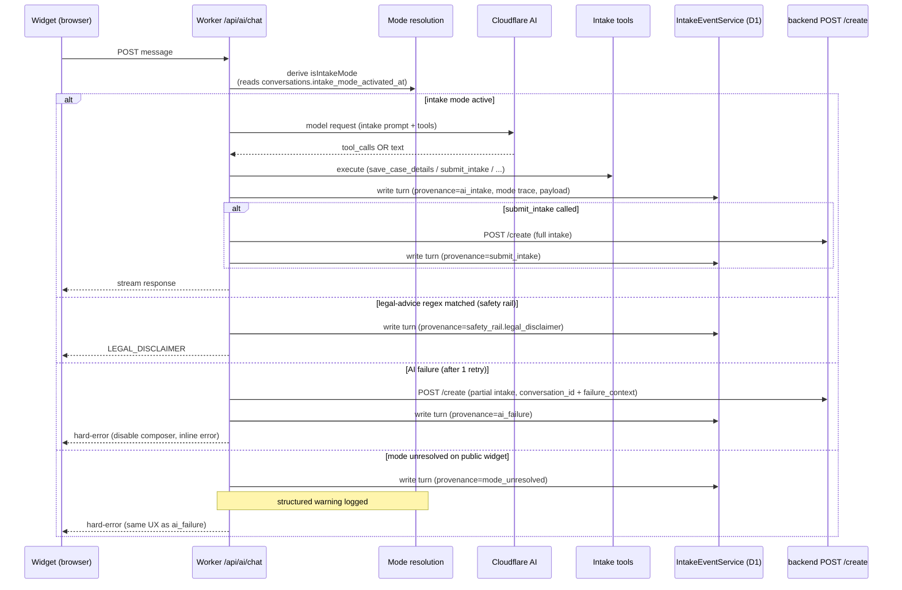

# feat: Strengthen Intake AI — Loud & Inspectable

## Problem Frame

Public-widget intake AI on `/public/{org}?template=default` never fires today. `worker/routes/aiChat.ts:465-469` gates intake mode on `effectiveMode === 'REQUEST_CONSULTATION'` (or three fallback signals), and the widget bootstrap path never propagates that mode to subsequent message turns — the slim-form sets `mode: 'REQUEST_CONSULTATION'` once at `src/shared/hooks/useIntakeFlow.ts:336`, but subsequent message bodies don't carry it. Conversations silently route to general QA mode with a generic prompt and no intake tools. Compounding the bad UX: regex shortcuts at `aiChat.ts:520-540` intercept hours/services/legal-advice questions and return hard-coded replies before the model is even called, masking AI failure with a scripted layer that looks like AI is working. No per-turn telemetry exists, no inspectable admin surface, no warning when intake mode silently fails to resolve.

This plan fixes the proximate bug, kills the silent fallbacks (preserving `LEGAL_DISCLAIMER` as a tagged safety rail), stands up an append-only per-turn intake event timeline in worker-side D1 mirroring `SessionAuditService`'s shape, builds an engineer-only admin inspection view gated by Better-Auth session + email allowlist, and switches the AI-failure path to a hard-error UX with a partial-intake submit to the backend `POST /create` endpoint (4 required fields + `conversation_id` linking back to the timeline). Conversational-quality work (slot inference, custom-template runtime parity, Typeform-direction polish) is named and deferred per the origin doc; this iteration buys the observability substrate those iterations will need.

---

## Requirements Trace

Carries forward all 14 active requirements from the origin doc (R15 was dropped during brainstorm scoping). See origin doc for full R/A/F/AE definitions.

- **Mode wiring (R1, R2)** — U1, U2
- **Fallback purge + safety-rail distinction (R3, R4, R5, R6)** — U3
- **Event timeline persistence (R7, R8, R9)** — U4, U5
- **Admin inspection view (R10, R11, R12)** — U9, U10
- **Failure UX + partial submit (R13, R14)** — U6, U7, U8
- **Engineer-inspection happy path** — covered end-to-end by U11 (E2E)

Acceptance examples AE1–AE6 from the origin map to test scenarios in their respective units (each test scenario that enforces an origin AE is prefixed with `Covers AE<N>.`).

Origin actors carried forward: A1 (public widget user), A2 (practice owner — flagging out of v1 per scope), A3 (Blawby engineer), A4 (intake AI runtime), A5 (backend `POST /create`).

---

## Key Technical Decisions

- **Mode signal persisted as `intake_mode_activated_at TEXT NULL` column on `conversations` table** (not the existing `user_info` JSON blob). Queryable for diagnostics ("how many widget sessions activated intake mode this week?"), survives reads from any handler without JSON-decode, and the timestamp doubles as the "when did intake start" signal needed for the event-timeline turn_seq baseline. Trade-off: requires a migration. User-confirmed.

- **Event timeline lives in worker-side D1**, not in the backend. Confirmed by the brainstorm's `Dependencies/Assumptions` section and the cross-repo matrix (`docs/lead-conversation-intake-matter-payment-matrix.md`): worker owns conversation state, backend owns durable intake records, link is `conversation_id`. Mirrors the MCP plan precedent (`docs/plans/2026-05-15-002-feat-blawby-mcp-agent-surface-plan.md`).

- **`IntakeEventService` mirrors `SessionAuditService`'s shape** (`worker/services/SessionAuditService.ts:78-91`): constructor `(env: Env)`, single insert per turn, payload as JSON column, closed-enum CHECK constraint on `provenance`. Naming convention `intake.<event>` (dotted, snake-case) matches the existing `Logger.info('ai.tool.raw', ...)` precedent for diagnostic events.

- **Closed-enum `provenance` at schema level** via `CHECK (provenance IN (...))`. Required by R8 ("New provenance values require a schema change, not a free-text addition"). Matches the existing CHECK-constraint pattern in `worker/migrations/20260514_add_report_deliveries.sql`.

- **Per-conversation `turn_seq` integer column**, monotonic per conversation. Allows stable ordering of timeline turns without timestamp collision risk. The MCP plan flagged that naive `prev_row_hash` linear chains serialize writes; for low-volume intake the simpler `turn_seq` from a counter on the conversation row is sufficient.

- **AI failure semantics: 1 retry on transient errors (5xx, network), 0 retries on logic errors (parse failure, tool execution exception), then hard-error**. Mark conversation with `ai_failed_at TEXT NULL` column to prevent duplicate partial-intake submissions when the user re-sends after error. Bounded, idempotent, loud.

- **Worker sends `failure_context` on partial-intake submit even though backend silently strips it today.** Future-friendly: when the backend adds the field, the worker is already populating it. Recoverable today via `conversation_id` → engineer opens timeline. Per brainstorm's Deferred-to-Planning question resolution.

- **Hours questions handled by intake system-prompt addition, not by extending `PRACTICE_CONTEXT`**. After removing the hours regex shortcut, the AI is told (via a one-line prompt clause) to recommend the user contact the practice via the already-projected `businessPhone`/`businessEmail`/`website` when asked about hours. Avoids adding a new optional field that practices would need to populate. User-confirmed.

- **Admin route gated by Better-Auth session + engineer email allowlist** (`INTAKE_INSPECTOR_ENGINEER_EMAILS` env var, comma-separated, read at startup). Middleware composed alongside `withAuth` per the MCP plan's `withMCPAuth` pattern — does NOT fork `withAuth`. User-confirmed. Trade-off: allowlist drifts as team changes; rotation lives in env vars, not code.

- **Admin view is a minimal frontend page**, not JSON-only. Engineers can navigate to `/admin/intake-inspector/:conversationId` directly. Rendered with the existing `queryCache`/`useQuery` pattern per the `docs/audits/api-parallel-requests-567.md` learning — no new context, no new fetch infra. Provenance badges using existing UI primitives (`@/shared/ui/Badge` or equivalent).

- **Frontend hard-error UX adds a new state branch to `MessageComposer`** (disabled input + inline error message), not a new context or a parent-level shim. Error state distinct from toast: this is a permanent end-of-conversation marker, not a transient notification. Aligns with `docs/engineering/loading-states.md` (hard-error UI ≠ loading UI).

---

## High-Level Technical Design

The plan composes three independent surfaces around the existing `aiChat.ts` flow. The diagram below illustrates how a single intake turn moves through the system after this plan lands; it is **directional guidance for review, not implementation specification**. The implementing agent should treat it as context, not code to reproduce.



Three things this diagram is NOT prescribing:
- The exact SDK methods used to write to D1 (the implementer follows the `SessionAuditService` pattern).
- The order of operations within `aiChat.ts` (the implementer chooses where in the existing flow to interleave timeline writes — appended after the existing response handling is the obvious place but not a constraint).
- The exact retry mechanism (the implementer picks bounded retry semantics that fit the existing `consumeAiStream`/`requestChatCompletions` shape).

---

## Implementation Units

### U1. Mode persistence column + intake-mode signal source-of-truth

**Goal:** Replace the brittle per-message `mode === 'REQUEST_CONSULTATION'` check with a conversation-row signal set at session origin, so subsequent turns don't depend on the client remembering to send mode.

**Requirements:** R1, R2; Covers AE1.

**Dependencies:** none (foundational).

**Files:**
- `worker/migrations/20260518_add_intake_mode_columns.sql` (new — add `intake_mode_activated_at TEXT NULL` and `ai_failed_at TEXT NULL` to `conversations`)
- `worker/schema.sql` (update — mirror the migration for `npm run db:init`)
- `worker/services/ConversationService.ts` (modify — add `markIntakeModeActivated(conversationId, practiceId)` method; expose `intakeModeActivatedAt` in conversation reads)
- `worker/routes/aiChat.ts` (modify — replace mode-resolution branch at lines 465-469 with a check against `conversations.intake_mode_activated_at`; keep `isPublic` gate; mode is active for the conversation iff `isPublic && intake_mode_activated_at IS NOT NULL`)
- `worker/routes/conversations.ts` (modify — the PATCH `/api/conversations/{id}` handler that receives the slim-form patch from `useIntakeFlow.ts:343` calls `markIntakeModeActivated` when the inbound metadata transition includes `status: 'collecting_case'` AND `mode: 'REQUEST_CONSULTATION'`. Verified during planning: `useIntakeFlow.ts:331-343` constructs the patch and calls `updateConversationMetadata`, which posts to this endpoint — NOT to widget.ts)
- `src/shared/hooks/useIntakeFlow.ts` (no client-side changes needed — the existing PATCH-conversation flow already carries the signal; worker-side derivation is sufficient)
- `worker/services/__tests__/ConversationService.test.ts` (new or extend — unit tests for `markIntakeModeActivated`)
- `tests/integration/aiChat-intake-mode.test.ts` (new — worker-pool integration test for the resolved branch behavior)

**Approach:** Source-of-truth signal lives on `conversations.intake_mode_activated_at` (timestamp set when the PATCH-conversation handler sees the slim-form's `status: 'collecting_case'` + `mode: 'REQUEST_CONSULTATION'` metadata transition). The canonical mode-resolution predicate in `aiChat.ts` becomes `isPublic && intake_mode_activated_at IS NOT NULL`, full stop — the legacy `hasSlimContactDraft` / `intakeBriefActive` / per-message `effectiveMode` fallback signals are **removed** from the predicate. To prevent silently mis-routing pre-existing intake conversations during the deploy window, the migration includes a one-time backfill: `UPDATE conversations SET intake_mode_activated_at = COALESCE(updated_at, created_at) WHERE <conditions where the existing fallback signals would have resolved intake-mode-true>` — implementer to derive the exact condition by reading the current `aiChat.ts:465-469` predicate before deletion. This eliminates the dual-signal ambiguity and prevents U2 warning spam during rollout.

**Patterns to follow:** `worker/services/SessionAuditService.ts` for service-method shape. Existing column-addition migrations in `worker/migrations/` for nullable-column patterns.

**Test scenarios:**
- **Covers AE1.** Given a freshly-bootstrapped public widget session where the slim contact form has just been submitted, when the next message hits `/api/ai/chat`, then `isIntakeMode` resolves true AND the response includes a model request that contains the intake system prompt + intake tools.
- Given a public widget session where `intake_mode_activated_at IS NULL`, when a message hits `/api/ai/chat`, then `isIntakeMode` resolves false AND the warning event from U2 fires.
- Given a non-public conversation (signed-in user inside the practice app, not the widget), when a message hits `/api/ai/chat`, then intake-mode does NOT activate (the `isPublic` gate still applies).
- `markIntakeModeActivated` is idempotent: calling it twice on the same conversation does not change `intake_mode_activated_at` after the first call (the first activation wins; downstream observability depends on the original timestamp).
- The migration adds the column with `NULL` default; existing rows are unaffected. Re-execution protection comes from the `d1_migrations` tracking table, not statement-level idempotency — D1/SQLite does not support `IF NOT EXISTS` on `ALTER TABLE ADD COLUMN` (see `worker/migrations/20251105_add_welcomed_at.sql`). Re-running an already-applied migration is a no-op because `wrangler d1 migrations apply` consults `d1_migrations` before executing.

**Verification:** Migration applies locally (`npx wrangler d1 execute DB --local --config worker/wrangler.toml --env dev --file worker/migrations/20260518_add_intake_mode_columns.sql`). The migration is NOT idempotent at the statement level — D1/SQLite does not support `IF NOT EXISTS` on `ALTER TABLE ADD COLUMN` (per `worker/migrations/20251105_add_welcomed_at.sql:5`); re-execution protection comes from the `d1_migrations` tracking table, which is how every other migration in the repo handles re-runs. New tests pass. Manual smoke: open `https://local.blawby.com/public/{slug}?template=default`, complete slim form, send a message, observe intake-tool-call in worker logs.

---

### U2. Structured warning when intake mode resolves false on the public widget path

**Goal:** Make silent routing-to-QA-mode loud in the logs so the next intake bug surfaces in days, not months.

**Requirements:** R2; Covers AE1 (the warning-logged assertion).

**Dependencies:** U1 (the new mode-resolution code path is what emits the warning).

**Files:**
- `worker/routes/aiChat.ts` (modify — in the mode-resolution code path from U1, when `isPublic && !isIntakeMode`, emit `Logger.warn('intake.mode.unresolved', {...})`)
- `worker/utils/logger.ts` (no change expected — existing `Logger.warn` supports structured context fields)
- `tests/integration/aiChat-intake-mode.test.ts` (extend from U1 — assert that the warning logger is invoked with the expected fields)

**Approach:** When the resolved mode branch from U1 determines that a `isPublic === true` conversation does NOT have intake-mode active, emit a structured warning with: `conversationId`, `practiceId`, `effectiveMode`, `intakeModeActivatedAt`, `hasSlimContactDraft`, `consultation_present`, `userMessage` (first 100 chars). Event name `intake.mode.unresolved` follows the existing `ai.tool.raw` dotted-snake convention.

**Patterns to follow:** Existing structured-logger usage in `worker/routes/aiChat.ts` (search for `Logger.info('ai.` and `Logger.warn(` for shape).

**Test scenarios:**
- Given a public widget session with `intake_mode_activated_at IS NULL`, when `/api/ai/chat` handles a message, then `Logger.warn` is called with event name `intake.mode.unresolved` and a context object containing the four diagnostic flags.
- Given a private/onboarding conversation, when intake mode is not active for any reason, then the warning does NOT fire (it's specific to the public widget path; other contexts have legitimate non-intake routing).

**Verification:** Unit test asserts the warning's fields. Manual smoke after deploy: confirm `wrangler tail` shows the warning when a known-broken session is reproduced.

---

### U3. Remove silent regex fallbacks; keep LEGAL_DISCLAIMER as tagged safety rail; remove non-intake-mode prompt path on widget

**Goal:** Eliminate the regex shortcuts and generic-QA prompt that hide AI failures behind scripted responses, while keeping the legal-advice safety rail intact and visible.

**Requirements:** R3, R4, R5, R6; Covers AE2, AE3, AE6.

**Dependencies:** U1 (the non-intake-mode prompt deletion is safe only after mode resolution is fixed).

**Files:**
- `worker/routes/aiChat.ts` (modify — delete hours-regex branch and services-regex branch at lines 520-540; keep legal-advice branch but route through the same logging+timeline path as a regular turn; delete the `else if (!isIntakeMode)` branch at line 706 for the public widget path; preserve `isOnboardingMode` branch unchanged)
- `worker/routes/aiChatShared.ts` (modify — remove the hours and services regex constants; keep the legal-advice regex and `LEGAL_DISCLAIMER` constant)
- `worker/routes/aiChatIntake.ts` (modify — add a one-line clause to the intake system prompt: "If the user asks about office hours and they are not listed in PRACTICE_CONTEXT, recommend they contact the practice via the businessPhone, businessEmail, or website listed above")
- `worker/routes/__tests__/aiChat-shortcut-removal.test.ts` (new — assert the deleted code paths are gone and the legal-advice path still functions)
- `tests/integration/aiChat-intake-mode.test.ts` (extend — assert that hours/services questions in public widget intake invoke the AI model rather than the deleted regex shortcuts)

**Approach:** Delete the `HOURS_QUESTION_REGEX` branch (currently the FIRST short-circuit at `aiChat.ts:521-531` — fires UNCONDITIONALLY, including during active intake mode, NOT only during `isGeneralQaMode`) and the `isGeneralQaMode && SERVICE_QUESTION_REGEX` branch. After deletion, hours and services questions during intake mode route through the AI instead of the scripted reply. The legal-advice branch (`isGeneralQaMode && hasLegalIntent` returning `LEGAL_DISCLAIMER`) survives but is restructured so its response writes a timeline turn with provenance `safety_rail.legal_disclaimer` (the actual timeline write is in U5, but this unit prepares the call-site). The `else if (!isIntakeMode)` block at ~line 706 is deleted because U1's mode-resolution change means: on the public widget path, either intake mode is active (use the intake prompt) or U2 logs a defect (handled in U2). The onboarding branch (`isOnboardingMode`) is untouched.

**Execution note:** Characterization-first. Before deleting the shortcuts, add tests that assert current behavior: hours regex returns hard-coded reply IN BOTH intake mode AND QA mode (since the current code is mode-unconditional); services regex returns hard-coded reply ONLY in QA mode. Then delete the shortcut code AND the characterization tests, replacing them with the new assertions: hours and services questions during intake mode route through the AI.

**Patterns to follow:** Existing regex constants in `worker/routes/aiChatShared.ts` show the deletion target shape. The `isOnboardingMode` branch is the reference for how a legitimate non-intake mode is preserved.

**Test scenarios:**
- **Covers AE2.** Given a public widget intake conversation where the user asks "what are your hours?", when the worker handles the message, then the AI is called with the intake system prompt and PRACTICE_CONTEXT; no pre-emptive regex shortcut intercepts the message.
- **Covers AE3.** Given a public widget intake conversation where the user asks "do I have a case?" (or any phrase matching the legal-advice regex), when the worker handles the message, then the `LEGAL_DISCLAIMER` response is returned AND the call site is set up to emit a `safety_rail.legal_disclaimer` provenance turn (verified end-to-end in U5).
- **Covers AE6.** Given an onboarding session (not a public widget intake), when the worker handles a message, then the onboarding system prompt path applies unchanged — `isOnboardingMode` branching is preserved.
- Given a public widget intake conversation where the user asks "what services do you offer?", when the worker handles the message, then the AI answers from `PRACTICE_CONTEXT.services` (no pre-emptive regex shortcut). The response varies by practice rather than being a templated string.
- Negative: the deleted hours/services regex constants are gone (grep test against `worker/routes/aiChatShared.ts`).

**Verification:** Tests pass. Manual smoke: in `https://local.blawby.com/public/{slug}?template=default`, send "what are your hours?" and confirm the response is AI-generated (varied wording, references practice contact info), not the scripted "we haven't published our hours" string.

---

### U4. Intake event timeline schema + IntakeEventService

**Goal:** Build the append-only persistence layer that captures every intake turn's full diagnostic context.

**Requirements:** R7, R8, R9.

**Dependencies:** none.

**Files:**
- `worker/migrations/20260518_add_intake_events.sql` (new — create `intake_events` table with closed-enum `provenance` CHECK constraint and per-conversation `turn_seq`)
- `worker/schema.sql` (update — mirror the migration)
- `worker/services/IntakeEventService.ts` (new — mirrors `SessionAuditService.ts` shape; methods: `recordTurn(params)`, `listByConversation(conversationId)`, `getNextTurnSeq(conversationId)`)
- `worker/types/intakeEvent.ts` (new — TypeScript types for the provenance enum, turn payload, and read DTOs; snake_case at the wire boundary per the auth-architecture convention)
- `worker/services/__tests__/IntakeEventService.test.ts` (new — unit tests against the worker-pool D1 binding)

**Approach:** Schema below (final form lives in the migration; this is design intent — implementer can refine column types as needed):

```sql
CREATE TABLE IF NOT EXISTS intake_events (
  id TEXT PRIMARY KEY,
  conversation_id TEXT NOT NULL,
  practice_id TEXT NOT NULL,
  turn_seq INTEGER NOT NULL,
  provenance TEXT NOT NULL CHECK (provenance IN (
    'ai_intake',
    'ai_intake_no_tool_call',
    'safety_rail.legal_disclaimer',
    'ai_failure',
    'submit_intake',
    'mode_unresolved'
  )),
  mode_resolution_json TEXT,
  user_message TEXT,
  model_request_json TEXT,
  model_response_json TEXT,
  tool_calls_json TEXT,
  tool_results_json TEXT,
  failure_reason TEXT,
  created_at TEXT NOT NULL DEFAULT (strftime('%Y-%m-%dT%H:%M:%fZ', 'now')),
  UNIQUE (conversation_id, turn_seq)
);
CREATE INDEX IF NOT EXISTS idx_intake_events_conversation_seq
  ON intake_events(conversation_id, turn_seq);
CREATE INDEX IF NOT EXISTS idx_intake_events_practice_created
  ON intake_events(practice_id, created_at DESC, id DESC);
CREATE INDEX IF NOT EXISTS idx_intake_events_provenance
  ON intake_events(provenance, created_at DESC);
```

`turn_seq` is derived per-conversation via a small `getNextTurnSeq` helper that reads `MAX(turn_seq) + 1` for the conversation; the `UNIQUE (conversation_id, turn_seq)` constraint guards against races. JSON columns are stored as TEXT (D1 standard) and parsed on read. Per the brainstorm's retention decision, no automatic cleanup is built; per-record deletion at the `conversation_id` grain is supported via `deleteByConversation(conversationId)` (intentionally engineer-callable for compliance triggers).

**Patterns to follow:** `worker/services/SessionAuditService.ts:78-91` (insert pattern), `worker/migrations/20260514_add_report_deliveries.sql` (migration template — CHECK constraint, ISO timestamp default, composite indexes).

**Test scenarios:**
- `recordTurn` inserts a row with all expected columns; `id` is generated server-side (UUID); `created_at` defaults to current ISO timestamp.
- `getNextTurnSeq` returns 1 for the first turn of a conversation; returns N+1 after N turns recorded.
- Inserting two turns with the same `(conversation_id, turn_seq)` raises a uniqueness violation (concurrency guard).
- `provenance` outside the enum is rejected by the CHECK constraint (insert raises).
- `listByConversation` returns rows ordered by `turn_seq ASC`.
- `deleteByConversation` removes all rows for a conversation; returns the count deleted.
- Migration applies idempotently (re-run is a no-op via `CREATE … IF NOT EXISTS`).

**Verification:** Migration applies locally. Unit tests pass against the worker-pool D1 binding (`tests/integration/`).

---

### U5. Wire IntakeEventService into the aiChat handler — provenance-tag every intake turn

**Goal:** Connect the timeline service to every code path in the intake handler so every turn is recorded with the correct provenance tag.

**Requirements:** R7, R8, R9; Covers AE2, AE3.

**Dependencies:** U1 (mode resolution), U2 (warning event), U3 (fallback purge with legal-disclaimer reclassification), U4 (timeline service exists).

**Files:**
- `worker/routes/aiChat.ts` (modify — call `IntakeEventService.recordTurn` at every intake-turn boundary; emit `provenance: 'ai_intake'` on normal AI turns, `'ai_intake_no_tool_call'` when AI responds without a tool call, `'safety_rail.legal_disclaimer'` on the kept regex branch from U3, `'mode_unresolved'` when U2's warning condition fires, `'submit_intake'` when the AI completes the intake)
- `worker/routes/__tests__/aiChat-timeline-wiring.test.ts` (new — integration-style test asserting that each provenance tag is emitted on the right code path)

**Approach:** `IntakeEventService` is constructed inline (`new IntakeEventService(env)`) at the top of the chat handler alongside the existing services. Each turn-boundary code path adds a `recordTurn` call. **Provenance-dependent write semantics:** `ai_intake`, `ai_intake_no_tool_call`, `safety_rail.legal_disclaimer`, and `submit_intake` writes are fire-and-forget for performance (log `intake.timeline.write_failed` warning on failure but do NOT fail the user-facing AI response). `ai_failure` and `mode_unresolved` writes are **AWAITED and retried once on failure**; if both attempts fail, an out-of-band `Logger.error('intake.timeline.write_failed_critical')` fires with the full intended turn payload (request, response, mode trace) inlined so engineers can recover the diagnostic data from logs even when the timeline row was lost. This differentiation is required because `ai_failure` and `mode_unresolved` turns ARE the timeline's primary purpose (per the brainstorm's success criterion); silently dropping them recreates the "engineer must grep logs" workflow the brainstorm exists to eliminate.

**Patterns to follow:** Existing service-call patterns in `aiChat.ts` for `ConversationService.mergeConsultationMetadata`. The fire-and-forget-with-warning pattern matches the existing `Logger.warn('Failed to persist merged intake state ...')` shape at `aiChat.ts:167-173`.

**Test scenarios:**
- **Covers AE2.** Given a hours-question turn (post U3 changes), then a timeline row with `provenance: 'ai_intake'` is recorded.
- **Covers AE3.** Given a legal-advice-question turn, then a timeline row with `provenance: 'safety_rail.legal_disclaimer'` is recorded AND the `LEGAL_DISCLAIMER` response is returned to the user.
- Given an intake turn where the AI responds with a tool call (`save_case_details`), then the timeline row's `tool_calls_json` field contains the tool call's name + args + result.
- Given an intake turn where the AI responds with text but no tool call, then the timeline row has `provenance: 'ai_intake_no_tool_call'`.
- Given a fire-and-forget timeline write fails (provenance is `ai_intake`, `ai_intake_no_tool_call`, `safety_rail.legal_disclaimer`, or `submit_intake`; D1 returns an error), then the AI response still streams to the user AND a `Logger.warn('intake.timeline.write_failed')` is emitted with `conversationId` + `provenance` for the dropped record.
- Given an `ai_failure` timeline write fails twice (initial attempt + one retry), then the handler completes AND a `Logger.error('intake.timeline.write_failed_critical')` fires with the full intended turn payload (request, response, mode trace, failure_reason) inlined so the diagnostic data is recoverable from logs.
- Given an `submit_intake` tool call completes successfully, then a timeline row with `provenance: 'submit_intake'` is recorded.

**Verification:** Integration tests pass. Manual smoke: complete an intake on local widget, query `intake_events` table directly, confirm one row per turn with expected provenance.

---

### U6. AI-failure detection + bounded retry + ai_failed_at state marker

**Goal:** Define and detect "AI failure" deterministically; bound retry; mark the conversation as failed so duplicate partial submits don't fire.

**Requirements:** R13.

**Dependencies:** U1 (the `ai_failed_at` column added with the U1 migration), U4 (timeline service for the `ai_failure` event).

**Files:**
- `worker/routes/aiChat.ts` (modify — wrap the existing AI request in a bounded-retry helper that retries once on transient errors (5xx, network), zero retries on logic errors; on exhausted retries, mark the conversation and record the timeline event)
- `worker/utils/aiClient.ts` (modify if needed — surface a typed error from `requestChatCompletions` distinguishing transient from logic failures, OR check error codes inline in the handler)
- `worker/services/ConversationService.ts` (extend from U1 — add `markAiFailed(conversationId, practiceId, failureReason)` method that sets `ai_failed_at`)
- `tests/integration/aiChat-failure-path.test.ts` (new — assert retry-once semantics and the failure marker)

**Approach:** "AI failure" = one of:
1. Upstream AI HTTP returns 5xx or network error **BEFORE any token has been emitted to the SSE stream** (transient — retry once)
2. AI HTTP returns 4xx (logic — fail immediately, no retry)
3. AI returns empty content AND no tool calls (logic — fail immediately)
4. Tool execution throws an exception that isn't a known recoverable case (logic — fail immediately)
5. Stream drops or errors AFTER `emittedAnyToken === true` (logic — DO NOT retry; the user has already seen partial content. Mark the partial assistant message truncated and emit hard-error)

Retry semantics: 1 attempt + 1 retry on PRE-stream transient with a short backoff (500ms is fine for v1). After exhaustion / on logic failure: **submit the partial intake to backend (U7) FIRST**, then call `ConversationService.markAiFailed(conversationId, practiceId, failureReason)` to set `ai_failed_at`, then await the `ai_failure` timeline event write (per U5's awaited semantics for this provenance). Ordering matters: if `markAiFailed` runs before the submit completes and the worker crashes between the two, the next user message short-circuits but the backend never received the partial intake — the brainstorm's "no lead silently dropped" invariant fails. Submit-then-mark ordering preserves the invariant.

**Engineer escape hatch:** Add `ConversationService.clearAiFailed(conversationId)` exposed via the admin route from U9. Rationale: a Cloudflare AI brownout that resolves in 60 seconds can permanently brick every conversation that hit it (user sees disabled-composer UI even after the outage resolves, no client-side recovery path on a public widget). The escape hatch is an operational runbook for engineers to unbrick conversations post-incident.

Subsequent message turns on the same conversation check `ai_failed_at IS NOT NULL` and short-circuit without re-invoking the AI (the next turn would just get the same error). The frontend disabled-composer state (U8) is the user-facing gate; the server-side short-circuit is belt-and-suspenders to prevent re-submission of partial intakes.

**Patterns to follow:** Existing error handling in `aiChat.ts` around `Logger.warn('AI upstream request failed', ...)`. Use `AbortController` for timeout shape (per `BackendEventService.ts:32-41`).

**Test scenarios:**
- Given the AI HTTP returns 503 once then succeeds (PRE-stream), when the handler runs, then the retry fires and the user gets a successful response; no `ai_failed_at` is set.
- Given the AI HTTP returns 503 twice (PRE-stream, exhausting retries), when the handler runs, then U7's partial-intake submit fires FIRST, THEN `ai_failed_at` is set, THEN the `ai_failure` timeline event is awaited and recorded with `failure_reason: 'upstream_transient_exhausted'`, and U8's hard-error response is returned to the widget.
- Given the AI HTTP returns 400 (logic error), when the handler runs, then no retry fires; the failure path runs (submit → mark → timeline) immediately.
- Given the AI returns empty content with no tool calls, when the handler runs, then the conversation is marked failed with `failure_reason: 'empty_response'`.
- Given a tool execution throws an exception, when the handler runs, then the conversation is marked failed with `failure_reason: 'tool_execution_exception'` AND the exception message is captured in the timeline event.
- Given the AI emits 3 tokens then the stream drops, when the handler runs, then NO retry fires AND the partial assistant message is marked truncated (not deleted, not silently abandoned) AND the failure path runs (submit → mark → timeline) with `failure_reason: 'in_stream_drop_after_emit'`.
- Given `ai_failed_at IS NOT NULL` on the conversation, when a subsequent message hits the handler, then the handler short-circuits and returns the same hard-error response without invoking the AI AND without re-submitting to backend (idempotency).
- Given an engineer calls `clearAiFailed(conversationId)` via the admin route, when a subsequent user message hits the handler, then `ai_failed_at` is null and the handler invokes the AI normally.

**Verification:** Integration tests pass. Manual smoke: temporarily inject an AI failure (env override that returns 503), confirm `ai_failed_at` is set, timeline shows the event, widget renders the U8 hard-error UI.

---

### U7. PartialIntakeSubmissionService — worker → backend on AI failure

**Goal:** Submit the intake to backend `POST /create` even on failure, so leads aren't lost to AI flakiness.

**Requirements:** R14; Covers AE5.

**Dependencies:** U6 (the failure-detection path triggers this submission).

**Files:**
- `worker/services/PartialIntakeSubmissionService.ts` (new — mirrors `worker/services/BackendEventService.ts:32-41` shape; method `submit(conversationId, practiceId, collectedFields, failureContext)` POSTs to `${BACKEND_API_URL}/api/practice-client-intakes/create`)
- `worker/routes/aiChat.ts` (modify — on the failure path from U6, call `PartialIntakeSubmissionService.submit(...)` with the slim-form contact data, any intake fields already collected from `conversations.user_info.case`, the `conversation_id`, and a `failure_context` block)
- `worker/types/wire/intake.ts` (modify — extend the existing `BackendIntakeCreatePayloadSchema` with an optional `failure_context` field; do NOT create a new wire-types file, per the existing schema already covering all 4 required + all optional intake fields + `conversation_id`)
- `worker/services/__tests__/PartialIntakeSubmissionService.test.ts` (new — unit test with mocked fetch)
- `tests/integration/aiChat-failure-path.test.ts` (extend from U6 — assert the submission is fired with the right payload shape)

**Approach:** The service constructs the JSON body with backend's 4 required fields (`slug` from the practice, `amount` from the practice's `consultationFee` default, `email` and `name` from the slim form), plus any optional fields collected so far (`description`, `phone`, `urgency`, `desired_outcome`, etc.), plus `conversation_id`, plus `failure_context: { reason, mode_resolution_trace, timeline_ref }`. **`last_user_message` is deliberately omitted from `failure_context`** — it's user-entered legal situation content (PII) and the backend's HTTP middleware / APM agents / Railway platform may log raw request bodies even though the Zod schema strips the field from the validated DTO. The recovery path for engineers is `conversation_id` → admin inspector view, which already exposes the full last user message inside the timeline. `timeline_ref` is `conversation_id` (redundant top-level + inside failure_context for forward-compat). The `failure_context` field will be silently stripped by the backend today (verified during brainstorm — backend Zod schema has no `.passthrough()`); sent anyway per the Deferred-to-Planning resolution. 30s timeout via `AbortController` (matches `BackendEventService` shape).

The submission is best-effort — if it fails, log `intake.partial_submit_failed` and continue with the hard-error response. The next iteration could add a retry queue, but v1 doesn't.

**Patterns to follow:** `worker/services/BackendEventService.ts:22-41` for the fetch + bearer-token + timeout + error-swallowing pattern. Uses `WIDGET_AUTH_TOKEN_SECRET` OR a new dedicated env var per the MCP plan's "don't double-purpose tokens" learning — implementer should follow the existing convention for unauthenticated practice-client-intakes (since the backend route is anonymous, no token is strictly required, but worker→backend service-to-service calls conventionally use one).

**Test scenarios:**
- **Covers AE5 (b).** Given an AI failure on an intake conversation, when `PartialIntakeSubmissionService.submit` is called, then a POST is sent to `${BACKEND_API_URL}/api/practice-client-intakes/create` with the 4 required fields (`slug`, `amount`, `email`, `name`), `conversation_id`, and a `failure_context` block containing `reason`, `mode_resolution_trace`, `timeline_ref` (NOT `last_user_message` — verify it is absent).
- Given the slim form collected name and email but no phone, when submission fires, then the body includes name+email and omits phone (backend treats phone as optional).
- Given intake collected `description` and `urgency` before failure, when submission fires, then those fields are included.
- Given the backend returns 200, when submission completes, then no warning is logged.
- Given the backend returns 500, when submission completes, then `Logger.warn('intake.partial_submit_failed', { conversationId, status, body })` is emitted and the hard-error response to the user still fires (the partial-submit failure does not change user-facing behavior).
- Given a network timeout (AbortController fires), when submission completes, then `Logger.warn` is emitted with `reason: 'timeout'`.
- The request body is JSON, with `Content-Type: application/json` header.

**Verification:** Unit and integration tests pass. Manual smoke: inject AI failure, observe a row appearing in backend `practice_client_intakes` with the conversation's contact data.

---

### U8. Frontend hard-error UX in widget — disable composer + inline error

**Goal:** Replace the toast-based error for AI failures with a permanent disabled-composer state that tells the user their info has been sent to the practice.

**Requirements:** R13; Covers AE5.

**Dependencies:** U6 (the worker returns a hard-error response shape this UI consumes).

**Files:**
- `src/features/chat/components/MessageComposer.tsx` (modify — add prop `hardError?: { message: string } | null`; when set, render the disabled state + an inline error region above the textarea with `role='alert' aria-live='assertive'`; clear any in-progress unsent textarea value when transitioning to hard-error; the error message is rendered from the prop's `message` field — NOT from a fixed string)
- `src/app/WidgetApp.tsx` (modify — `handleMessageError` distinguishes "hard error" (from U6's response) from "transient toast" error; hard errors set a state that propagates to `ChatContainer` → `MessageComposer`)
- `src/features/chat/components/ChatContainer.tsx` (modify — pass `hardError` prop down to `MessageComposer`)
- `src/features/chat/components/__tests__/MessageComposer.test.tsx` (extend — assert the new branch renders correctly with `role='alert'`, input is disabled when `hardError` is set, in-progress text is cleared on transition)
- `src/app/__tests__/WidgetApp.test.tsx` (extend — assert the hard-error response from worker propagates to the composer state)
- `worker/routes/conversations.ts` (modify — when loading a conversation with `ai_failed_at IS NOT NULL`, include the canonical hard-error copy in the conversation envelope so the widget can re-render the disabled state on page reload without depending on cached client state)

**Approach:** The worker (U6) responds with a recognizable shape on hard error — an HTTP status (503 with a JSON body `{ error: 'ai_failed', message: 'Our intake assistant is having trouble right now. We've passed what you've told us to the practice and they'll reach out.' }`) included in the response stream. The widget's error handler at `src/app/WidgetApp.tsx:214-225` detects this shape and updates a `hardError` state (added to the existing chat-state machinery, NOT a new context — per the state-management learning). `MessageComposer` renders the dynamic error message from `hardError.message` (canonical copy comes from the worker, not the client — single source of truth and easier to A/B or rephrase). Error message renders ABOVE the textarea with `role='alert' aria-live='assertive'` so screen readers announce the state change. In-progress unsent text in the composer is cleared on hard-error transition (the user did not send that content; preserving it in disabled state is misleading). On page reload, `conversations.ts` returns the canonical error copy in the conversation envelope (driven by `ai_failed_at IS NOT NULL`), and the widget re-renders the disabled state with the same message.

**Patterns to follow:** Existing `disabled` prop on `MessageComposer` (`src/features/chat/components/MessageComposer.tsx:42` per repo research). Existing toast-error pattern in `WidgetApp.tsx` for the transient error path that still applies. Per `docs/engineering/loading-states.md`: hard-error UI is its own state branch, not a stuck loading state.

**Test scenarios:**
- **Covers AE5 (a).** Given the worker responds with the hard-error shape, when the widget's message error handler runs, then `MessageComposer` renders with input disabled and the inline error message visible.
- Given a transient error (network blip, not a hard-error response), when the message error handler runs, then the existing toast appears AND the composer stays enabled (no behavior change for non-hard-error cases).
- Given `hardError` is set, when the user attempts to type or click send, then no message is sent (input is fully disabled).
- Given `hardError` is set and the user reloads the page, the conversation is restored from the worker (per the `ai_failed_at` check in U6) and the disabled state re-renders.

**Verification:** Component tests pass. Manual smoke: inject worker-side AI failure, confirm widget renders the disabled state + correct copy; reload page and confirm state persists.

---

### U9. Admin intake-inspector worker route — gated by Better-Auth session + engineer email allowlist

**Goal:** Engineer-only worker endpoint that returns a conversation's full intake event timeline as JSON.

**Requirements:** R10, R11; Covers AE4.

**Dependencies:** U4 (the service the route reads from).

**Files:**
- `worker/routes/adminIntakeInspector.ts` (new — handler `handleListIntakeEvents(req, env)` takes `conversationId` from path, calls `IntakeEventService.listByConversation`, also calls `ConversationService.clearAiFailed` via a sibling handler `handleClearAiFailed`, returns JSON; logs every access as a structured event `admin.intake_inspector.access` with `{ engineerEmail, conversationId, practiceId, timestamp }`)
- `worker/middleware/withEngineerAllowlist.ts` (new — middleware that extracts the Better-Auth session via the existing pattern; **fails closed** when `session?.user?.email` is undefined, empty, or whitespace-only (returns 403 + `Logger.warn('admin.intake_inspector.no_email_on_session')`); fails closed when `session.user.isAnonymous === true` regardless of email; normalizes session email (lowercase + trim) BEFORE comparison; allowlist parsed once at module load from `env.INTAKE_INSPECTOR_ENGINEER_EMAILS` (comma-separated) with empty/whitespace-only entries dropped, all entries lowercased and trimmed; if all entries drop (env var empty/missing/whitespace-only), every request returns 403. Mirrors MCP plan's middleware-alongside pattern — does NOT modify `withAuth`)
- `worker/index.ts` (modify — register new routes at `/api/admin/intake-events/:conversationId` (GET) and `/api/admin/intake-events/:conversationId/clear-failure` (POST) with `withEngineerAllowlist(withAuth(handler, { required: true, allowStaleOnTimeout: false }))`; the `allowStaleOnTimeout: false` is critical — a removed engineer would otherwise retain access for up to 5 minutes via session cache)
- `vite.config.ts` (modify — add `/api/admin/intake-events` to `workerEndpoints` per `AGENTS.md:28` so Vite doesn't proxy it to the backend fallback)
- `worker/wrangler.toml` (modify — add `INTAKE_INSPECTOR_ENGINEER_EMAILS` to `[env.dev.vars]` and document the prod var requirement)
- `worker/routes/__tests__/adminIntakeInspector.test.ts` (new)
- `worker/middleware/__tests__/withEngineerAllowlist.test.ts` (new)

**Approach:** The middleware reads the session via `getAttachedAuthContext(request)` (set by `withAuth`), inspects `session?.user?.email`, compares (after normalization on both sides) against the allowlist (parsed once at module load from the env var), and returns 403 with a structured error body if absent. The route handler takes `conversationId` from the path, calls `service.listByConversation(conversationId)`, returns `{ conversation_id, turns: [...] }`. snake_case at the wire boundary per `docs/engineering/AUTHENTICATION_ARCHITECTURE.md`. Every successful access fires `Logger.info('admin.intake_inspector.access', { engineerEmail, conversationId, practiceId, action })` — forensic audit log so improper allowlist member action is recoverable. The `allowStaleOnTimeout: false` flag on the route's `withAuth` opts out of the 5-minute session-cache stale-tolerance window so a revoked engineer loses access immediately on session revocation, not after the cache window expires.

**Patterns to follow:** `worker/middleware/compose.ts` for the `withAuth` / `getAttachedAuthContext` composition shape (`worker/middleware/auth.ts` holds the lower-level primitives like `requireAuth` / `optionalAuth`; `compose.ts` is the HOF entry point the route table uses). MCP plan's `withMCPAuth` as the alongside-not-modifying-withAuth template. `worker/routes/debug.ts` for the gated-route shape.

**Test scenarios:**
- **Covers AE4.** Given a request from an authenticated engineer (email in allowlist) to `/api/admin/intake-events/{conversationId}`, when the route handles, then the response is 200 with a JSON body containing every timeline turn for that conversation in chronological order AND an access log entry `admin.intake_inspector.access` is emitted with `{ engineerEmail, conversationId }`.
- Given a request from an authenticated non-engineer (email NOT in allowlist), when the route handles, then the response is 403 with no timeline data leaked.
- Given a request with no auth session, when the route handles, then the response is 401 (`withAuth` rejects before the engineer-allowlist middleware fires).
- Given a request for a conversation_id with no events, when the route handles, then the response is 200 with `{ conversation_id, turns: [] }`.
- Given a request for a conversation_id that does not exist in any conversation table, when the route handles, then the response is 404 (distinguishable from 200-with-empty-turns by status code).
- Given `INTAKE_INSPECTOR_ENGINEER_EMAILS` env var is unset, empty, or whitespace-only, when any request hits the route, then the response is 403 (fail closed; no engineers means no access).
- Given the env var has whitespace or mixed case (`Engineer@FIRM.com , `, `engineer@firm.com`), when the middleware parses it, then emails are trimmed and lowercased; mixed-case session emails compare correctly.
- Given the env var contains a trailing comma producing an empty entry (`a@b.com,`), when the middleware parses it, then the empty entry is dropped (a request with `session.user.email === ''` does NOT match).
- Given `session.user.email` is undefined, when the middleware runs, then the response is 403 AND `Logger.warn('admin.intake_inspector.no_email_on_session', { sessionUserId })` is emitted.
- Given an anonymous Better-Auth session (`session.user.isAnonymous === true`), when the middleware runs, then the response is 403 regardless of allowlist contents.
- Given a POST to `/api/admin/intake-events/{conversationId}/clear-failure`, when the route handles, then `ConversationService.clearAiFailed(conversationId)` is called AND an access log entry `admin.intake_inspector.access` is emitted with `action: 'clear_failure'`.

**Verification:** Tests pass. Manual smoke: set `INTAKE_INSPECTOR_ENGINEER_EMAILS=theaiistheworld@gmail.com` in `.dev.vars`, hit the route with a known conversation id, verify JSON response.

---

### U10. Admin intake-inspector frontend page — minimal timeline view with provenance badges

**Goal:** Engineer-clickable view that renders the timeline for a given conversation_id, with expandable per-turn detail.

**Requirements:** R10, R11, R12; Covers AE4.

**Dependencies:** U9 (the API endpoint this page calls).

**Files:**
- `src/pages/admin/IntakeInspector.tsx` (new — page component; parses `conversationId` from URL OR shows an entry search input when URL is `/admin/intake-inspector` (no path param) so engineers can paste an email or partial UUID to find a conversation; calls `useQuery('intake-inspector:timeline:' + conversationId, fetcher)`, renders the conversation-level summary header AND the timeline. `IntakeTimelineRow` is a LOCAL sub-component defined in this file, NOT a separate file — single-consumer extraction adds files without earning the abstraction)
- `src/app/MainApp.tsx` (modify — add routes `/admin/intake-inspector` (no param: entry/search) and `/admin/intake-inspector/:conversationId` (timeline view) to the route tree)
- `src/shared/lib/apiClient.ts` (no change expected — existing client supports the new endpoint)
- `src/pages/admin/__tests__/IntakeInspector.test.tsx` (new)

**Approach:** Use the existing `useQuery` + `queryCache` pattern per `docs/audits/api-parallel-requests-567.md` — no new fetch infrastructure, no new context. Provenance badges via existing UI primitives (likely `@/shared/ui/Badge` — implementer to confirm). **Conversation summary header** (above the timeline): status badge (failed / completed / in-progress), turn count, timestamp range, practice identifier — gives engineers at-a-glance orientation before reading individual turns. **Each turn row** shows: `turn_seq`, `provenance` badge (colored by category — `ai_intake` green, `safety_rail.*` yellow, `ai_failure` red, `mode_unresolved` orange, `submit_intake` blue), `created_at` timestamp, expand control. **Expand behavior:** per-row independent toggle (not accordion); all-collapsed initial state; expand state is local component state (not persisted across navigation). **Expanded view** shows the full JSON of `model_request_json`, `model_response_json`, `tool_calls_json`, `tool_results_json`, `mode_resolution_json`, `failure_reason` in `<pre>` blocks (engineer-acceptable). **State distinction:** 404 from API renders "conversation not found" (distinct from 200-with-empty-turns which renders "no timeline events recorded for this conversation"). **Engineer recovery action:** when conversation has `ai_failed_at` set, show a "Clear AI failure (unbrick)" button that POSTs to `/api/admin/intake-events/{conversationId}/clear-failure` and refetches the timeline. Loading state via the standard `AsyncState<T>` pattern per `docs/engineering/loading-states.md`.

**Patterns to follow:** Existing pages under `src/pages/` for layout shape. `queryCache.coalesceGet` for de-duping concurrent fetches. AGENTS.md:2 — do NOT use useEffect for derived state; rendering is computed directly from `useQuery` state.

**Test scenarios:**
- **Covers AE4.** Given the page renders for a conversation_id with N timeline turns, when the data loads, then N rows are visible in chronological order, each with its provenance badge.
- Given a row is clicked/expanded, when the expand toggle fires, then the model request, response, tool calls, and mode trace are visible in the expanded section.
- Given the API returns 403, when the page renders, then a "not authorized" message is shown (no raw error dump).
- Given the API returns 200 with an empty timeline, when the page renders, then a "no timeline events recorded for this conversation" message is shown.
- Given the user navigates to a conversation_id then back, when `useQuery` cache is hit, then no redundant fetch fires (per the parallel-requests-audit learning).
- Loading state shows briefly before data arrives; hard-error state is distinct from loading state.

**Verification:** Component tests pass. Manual smoke: complete an intake locally, navigate to `/admin/intake-inspector/{conversation_id}`, verify timeline renders with badges and expand works.

---

### U11. E2E coverage — happy path + AI-failure path on the public widget

**Goal:** End-to-end Playwright tests that exercise the full flow on the actual widget surface, catching regressions across the worker-frontend boundary.

**Requirements:** Success criteria from the origin doc (verifiable end-to-end).

**Dependencies:** U1-U8 all need to be in place.

**Files:**
- `tests/e2e/widget-intake-ai-fires.spec.ts` (new — happy path: open widget, complete slim form, send first message, assert AI model is invoked and tool call attempted)
- `tests/e2e/widget-intake-ai-failure.spec.ts` (new — failure path: open widget, complete slim form, simulate AI failure (env override or mock), assert hard-error UI renders and backend received partial intake)
- `tests/e2e/widget-intake-flow.spec.ts` (extend if appropriate — the existing test may need updates to reflect the changed mode-resolution behavior)

**Approach:** Use the existing `fixtures.public.ts` pattern from `tests/e2e/widget-intake-flow.spec.ts`. Happy-path test asserts a network request to the AI endpoint is made AND the response contains tool-call content (via Playwright's `page.waitForRequest`). Failure-path test uses an env override (or a stub server) to force the AI to return 503; asserts the widget renders the hard-error UI AND a backend `POST /create` request fires with the conversation_id.

The failure-path test needs a small worker-side affordance: an env var `INTAKE_AI_FORCE_FAILURE=true` that short-circuits `requestChatCompletions` to throw. **This short-circuit MUST be gated by `env.NODE_ENV !== 'production'` in addition to the env-var check** — if `INTAKE_AI_FORCE_FAILURE` is accidentally set on a production deploy (config drift, mispipelined deploy), it must be a silent no-op rather than silently disabling AI for all intake conversations. If the NODE_ENV gating proves insufficient (e.g., staging needs to also fail-disabled), an MSW-style HTTP interception layer in the E2E setup is the fallback.

**Patterns to follow:** `tests/e2e/widget-intake-flow.spec.ts` for test shape and fixture usage. Existing Playwright `page.waitForRequest` / `page.route` patterns for network assertions.

**Test scenarios:**
- E2E happy path: open `/public/{slug}?template=default`, complete slim form, send "I need help with a contract dispute", assert: (a) AI request fires, (b) AI response contains a tool call, (c) timeline row exists for the turn via the admin route (or via D1 direct query in the test harness).
- E2E failure path: open widget, complete slim form, with forced AI failure: send a message, assert: (a) widget renders hard-error UI with the expected copy, (b) `POST /create` to backend fires with the slim-form fields + conversation_id, (c) timeline row exists with `provenance: 'ai_failure'`.
- E2E mode-wiring regression guard: open widget, complete slim form, send "what are your hours?", assert: the response is AI-generated (varied wording across runs) AND NOT the scripted "we haven't published our hours" string. This guards against the U3 regex shortcuts reappearing.

**Verification:** `npm run test:e2e` passes. The two new specs run against `https://local.blawby.com` per the project's E2E convention.

---

## Scope Boundaries

### Deferred to Follow-Up Work

- **Slot inference / multi-field utterance parsing** ("Charlotte, NC" → city + state in one turn). The default template's separate city/state fields will continue to be asked separately. This iteration makes the bad UX visible in the timeline; fixing it is the next iteration's job. (Origin: Scope Boundaries.)
- **Custom-template runtime parity** (dynamic per-template AI tool schemas, conditional field logic, branching). Question Builder authoring surface already exists; runtime treatment of non-default templates is a separate brainstorm. (Origin: Scope Boundaries.)
- **Typeform-direction visual polish** (motion, copy, layout work on the widget itself). (Origin: Scope Boundaries.)
- **Replay-against-current-config** action (re-fire a stored timeline turn against the current model + prompt to verify a fix). Queued as Phase 2 of this initiative once timeline ships and PII/sandboxing are thought through. (Origin: Scope Boundaries.)
- **Practice-owner exposure of the admin inspection view**. Engineer-only in v1. (Origin: Scope Boundaries.)
- **Dashboard flagging of degraded intakes for practice owners** (was R15, dropped during brainstorm scoping). Backend `practice_client_intakes` schema has no first-class field for submission quality and the dashboard has no UI to render one. v1 still posts partial intakes to backend `POST /create` so no leads are lost, but they appear as normal `pending_review` intakes; only the engineer inspection view distinguishes them. (Origin: Scope Boundaries.)
- **Automatic retention / deletion of stored model payloads**. Retention is indefinite by decision; per-record manual deletion (at the conversation_id grain) is supported via `IntakeEventService.deleteByConversation`. Automated retention policies, GDPR-style deletion-on-request flows, and jurisdiction-specific retention rules are deferred. (Origin: Scope Boundaries.)
- **Cleanup of the slim-form `mode: 'REQUEST_CONSULTATION'` body field**. U1 makes the column-based signal canonical; the body field becomes a backward-compatible no-op. Cleaning up the client-side send is deferred to avoid coordinating a stale-cache risk during the rollout window.

### Outside this iteration

- Backend (`blawby-backend`) schema changes for a first-class `submission_quality` / `failure_context` field. Worker sends the data anyway (silently stripped today). Future backend work to surface this is its own brainstorm + plan.

---

## System-Wide Impact

- **Worker (`worker/`)** — new D1 table, two new services (`IntakeEventService`, `PartialIntakeSubmissionService`), one new route prefix (`/api/admin/intake-events/*`), one new middleware (`withEngineerAllowlist`), modifications to the central `aiChat.ts` handler, two new env vars (`INTAKE_INSPECTOR_ENGINEER_EMAILS` plus optional `INTAKE_AI_FORCE_FAILURE` for E2E).
- **Frontend (`src/`)** — new admin page route `/admin/intake-inspector/:conversationId`, new state branch in `MessageComposer` for hard-error UX, no new contexts.
- **Build (`vite.config.ts`)** — new `/api/admin/intake-events` entry in `workerEndpoints`. Missing this entry is the #1 local-dev trap per the MCP plan precedent.
- **Cross-repo (`blawby-backend`)** — no schema or code change required. v1 piggybacks on existing `POST /create` and the existing optional `conversation_id` field. Future flagging work is its own brainstorm.
- **Engineering workflow** — new admin URL pattern (`/admin/intake-inspector/{conversation_id}`) becomes the engineer's first stop when an intake bug is reported. Worth a one-line note in `AGENTS.md` after the plan ships.

---

## Dependencies / Assumptions

- **Backend `POST /create` accepts the four required fields + optional `conversation_id`**: verified during brainstorm. No backend change needed for v1.
- **Slim contact form captures name + email + phone before AI conversation starts**: verified via existing `hasSlimContactDraft` signal in `aiChat.ts`. U7's partial-intake submit depends on this.
- **Better-Auth session machinery is available in worker handlers** via existing `getAttachedAuthContext`: verified via `worker/middleware/auth.ts` patterns.
- **`INTAKE_INSPECTOR_ENGINEER_EMAILS` env var rollout coordinated separately**: planning assumes engineers will be added to the allowlist before they need to use the admin view. Initial value can be set during deploy.
- **D1 supports the `CHECK (column IN (...))` enum pattern**: verified via existing migrations.
- **Existing `useQuery`/`queryCache` infra supports the admin page's data needs**: assumed per the parallel-requests-audit learning; implementer verifies during U10.

---

## Risks & Mitigations

- **Risk: Migration drops or corrupts existing conversations.**
  Mitigation: column-add migrations are additive (no DROP). All new columns are nullable. The migration includes one targeted backfill UPDATE for `intake_mode_activated_at` on pre-existing intake conversations (see U1 Approach); the UPDATE is scoped to a derivable subset and is safe to re-run because applied migrations are tracked in `d1_migrations` (re-execution protection lives at the tracker level, not the statement level — D1/SQLite does not support `IF NOT EXISTS` on `ALTER TABLE ADD COLUMN`). Test the migration locally against a populated dev D1 before staging deploy.

- **Risk: Timeline write failures silently block intake.**
  Mitigation: U5 specifies fire-and-forget timeline writes with `Logger.warn('intake.timeline.write_failed')`. Timeline write failures degrade observability for that turn but do not block the AI response. Tested explicitly in U5's scenarios.

- **Risk: `LEGAL_DISCLAIMER` regex inadvertently broken during U3's purge.**
  Mitigation: U3's test scenarios explicitly cover the legal-advice path. The U3 implementation deletes only the hours and services regex constants, not the legal-advice regex.

- **Risk: Engineer email allowlist leaks via the env var.**
  Mitigation: env vars are not user-facing surface area. The allowlist is operational config, not a credential. Rotation is a redeploy.

- **Risk: Storing full model payloads (which include user-entered legal situation descriptions) grows D1 storage indefinitely.**
  Mitigation: retention is indefinite by decision. `IntakeEventService.deleteByConversation` provides the per-record deletion path for compliance triggers. D1 storage limits will not be hit at projected v1 intake volume; revisit before scale.

- **Risk: Hours questions after U3 land badly when the practice has no hours info in `PRACTICE_CONTEXT`.**
  Mitigation: U3 adds the one-line prompt clause directing the AI to recommend the practice contact info. Manual smoke validates the new prompt's output. If the prompt clause proves insufficient, a follow-up iteration can extend `PRACTICE_CONTEXT` to carry hours.

- **Risk: The `ai_failed_at` short-circuit blocks legitimate re-attempts after a transient outage resolves.**
  Mitigation: `ai_failed_at` is per-conversation, not per-practice. A user starting a new conversation always gets a fresh AI attempt. The short-circuit only affects the same conversation that already failed — re-attempts on a known-failed conversation are intentional non-goals (per U6's design).

---

## Verification Strategy

Each implementation unit defines its own test scenarios with acceptance-example back-references (`Covers AE<N>`). The whole-plan verification is:

1. All unit tests pass (`npm run test`).
2. Worker integration tests pass (`npm run test:worker` or equivalent vitest project invocation).
3. New E2E specs pass (`npm run test:e2e`).
4. Manual smoke against `https://local.blawby.com/public/{slug}?template=default`:
   - Send "I need help with a contract dispute" — confirm AI fires, tool call recorded in timeline.
   - Send "what are your hours?" — confirm AI-generated response (not scripted).
   - Send "do I have a case?" — confirm `LEGAL_DISCLAIMER` returned AND timeline row with `safety_rail.legal_disclaimer` provenance.
   - With `INTAKE_AI_FORCE_FAILURE=true` set, send a message — confirm hard-error UI renders, backend received `POST /create` (check backend DB), timeline shows `ai_failure` turn.
   - Open `/admin/intake-inspector/{conversation_id}` with an allowlisted engineer email — confirm timeline renders with badges + expandable detail.
5. Production observability check after deploy: `wrangler tail` for `intake.mode.unresolved` warnings — should be near-zero. If non-zero, a public-widget mode-resolution edge case wasn't covered by U1; investigate immediately rather than waiting for symptoms.
